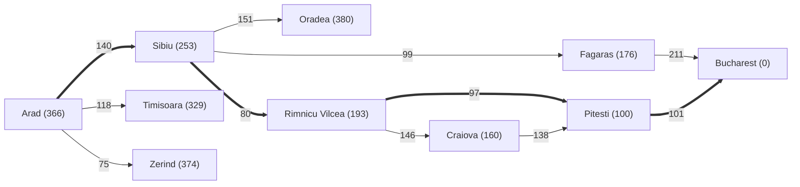

# A* Search (Búsqueda A*)

> **Summary (EN):** A* expands the node with the lowest f(n) = g(n) + h(n), where g is the cost already paid from the start and h the estimated cost to the goal; so f estimates the total cost of the best path through n. With an admissible heuristic (consistent if states are never reopened) A* is complete and optimal. Its weakness is memory: it keeps every generated node, O(b^d). On the Romania map it finds the 418 km route Arad–Sibiu–Rimnicu Vilcea–Pitesti–Bucharest expanding 5 nodes, versus 9 for Dijkstra on the assignment's subgraph.

> **En palabras simples (ES):** A\* elige el lugar que tiene el **mejor total estimado del viaje**: lo que ya caminé (g) + lo que creo que me falta (h). Es como greedy, pero sin olvidar lo que ya pagaste. Si la estimación h nunca exagera, el primer camino a la meta que A\* **saca** de la lista es el más barato. *(Abajo está el pseudocódigo paso a paso, en inglés y en español.)*

## Términos clave

| English | Español | Significado (en simple) |
|---|---|---|
| g(n) | Costo acumulado | Lo que **ya pagué** desde el inicio hasta n (km recorridos). |
| h(n) | Heurística | Lo que **creo que falta** desde n hasta la meta. |
| f(n) = g(n) + h(n) | Costo total estimado | Cuánto costaría el viaje completo si paso por n. |
| Admissible / Consistent | Admisible / Consistente | h nunca exagera / h no "salta" al avanzar. Ver [Heuristics](heuristics.md). |
| Optimally efficient | Óptimamente eficiente | Ningún algoritmo parecido, con la misma h, puede revisar menos nodos que A\*. |
| Contour | Contorno | Zona donde f es menor que cierto valor; A\* avanza "por capas" de f. |
| Weighted A\* | A\* ponderado | Usa f = g + W·h con W > 1: más rápido, pero el camino puede ser un poco más caro. |
| IDA\*, RBFS, SMA\* | — | Versiones de A\* que usan poca memoria. |

## Explicación

### 1. La idea

A\* junta lo mejor de dos algoritmos:

- de **Dijkstra/UCS** toma g, **lo que ya costó llegar** (para no olvidar lo pagado);
- de **greedy** toma h, **lo que parece faltar** (para ir hacia la meta).

Siempre revisa el nodo con menor **f = g + h**, el "total estimado del viaje". Es como un viajero que pregunta en cada pueblo: "¿cuánto llevo + cuánto me falta?", y sigue por el pueblo con el menor total.

### 2. Propiedades (slides 02, s14)

- **¿Completo?** Sí, si hay solución y h es admisible (y cada nodo tiene un número finito de hijos y los costos son positivos).
- **¿Óptimo?** Sí, si h es **admisible** (nunca exagera) en la versión de AIMA 4e, que vuelve a revisar un estado si encuentra un camino más barato. Si la implementación **nunca vuelve a revisar** estados ya expandidos (como la de la tarea), hace falta h **consistente**. Ver [Heuristics](heuristics.md).
- **Memoria:** O(b^d). Guarda **todos** los nodos: es su mayor problema.
- **Tiempo:** depende de qué tan buena sea h.

```
function A-STAR(problem, h):
    g[start] ← 0;  f[start] ← h(start)
    frontier ← {start};  explored ← ∅;  parent[start] ← None
    while frontier not empty:
        n ← node in frontier with lowest f
        if goal(n): return reconstruct_path(parent, n)
        frontier.remove(n);  explored.add(n)
        for (m, cost) in neighbors(n):
            if m in explored: continue
            if g[n] + cost < g[m]:
                g[m] ← g[n] + cost
                f[m] ← g[m] + h(m)
                parent[m] ← n
                frontier.add(m)
    return failure
```

Así está implementado `a_estrella()` en la tarea [A\* vs Dijkstra](../assignments/astar-vs-dijkstra.md).

## Ejemplo — Arad → Bucarest (AIMA Fig. 3.18)

| Paso | Saca de la frontera | f = g + h | Lo que entra a la frontera (con su f) |
|---|---|---|---|
| 1 | Arad | 0 + 366 = 366 | Sibiu 393, Timisoara 447, Zerind 449 |
| 2 | Sibiu | 140 + 253 = 393 | Rimnicu V. 413, Fagaras 415, Oradea 671 (Arad ya revisado) |
| 3 | Rimnicu Vilcea | 220 + 193 = 413 | Pitesti 417, Craiova 526 |
| 4 | Fagaras | 239 + 176 = 415 | Bucarest 450 |
| 5 | Pitesti | 317 + 100 = 417 | **Bucarest mejora a 418** (Craiova sigue en 526) |
| 6 | Bucarest | 418 + 0 = 418 | ✅ meta |

**Lo importante está en los pasos 4 y 5:** Bucarest entra a la frontera con f = 450 (por Fagaras), pero A\* **no se detiene al descubrirlo**; se detiene al **sacarlo**. Antes saca Pitesti (417 < 450) y descubre un camino a Bucarest de 418. Por eso A\* es óptimo.

Resultado real de la tarea: A\* revisó 5 nodos y Dijkstra 9, ambos con costo 418.

## Por qué A\* es óptimo (prueba de AIMA §3.5.2)

**Idea de la prueba (por contradicción):** supón que A\* devuelve un camino **más caro** que el óptimo (costo C mayor que C\*). Entonces algún nodo n del camino óptimo se quedó sin revisar. Llamemos g\*(n) al costo óptimo desde el inicio hasta n, y h\*(n) al costo óptimo desde n hasta la meta:

```
f(n) > C*                 (si no, n se habría expandido antes que la meta de costo C)
f(n) = g(n) + h(n)        (definición)
f(n) = g*(n) + h(n)       (n está en el camino óptimo)
f(n) ≤ g*(n) + h*(n)      (admisibilidad: h(n) ≤ h*(n))
f(n) ≤ C*                 (C* = g*(n) + h*(n))
```

En palabras: la primera línea dice que f(n) es **mayor** que C\*, y la última que es **menor o igual**. Las dos no pueden ser verdad a la vez → la suposición era falsa → A\* solo devuelve caminos óptimos.

## Contornos y eficiencia (AIMA §3.5.3)

- A\* avanza **por capas de f**, como curvas de nivel en un mapa (contornos de 380, 400, 420 en Rumania). UCS avanza en círculos alrededor del inicio; con una buena h, las capas de A\* se **estiran hacia la meta**.
- A\* revisa **todos** los nodos con f(n) < C\*, quizá algunos con f(n) = C\*, y **ninguno** con f(n) > C\*.
- Por eso **se salta** nodos inútiles: Timisoara (447) y Zerind (449) son vecinos de Arad pero nunca se revisan, porque la solución de 418 aparece antes.
- Con h consistente, A\* es **óptimamente eficiente**: ningún algoritmo parecido con la misma h revisa menos nodos. Aun así, el número de nodos puede ser enorme.

## Variantes (AIMA §3.5.4–3.5.6) *(para cultura general)*

| Variante | Idea (en simple) | Qué garantiza |
|---|---|---|
| **Weighted A\*** | f = g + W·h con W > 1: le da más peso a la estimación | Más rápido (Fig. 3.21: 7 veces menos estados) con un camino algo más caro (aquí 5 %), nunca más de W veces el óptimo |
| **Beam search** | Guardar solo los k mejores nodos de la frontera | Rápido, pero puede no encontrar solución ni la mejor |
| **IDA\*** | Como IDS, pero el límite es de **f** (no de profundidad); el nuevo límite es el menor f que se pasó del anterior | Óptimo, con poca memoria |
| **RBFS** | DFS que recuerda el f de la mejor alternativa y regresa si la rama actual se vuelve peor | Óptimo con h admisible, poca memoria; cambia mucho de opinión |
| **SMA\*** | A\* normal hasta llenar la memoria; luego borra el peor nodo y guarda su valor en el padre | Encuentra la solución si cabe en memoria |
| **A\* bidireccional** | Dos búsquedas, desde el inicio y desde la meta | Completo y óptimo con h admisible |

**La familia "best-first" según qué número usa:**

| Algoritmo | f(n) | W |
|---|---|---|
| Uniform-cost search (Dijkstra) | g(n): solo lo pagado | 0 |
| A\* | g(n) + h(n): pagado + estimado | 1 |
| Weighted A\* | g(n) + W·h(n) | entre 1 e ∞ |
| Greedy best-first | h(n): solo lo estimado | ∞ |

### Diagrama

Parte del mapa de Rumania usada en la tarea (costos en km; h en línea recta entre paréntesis). El camino óptimo está resaltado: 140 + 80 + 97 + 101 = **418**.



## Pseudocódigo intuitivo (para explicar en el examen)

> **Idea (ES):** A\* elige el lugar que tiene el **mejor total estimado del viaje**: lo que ya caminé (g) + lo que creo que me falta (h). Es como greedy, pero sin olvidar lo que ya pagaste. Si la estimación h nunca exagera, el primer camino a la meta que A\* **saca** de la lista es el más barato.

**Antes de empezar: qué significa cada cosa**

| Símbolo | Qué es (en simple) | English |
|---|---|---|
| g(n) | lo que ya pagué desde el inicio hasta n (km recorridos) | path cost so far |
| h(n) | lo que creo que falta desde n hasta la meta (línea recta) | heuristic estimate |
| f(n) = g(n) + h(n) | el costo total estimado del viaje si paso por n | estimated total cost |
| Cola de prioridad | lista donde siempre sale el de menor f | priority queue |
| Padre | de qué nodo vine, para reconstruir el camino | parent |

**Pasos** — en inglés (como lo escribes en el examen) y debajo en español (para entender):

1. Put the start in a priority queue with g = 0 and f = h(start).
   - *ES:* Pon el inicio; su g es 0, así que su f es solo la estimación.
2. Take the node with the SMALLEST f.
   - *ES:* Saca el que tiene el mejor total estimado.
3. If it is the goal → return the path. Test the goal when you take it out, not when you add it.
   - *ES:* Si es la meta, termina. Ojo: la meta se revisa al **sacarla**; puede estar en la lista con un costo alto y luego aparecer un camino más barato.
4. For each neighbor: new_g = g(node) + step cost. If the neighbor is new or new_g is smaller than its old g → save new_g, f = new_g + h, and the parent; add it to the queue.
   - *ES:* Para cada vecino calcula lo que costaría llegar por aquí. Si es nuevo o es más barato que antes, guárdalo con su nuevo total y anota de dónde vino.
5. Go back to step 2.
   - *ES:* Repite.

**Ejemplo con números:** Arad → Bucarest (f = g + h):
1. Saca Arad: f = 0 + 366 = 366.
2. Saca Sibiu: f = 140 + 253 = 393.
3. Saca Rimnicu Vilcea: f = 220 + 193 = 413.
4. Saca Fagaras: f = 239 + 176 = 415. Aquí aparece Bucarest con f = 450 + 0 = **450**, pero A\* **no** para todavía.
5. Saca Pitesti: f = 317 + 100 = 417. Bucarest mejora a f = 418 + 0 = **418**.
6. Saca Bucarest con 418 → termina. Camino Arad–Sibiu–Rimnicu Vilcea–Pitesti–Bucarest = **418 km** (el óptimo).

**Say it in the exam (EN):** "A* expands the node with the lowest f(n) = g(n) + h(n), where g is the cost already paid and h the estimated cost to the goal, so f estimates the total cost of the best path through n. It is complete and optimal if h is admissible (and consistent when states are never reopened). Its weakness is memory: it keeps every node, O(b^d). On Romania it finds the optimal 418 km route expanding only 5 nodes."

**Dilo así (ES):** "A\* expande el nodo con menor f = g + h: lo ya pagado más lo que se estima que falta. Es completo y óptimo si h es admisible (y consistente si no reabre estados). Su debilidad es la memoria, porque guarda todos los nodos. En Rumania encuentra la ruta óptima de 418 km expandiendo solo 5 nodos."

## Errores comunes y tips de examen

- **Revisar la meta al sacarla, no al descubrirla.** Si no, A\* devolvería el camino de 450 por Fagaras.
- Con h = 0, A\* es igual a UCS/Dijkstra. Con f = h, es greedy.
- Si h exagera (no es admisible), A\* puede devolver un camino más caro (aunque a veces más rápido: *weighted A\**).
- Usa mucha memoria → para eso existen IDA\*, RBFS y SMA\* (tabla de arriba).
- Si te piden *demostrar* que es óptimo, usa la prueba por contradicción de 5 líneas.

## Relacionado

- [Heuristics](heuristics.md)
- [Greedy Best-First Search](greedy-best-first-search.md)
- [Uninformed Search](uninformed-search.md) (UCS/Dijkstra)
- [A* vs Dijkstra assignment](../assignments/astar-vs-dijkstra.md)
- [Search algorithms comparison](../study/search-algorithms-comparison.md)

## Fuentes

- [Slides 02](../sources/slides-02-problem-solving.md), slides 14–15.
- [AIMA 4e](../sources/book-russell-norvig-aima.md) §3.5 y Fig. 3.18 (ingestado: prueba de optimalidad, contornos, eficiencia óptima, weighted A\*, IDA\*, RBFS, SMA\*, bidireccional; traza verificada ejecutando la tarea).
