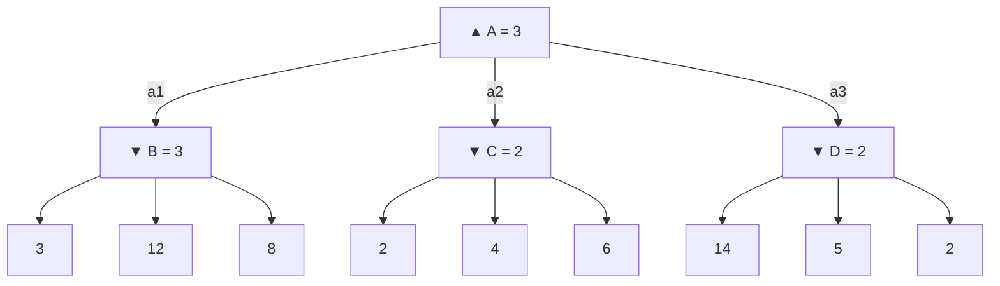

# Adversarial Search and Minimax (Búsqueda adversarial y Minimax)

> **Summary (EN):** In games, agents have opposing goals, so we look for the best move assuming the opponent also plays perfectly. For two-player, zero-sum, deterministic games where both players see everything, Minimax gives each position a value: the final score at the end of the game, the maximum of the children on MAX's turn and the minimum on MIN's turn. It explores the whole game tree depth-first (time O(b^m), memory O(b·m)); real games stop at a depth limit and use an evaluation function to estimate positions.

> **En palabras simples (ES):** En un juego de dos jugadores, piensa: "yo elijo lo mejor para mí, y mi rival elige lo peor para mí". Minimax arma el árbol de jugadas y, desde el final hacia arriba, en mis turnos toma el **máximo** y en los del rival el **mínimo**. *(Abajo está el pseudocódigo paso a paso, en inglés y en español.)*

## Términos clave

| English | Español | Significado (en simple) |
|---|---|---|
| Adversarial search | Búsqueda adversarial | Buscar la mejor jugada cuando hay un rival. |
| MAX / MIN | MAX / MIN | Yo, que quiero el número más alto / el rival, que quiere el más bajo. |
| Zero-sum | Suma cero | Lo que gana uno lo pierde el otro. |
| Perfect information | Información perfecta | Los dos ven todo el tablero (nada oculto). |
| Utility | Utilidad | El puntaje final de la partida (ganar = +1, perder = −1, empate = 0). |
| Terminal test | Prueba terminal | La pregunta "¿ya terminó la partida?". |
| Ply | Ply (media jugada) | Una jugada de un solo jugador. |
| Evaluation function | Función de evaluación | Una estimación de qué tan buena es una posición que todavía no termina. |
| Cutoff / depth limit | Corte / límite de profundidad | Dejar de mirar más adelante después de cierto número de jugadas. |
| *b*, *m* | — | Jugadas posibles por turno / número de jugadas hasta el final. |

## Explicación

### 1. ¿Qué cambia cuando hay un rival?

Hasta ahora buscábamos un **camino**. En un juego, lo que pasa depende también de lo que haga el rival. Ya no buscamos un camino, sino **la mejor jugada suponiendo que el rival también juega perfecto**.

Un juego se describe con seis cosas (AIMA §6.1): el estado inicial (S₀), a quién le toca (TO-MOVE), qué jugadas hay (ACTIONS), qué pasa después de cada jugada (RESULT), si ya terminó (IS-TERMINAL) y el puntaje final (UTILITY; en ajedrez 1, 0 o ½). Los juegos más estudiados son **deterministas, de dos jugadores, por turnos, con todo a la vista y de suma cero**.

¿Qué tan grandes son? El árbol del gato (tic-tac-toe) tiene menos de 362 880 finales (5 478 posiciones distintas); el del ajedrez, más de 10⁴⁰ nodos.

### 2. El valor minimax

A cada posición se le da un número así:

```
MINIMAX(s) =
    UTILITY(s, MAX)                              if IS-TERMINAL(s)
    max_a MINIMAX(RESULT(s, a))                  if TO-MOVE(s) = MAX
    min_a MINIMAX(RESULT(s, a))                  if TO-MOVE(s) = MIN
```

En palabras:
- Si la partida terminó → su valor es el puntaje final.
- Si me toca a mí (MAX) → su valor es **el mayor** de los valores de mis jugadas.
- Si le toca al rival (MIN) → su valor es **el menor** de los valores de sus jugadas.

```python
def minimax(state, maximizing, depth):
    if terminal(state):  return utility(state)
    if depth == 0:       return evaluate(state)       # heuristic cutoff
    values = [minimax(result(state, a), not maximizing, depth - 1)
              for a in actions(state)]
    return max(values) if maximizing else min(values)
```

### 3. Ejemplo de AIMA (Fig. 6.2)

Tengo 3 jugadas (a₁, a₂, a₃). Después de cada una, el rival tiene 3 respuestas. Los puntajes finales son: después de a₁ → {3, 12, 8}; después de a₂ → {2, 4, 6}; después de a₃ → {14, 5, 2}.

1. El rival (MIN) elige el **menor** en cada grupo: B = 3, C = 2, D = 2.
2. Yo (MAX) elijo el **mayor** de esos: max(3, 2, 2) = **3**.
3. Juego **a₁**.

### 4. Propiedades

- Supone que **los dos juegan perfecto**.
- Recorre el árbol en profundidad (como DFS): tiempo **O(b^m)**, memoria **O(b·m)**.
- En juegos reales es imposible llegar al final: en ajedrez hay unas 35 jugadas por turno y unas 80 jugadas por partida → 35⁸⁰ ≈ **10¹²³** posiciones.
- Si el rival **no** juega perfecto, yo obtengo **al menos** el valor minimax (quizá más).
- Mi estrategia es un **plan condicional**: una respuesta para cada jugada del rival. Es la misma idea que la [búsqueda AND–OR](search-in-complex-environments.md) (mi turno ≈ OR, turno del rival ≈ AND).

**Más de dos jugadores (§6.2.2):** cada nodo guarda un **vector** de puntajes ⟨v_A, v_B, v_C⟩ y cada jugador elige lo mejor para su propio puntaje. Aparecen **alianzas** solas (dos débiles contra uno fuerte).

### 5. Minimax con corte y evaluación (AIMA §6.3)

Como no se puede llegar al final, se mira solo unas cuantas jugadas adelante y se **estima** qué tan buena es la posición:

```
H-MINIMAX(s, d) =
    EVAL(s, MAX)                                   if IS-CUTOFF(s, d)
    max_a H-MINIMAX(RESULT(s, a), d + 1)           if TO-MOVE(s) = MAX
    min_a H-MINIMAX(RESULT(s, a), d + 1)           if TO-MOVE(s) = MIN
```

- **Función de evaluación (EVAL):** debe ser rápida, parecerse a la probabilidad de ganar y dar el puntaje real en posiciones finales. La forma típica es una **suma con pesos**: EVAL(s) = w₁f₁(s) + … + wₙfₙ(s). En ajedrez, por ejemplo, se cuentan las piezas: peón 1, caballo o alfil 3, torre 5, reina 9. Esto supone que cada característica cuenta por separado; los programas modernos aprenden combinaciones más complejas.
- **Promedio por tipo de posición:** si el 82 % de los finales "2 peones contra 1" se ganan, el 2 % se pierden y el 16 % son tablas: 0.82·1 + 0.02·0 + 0.16·½ = **0.90**.
- **¿Cuándo cortar?** A profundidad fija o, mejor, con **profundización iterativa**: cuando se acaba el tiempo, se usa la mejor jugada de la búsqueda completa más profunda.
- **Búsqueda de quietud (*quiescence*):** solo evaluar posiciones "tranquilas", sin una captura pendiente que lo cambie todo; si no, seguir mirando.
- **Efecto horizonte:** el programa "esconde" una pérdida inevitable empujándola más allá de lo que alcanza a ver (por ejemplo, sacrifica peones para retrasar la pérdida de un alfil que igual va a perder).
- **Poda hacia adelante (*forward pruning*):** descartar jugadas que parecen malas sin revisarlas. Ahorra tiempo, pero puede equivocarse. (Alfa–beta, en cambio, solo poda lo que **seguro** no importa.)
- **Tablas de aperturas y finales:** en vez de buscar, consultar respuestas ya guardadas. Los finales con 7 piezas o menos ya están resueltos.

Cuánto alcanza a ver en ajedrez (AIMA): minimax a 10⁶ nodos/s llega a unas 5 jugadas (le gana un jugador promedio); con alfa–beta y tablas, unas 14 (nivel experto); Stockfish, más de 30.

### 6. La tarea del gato 4×4

**Función de evaluación de la tarea:** para cada línea (4 filas, 4 columnas, 2 diagonales): si solo tiene X, suma cuántas X hay; si solo tiene O, resta cuántas O hay. Es la idea clásica de "líneas abiertas".

⚠️ **Regla de oro:** **ganar tiene que valer más que cualquier estimación.** Si ganar vale +1 pero una posición sin terminar puede valer +2, el programa prefiere esa posición "prometedora" antes que ganar. Esto pasa en la [tarea 4×4](../assignments/tic-tac-toe-4x4-minimax.md) (verificado: la IA no tomó una victoria inmediata en 2 de 54 posiciones de prueba). Solución: ganar = +1000 (o +1000 − profundidad, para preferir ganar rápido).

### Diagrama

Árbol de AIMA Fig. 6.2 con los valores minimax (▲ = MAX, ▼ = MIN):



## Pseudocódigo intuitivo (para explicar en el examen)

> **Idea (ES):** En un juego de dos jugadores, piensa: "yo elijo lo mejor para mí, y mi rival elige lo peor para mí". Minimax arma el árbol de jugadas y, desde el final hacia arriba, en mis turnos toma el **máximo** y en los del rival el **mínimo**.

**Antes de empezar: qué significa cada cosa**

| Palabra / símbolo | Qué es (en simple) | English |
|---|---|---|
| MAX | yo: quiero el número más alto | maximizing player |
| MIN | el rival: quiere el número más bajo (lo peor para mí) | minimizing player |
| Hoja / estado terminal | el final de la partida | terminal state |
| Utilidad | el puntaje final para MAX (ganar = +1, perder = −1, empate = 0, o puntos) | utility |
| EVAL | estimación del puntaje cuando no puedes llegar hasta el final (corte de profundidad) | evaluation function |
| b, m | jugadas posibles por turno / número de turnos hasta el final | branching factor / depth |

**Pasos** — en inglés (como lo escribes en el examen) y debajo en español (para entender):

1. If the game is over → return its utility. (At the depth limit → return EVAL.)
   - *ES:* Si la partida terminó, devuelve el puntaje final. Si no puedes mirar más lejos, devuelve una estimación.
2. If it is MAX's turn → return the MAXIMUM value among its children.
   - *ES:* En mi turno, me quedo con la jugada de mayor valor.
3. If it is MIN's turn → return the MINIMUM value among its children.
   - *ES:* En el turno del rival, suponemos que elige la de menor valor (la peor para mí).
4. At the root, play the move whose child has the best value.
   - *ES:* Arriba de todo, juega la jugada que llevó al mejor valor.

**Ejemplo con números:** árbol de AIMA. Tengo 3 jugadas; el rival responde con 3 opciones cada una. Hojas: jugada 1 → [3, 12, 8]; jugada 2 → [2, 4, 6]; jugada 3 → [14, 5, 2].
El rival (MIN) elige el menor en cada grupo: 3, 2 y 2. Yo (MAX) elijo el mayor de esos: **3** → juego la jugada 1.

**Say it in the exam (EN):** "Minimax assumes both players play perfectly. It explores the game tree depth-first and backs values up from the leaves: MAX takes the maximum of its children and MIN the minimum. Time is O(b^m) and space O(b·m). Real games stop at a depth limit and use an evaluation function to estimate the value of the position."

**Dilo así (ES):** "Minimax supone que ambos juegan perfecto. Recorre el árbol de jugadas en profundidad y sube los valores desde las hojas: MAX toma el máximo y MIN el mínimo. Tiempo O(b^m), memoria O(b·m). En juegos reales se corta a cierta profundidad y se usa una función de evaluación."

## Errores comunes y tips de examen

- Minimax recorre el árbol en profundidad (DFS): por eso la memoria es pequeña, O(b·m), aunque el tiempo sea enorme.
- MAX elige el máximo **de los valores de sus hijos**, que son nodos MIN (y al revés).
- Si cortas a cierta profundidad, el resultado ya no es el minimax "verdadero", sino una aproximación que depende de la función de evaluación.
- Mejora directa: [Alpha–Beta Pruning](alpha-beta-pruning.md) (mismo resultado, menos trabajo). Alternativa sin función de evaluación: [MCTS](monte-carlo-tree-search.md).
- La memoria es O(b·m) si se generan todas las jugadas a la vez, y O(m) si se generan de una en una (backtracking).
- El ajedrez técnicamente es de "suma constante" (1 + 0, o ½ + ½), pero se le llama de suma cero.

## Relacionado

- [Monte Carlo Tree Search](monte-carlo-tree-search.md)
- [Stochastic and Partially Observable Games](stochastic-and-partially-observable-games.md)
- [Alpha–Beta Pruning](alpha-beta-pruning.md)
- [Tic-tac-toe 4×4 assignment](../assignments/tic-tac-toe-4x4-minimax.md)
- [Task Environments](task-environments.md) (multiagente competitivo)
- [Uninformed Search](uninformed-search.md) (DFS)

## Fuentes

- [Slides 02](../sources/slides-02-problem-solving.md), slides 17–19.
- [AIMA 4e](../sources/book-russell-norvig-aima.md) §6.1–6.3 (ingestado: definición de juego, Fig. 6.2, multijugador, H-MINIMAX, evaluación, quiescence, horizonte, forward pruning, tablas).
