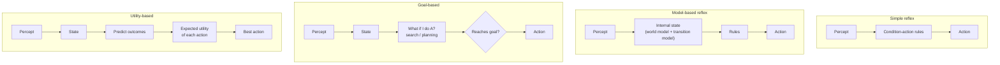

# Agent Types (Tipos de agentes)

> **Summary (EN):** Four agent architectures of increasing power: the simple reflex agent (condition–action rules on the current percept, no memory), the model-based reflex agent (keeps internal state using a world model and a transition model), the goal-based agent (plans and searches toward desired states) and the utility-based agent (maximizes expected utility, handling conflicting goals and uncertainty).

> **En palabras simples (ES):** Hay cuatro tipos de agentes, y cada uno agrega una pieza al anterior: el **reflejo simple** solo reacciona; el **basado en modelo** además recuerda; el **basado en metas** además planifica; el **basado en utilidad** además compara qué tan buena es cada opción. Cualquiera puede además **aprender**. *(Abajo está el pseudocódigo paso a paso, en inglés y en español.)*

## Términos clave

| English | Español | Significado |
|---|---|---|
| Simple reflex agent | Agente reflejo simple | Reglas condición–acción sobre la percepción actual. |
| Condition–action rule | Regla condición–acción | "si *suciedad* entonces *aspirar*". |
| Model-based reflex agent | Agente reflejo basado en modelo | Mantiene un estado interno actualizado. |
| World model / Transition model | Modelo del mundo / de transición | Cómo evoluciona el mundo solo / cómo lo afectan mis acciones. |
| Goal-based agent | Agente basado en objetivos | Elige acciones que lo acercan a un estado meta (búsqueda, planificación). |
| Utility-based agent | Agente basado en utilidad | Elige la acción con máxima utilidad esperada. |

## Explicación

| Tipo | Usa | Ventaja | Limitación |
|---|---|---|---|
| **Reflejo simple** | Solo la percepción actual | Simple y eficiente | Falla si el entorno es parcialmente observable |
| **Reflejo basado en modelo** | Estado interno + modelos del mundo y de transición | Actúa coherentemente sin ver todo | Sigue sin "querer" nada explícito |
| **Basado en objetivos** | Estado + metas + búsqueda/planificación | Se adapta si cambia la meta | Las metas son binarias: no distingue caminos mejores o peores |
| **Basado en utilidad** | Función de utilidad + probabilidades | Maneja objetivos en conflicto (velocidad vs. seguridad) e incertidumbre | Hay que definir bien la utilidad |

- **Reflejo simple:** funciona solo cuando la percepción actual contiene toda la información relevante.
- **Basado en modelo:** en cada paso actualiza su estado interno y después aplica las reglas a ese estado.
- **Basado en objetivos:** necesita saber *a dónde quiere ir*; esto conecta directamente con la unidad de [búsqueda](problem-formulation.md): el *problem-solving agent* es un agente basado en objetivos.
- **Basado en utilidad:** distingue soluciones de distinta calidad. En [optimización](optimization-basics.md), la función objetivo/fitness hace el papel de utilidad.

### Agentes que aprenden (AIMA §2.4.6)

Cualquiera de los cuatro tipos puede construirse **como agente que aprende**. Turing (1950) ya proponía construir máquinas que aprenden y "enseñarles", en vez de programarlas a mano. Cuatro componentes:

| Componente | Función |
|---|---|
| **Performance element** (elemento de desempeño) | Lo que antes llamábamos "el agente": recibe percepciones y elige acciones. |
| **Critic** (crítico) | Dice qué tan bien lo hace el agente respecto a un **estándar de desempeño fijo** y externo (las percepciones solas no dicen si algo es bueno: el jaque mate necesita un estándar que diga que es bueno). |
| **Learning element** (elemento de aprendizaje) | Usa la retroalimentación del crítico para modificar el elemento de desempeño. |
| **Problem generator** (generador de problemas) | Sugiere acciones **exploratorias** que dan experiencias nuevas e informativas (como los experimentos de Galileo). |

El generador de problemas es la versión "agente" de **exploración vs. explotación**: el elemento de desempeño siempre haría lo que hoy parece mejor; explorar un poco puede descubrir algo mucho mejor a largo plazo.

### Diagrama

## Pseudocódigo intuitivo (para explicar en el examen)

> **Idea (ES):** Hay cuatro tipos de agentes, y cada uno agrega una pieza al anterior: el **reflejo simple** solo reacciona; el **basado en modelo** además recuerda; el **basado en metas** además planifica; el **basado en utilidad** además compara qué tan buena es cada opción. Cualquiera puede además **aprender**.

**Antes de empezar: qué significa cada cosa**

| Palabra | Qué es (en simple) | English |
|---|---|---|
| Regla condición–acción | "si pasa X, haz Y" (si está sucio, aspira) | condition–action rule |
| Estado interno | la memoria del agente: lo que cree que pasa aunque no lo vea | internal state |
| Modelo del mundo | lo que el agente sabe de cómo cambia el mundo y qué hacen sus acciones | world model |
| Meta | la situación a la que quiere llegar (estar en Bucarest) | goal |
| Utilidad | un número que dice qué tan bueno es un resultado (más rápido y seguro = más alto) | utility |

**Pasos** — en inglés (como lo escribes en el examen) y debajo en español (para entender):

1. Simple reflex: action = the rule that matches the CURRENT percept.
   - *ES:* Reflejo simple: mira solo lo que ve ahora y aplica una regla. Ejemplo: un termostato ("si hace frío, enciende").
2. Model-based: update an internal state with the last action and the new percept, then apply the rule that matches that state.
   - *ES:* Basado en modelo: primero actualiza su memoria ("ya limpié A"), y decide según esa memoria. Ejemplo: aspiradora que hace un mapa de la casa.
3. Goal-based: update the state, plan a sequence of actions that reaches a GOAL, and do the first action.
   - *ES:* Basado en metas: busca un plan para llegar a la meta. Ejemplo: GPS que calcula la ruta.
4. Utility-based: update the state, estimate the expected utility of each action, and do the best one.
   - *ES:* Basado en utilidad: no solo pregunta "¿llego?" sino "¿qué tan bien llego?". Ejemplo: taxi autónomo que equilibra rapidez, comodidad y seguridad.
5. Learning agent: a critic judges how well the agent did; the learning element improves the agent; a problem generator suggests new things to try.
   - *ES:* Agente que aprende: un "crítico" le pone nota, una parte "aprendiz" mejora sus reglas, y otra parte le propone probar cosas nuevas. Ejemplo: programa de ajedrez que mejora jugando contra sí mismo.

**Ejemplo con números:** aspiradora con nota −1 por cada movimiento. El reflejo simple sigue moviéndose aunque todo esté limpio y pierde puntos. El basado en modelo recuerda "A y B limpios" y se queda quieto (*NoOp*): saca mejor nota.

**Say it in the exam (EN):** "A simple reflex agent reacts only to the current percept, so it fails when it cannot see everything. A model-based agent keeps an internal state. A goal-based agent plans toward a goal, but a goal is only reached or not reached. A utility-based agent gives each outcome a score, so it can trade off goals and handle uncertainty. Any of them can become a learning agent."

**Dilo así (ES):** "El reflejo simple solo reacciona a lo que ve ahora. El basado en modelo además recuerda. El basado en metas planifica para llegar a una meta, pero la meta solo se cumple o no. El basado en utilidad le da una nota a cada resultado y así puede comparar opciones. Cualquiera puede convertirse en un agente que aprende."

## Errores comunes y tips de examen

- La diferencia clave objetivo vs. utilidad: el objetivo es **sí/no**, la utilidad es **un número** que permite comparar.
- Un agente reflejo **con memoria** ya es "basado en modelo".

## Relacionado

- [Intelligent Agents](intelligent-agents.md)
- [Task Environments](task-environments.md)
- [Problem Formulation](problem-formulation.md)
- [State Representation](state-representation.md)

## Fuentes

- [Slides 03](../sources/slides-03-intelligent-agents.md), slides 14–17.
- [AIMA 4e](../sources/book-russell-norvig-aima.md) §2.4 (ingestado, incl. §2.4.6 agentes que aprenden).
