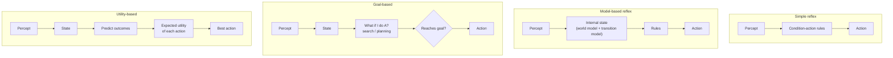

# Agent Types (Tipos de agentes)

> **Summary (EN):** Four agent designs, each adding one piece to the previous one: the simple reflex agent reacts to the current percept with if-then rules; the model-based agent also keeps an internal memory of the world; the goal-based agent also plans actions to reach a goal; the utility-based agent also scores how good each outcome is, so it can trade off goals and handle uncertainty. Any of them can become a learning agent.

> **En palabras simples (ES):** Hay cuatro tipos de agentes, y cada uno agrega una pieza al anterior: el **reflejo simple** solo reacciona; el **basado en modelo** además recuerda; el **basado en metas** además planifica; el **basado en utilidad** además compara qué tan buena es cada opción. Cualquiera puede además **aprender**. *(Abajo está el pseudocódigo paso a paso, en inglés y en español.)*

## Términos clave

| English | Español | Significado (en simple) |
|---|---|---|
| Simple reflex agent | Agente reflejo simple | Reacciona solo a lo que ve ahora, con reglas "si… entonces…". |
| Condition–action rule | Regla condición–acción | "Si pasa esto, haz aquello": si hay suciedad, aspira. |
| Model-based reflex agent | Agente reflejo basado en modelo | Además tiene memoria (estado interno) de lo que no ve. |
| World model / Transition model | Modelo del mundo / de transición | Lo que sabe de cómo cambia el mundo solo / qué cambia cuando él actúa. |
| Goal-based agent | Agente basado en metas | Planifica una secuencia de acciones para llegar a una meta. |
| Utility-based agent | Agente basado en utilidad | Le pone una nota a cada resultado y elige el de mejor nota esperada. |
| Learning agent | Agente que aprende | Mejora con la experiencia. |

## Explicación

### Los cuatro tipos, de más simple a más completo

Piensa en **cuatro choferes**:

1. **Reflejo simple — "reacciona y ya".** Solo mira lo que tiene enfrente y aplica una regla: "si el semáforo está en rojo, frena". **No tiene memoria.** Funciona bien solo si todo lo importante se ve en el momento. Ejemplo: un termostato.
2. **Basado en modelo — "reacciona, pero recuerda".** Guarda en memoria lo que no ve: "el auto de atrás estaba muy cerca hace un segundo". Para eso necesita saber cómo cambia el mundo (*modelo del mundo*) y qué cambian sus acciones (*modelo de transición*). Ejemplo: una aspiradora que hace un mapa de la casa.
3. **Basado en metas — "sabe a dónde va".** Tiene una meta ("llegar al aeropuerto") y **planifica** una ruta para lograrla. Esto conecta con la unidad de [búsqueda](problem-formulation.md): el agente que resuelve problemas buscando es de este tipo. Ejemplo: el GPS. Su límite: una meta solo se cumple o no (sí/no); no distingue una ruta buena de una excelente.
4. **Basado en utilidad — "busca la mejor forma de llegar".** Le pone un **número** (utilidad) a cada resultado: más rápido, más seguro y más cómodo da más puntos. Así puede comparar opciones y manejar metas en conflicto (rapidez vs. seguridad) y la incertidumbre. Ejemplo: un taxi autónomo. En [optimización](optimization-basics.md), la función objetivo hace el papel de la utilidad.

| Tipo | Usa | Ventaja | Limitación |
|---|---|---|---|
| **Reflejo simple** | Solo lo que ve ahora | Simple y rápido | Falla si no ve todo |
| **Basado en modelo** | Memoria + cómo cambia el mundo | Actúa bien aunque no vea todo | No "quiere" llegar a ningún lado |
| **Basado en metas** | Memoria + meta + búsqueda/planificación | Se adapta si cambias la meta | Meta = sí/no: no compara caminos |
| **Basado en utilidad** | Una nota para cada resultado + probabilidades | Compara opciones y maneja incertidumbre | Hay que definir bien la nota |

### Agentes que aprenden (AIMA §2.4.6)

Cualquiera de los cuatro tipos puede además **aprender**. Turing (1950) ya proponía construir máquinas que aprendan y "enseñarles", en vez de programarlo todo a mano. Un agente que aprende tiene **cuatro partes**, como un estudiante con un profesor:

| Parte | Qué hace (en simple) | Analogía |
|---|---|---|
| **Performance element** (elemento de desempeño) | Recibe percepciones y elige acciones: es "el agente" de siempre. | El estudiante que da el examen |
| **Critic** (crítico) | Dice qué tan bien lo hizo, comparando con una nota fija externa. Hace falta porque las percepciones solas no dicen si algo es bueno (que hubo jaque mate no dice que fue bueno; se necesita una regla que lo diga). | El profesor que califica |
| **Learning element** (elemento de aprendizaje) | Usa la calificación del crítico para mejorar al elemento de desempeño. | El estudiante corrigiendo sus errores |
| **Problem generator** (generador de problemas) | Propone probar cosas nuevas para aprender (como los experimentos de Galileo). | El profesor que da ejercicios nuevos |

El generador de problemas representa la idea de **explorar vs. explotar**: si el agente solo hace lo que hoy parece mejor (explotar), nunca descubre algo mejor; probar cosas nuevas de vez en cuando (explorar) puede dar mucho mejores resultados a largo plazo.

### Diagrama

## Pseudocódigo intuitivo (para explicar en el examen)

> **Idea (ES):** Hay cuatro tipos de agentes, y cada uno agrega una pieza al anterior: el **reflejo simple** solo reacciona; el **basado en modelo** además recuerda; el **basado en metas** además planifica; el **basado en utilidad** además compara qué tan buena es cada opción. Cualquiera puede además **aprender**.

**Antes de empezar: qué significa cada cosa**

| Palabra | Qué es (en simple) | English |
|---|---|---|
| Regla condición–acción | "si pasa X, haz Y" (si está sucio, aspira) | condition–action rule |
| Estado interno | la memoria del agente: lo que cree que pasa aunque no lo vea | internal state |
| Modelo del mundo | lo que el agente sabe de cómo cambia el mundo y qué hacen sus acciones | world model |
| Meta | la situación a la que quiere llegar (estar en Bucarest) | goal |
| Utilidad | un número que dice qué tan bueno es un resultado (más rápido y seguro = más alto) | utility |

**Pasos** — en inglés (como lo escribes en el examen) y debajo en español (para entender):

1. Simple reflex: action = the rule that matches the CURRENT percept.
   - *ES:* Reflejo simple: mira solo lo que ve ahora y aplica una regla. Ejemplo: un termostato ("si hace frío, enciende").
2. Model-based: update an internal state with the last action and the new percept, then apply the rule that matches that state.
   - *ES:* Basado en modelo: primero actualiza su memoria ("ya limpié A"), y decide según esa memoria. Ejemplo: aspiradora que hace un mapa de la casa.
3. Goal-based: update the state, plan a sequence of actions that reaches a GOAL, and do the first action.
   - *ES:* Basado en metas: busca un plan para llegar a la meta. Ejemplo: GPS que calcula la ruta.
4. Utility-based: update the state, estimate the expected utility of each action, and do the best one.
   - *ES:* Basado en utilidad: no solo pregunta "¿llego?" sino "¿qué tan bien llego?". Ejemplo: taxi autónomo que equilibra rapidez, comodidad y seguridad.
5. Learning agent: a critic judges how well the agent did; the learning element improves the agent; a problem generator suggests new things to try.
   - *ES:* Agente que aprende: un "crítico" le pone nota, una parte "aprendiz" mejora sus reglas, y otra parte le propone probar cosas nuevas. Ejemplo: programa de ajedrez que mejora jugando contra sí mismo.

**Ejemplo con números:** aspiradora con nota −1 por cada movimiento. El reflejo simple sigue moviéndose aunque todo esté limpio y pierde puntos. El basado en modelo recuerda "A y B limpios" y se queda quieto (*NoOp*): saca mejor nota.

**Say it in the exam (EN):** "A simple reflex agent reacts only to the current percept, so it fails when it cannot see everything. A model-based agent keeps an internal state. A goal-based agent plans toward a goal, but a goal is only reached or not reached. A utility-based agent gives each outcome a score, so it can trade off goals and handle uncertainty. Any of them can become a learning agent."

**Dilo así (ES):** "El reflejo simple solo reacciona a lo que ve ahora. El basado en modelo además recuerda. El basado en metas planifica para llegar a una meta, pero la meta solo se cumple o no. El basado en utilidad le da una nota a cada resultado y así puede comparar opciones. Cualquiera puede convertirse en un agente que aprende."

## Errores comunes y tips de examen

- La diferencia clave entre metas y utilidad: la meta es **sí o no**; la utilidad es **un número** que permite comparar.
- Un agente reflejo que **tiene memoria** ya es "basado en modelo".
- "Agente que aprende" no es un quinto tipo aparte: cualquiera de los cuatro puede aprender.

## Relacionado

- [Intelligent Agents](intelligent-agents.md)
- [Task Environments](task-environments.md)
- [Problem Formulation](problem-formulation.md)
- [State Representation](state-representation.md)

## Fuentes

- [Slides 03](../sources/slides-03-intelligent-agents.md), slides 14–17.
- [AIMA 4e](../sources/book-russell-norvig-aima.md) §2.4 (ingestado, incl. §2.4.6 agentes que aprenden).
