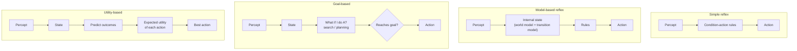

# Agent Types (Tipos de agentes)

> **Summary (EN):** Four agent architectures of increasing power: the simple reflex agent (condition–action rules on the current percept, no memory), the model-based reflex agent (keeps internal state using a world model and a transition model), the goal-based agent (plans and searches toward desired states) and the utility-based agent (maximizes expected utility, handling conflicting goals and uncertainty).

## Términos clave

| English | Español | Significado |
|---|---|---|
| Simple reflex agent | Agente reflejo simple | Reglas condición–acción sobre la percepción actual. |
| Condition–action rule | Regla condición–acción | "si *suciedad* entonces *aspirar*". |
| Model-based reflex agent | Agente reflejo basado en modelo | Mantiene un estado interno actualizado. |
| World model / Transition model | Modelo del mundo / de transición | Cómo evoluciona el mundo solo / cómo lo afectan mis acciones. |
| Goal-based agent | Agente basado en objetivos | Elige acciones que lo acercan a un estado meta (búsqueda, planificación). |
| Utility-based agent | Agente basado en utilidad | Elige la acción con máxima utilidad esperada. |

## Explicación

| Tipo | Usa | Ventaja | Limitación |
|---|---|---|---|
| **Reflejo simple** | Solo la percepción actual | Simple y eficiente | Falla si el entorno es parcialmente observable |
| **Reflejo basado en modelo** | Estado interno + modelos del mundo y de transición | Actúa coherentemente sin ver todo | Sigue sin "querer" nada explícito |
| **Basado en objetivos** | Estado + metas + búsqueda/planificación | Se adapta si cambia la meta | Las metas son binarias: no distingue caminos mejores o peores |
| **Basado en utilidad** | Función de utilidad + probabilidades | Maneja objetivos en conflicto (velocidad vs. seguridad) e incertidumbre | Hay que definir bien la utilidad |

- **Reflejo simple:** funciona solo cuando la percepción actual contiene toda la información relevante.
- **Basado en modelo:** en cada paso actualiza su estado interno y después aplica las reglas a ese estado.
- **Basado en objetivos:** necesita saber *a dónde quiere ir*; esto conecta directamente con la unidad de [búsqueda](problem-formulation.md): el *problem-solving agent* es un agente basado en objetivos.
- **Basado en utilidad:** distingue soluciones de distinta calidad. En [optimización](optimization-basics.md), la función objetivo/fitness hace el papel de utilidad.

### Agentes que aprenden (AIMA §2.4.6)

Cualquiera de los cuatro tipos puede construirse **como agente que aprende**. Turing (1950) ya proponía construir máquinas que aprenden y "enseñarles", en vez de programarlas a mano. Cuatro componentes:

| Componente | Función |
|---|---|
| **Performance element** (elemento de desempeño) | Lo que antes llamábamos "el agente": recibe percepciones y elige acciones. |
| **Critic** (crítico) | Dice qué tan bien lo hace el agente respecto a un **estándar de desempeño fijo** y externo (las percepciones solas no dicen si algo es bueno: el jaque mate necesita un estándar que diga que es bueno). |
| **Learning element** (elemento de aprendizaje) | Usa la retroalimentación del crítico para modificar el elemento de desempeño. |
| **Problem generator** (generador de problemas) | Sugiere acciones **exploratorias** que dan experiencias nuevas e informativas (como los experimentos de Galileo). |

El generador de problemas es la versión "agente" de **exploración vs. explotación**: el elemento de desempeño siempre haría lo que hoy parece mejor; explorar un poco puede descubrir algo mucho mejor a largo plazo.

### Diagrama



## Pseudocódigo intuitivo (para explicar en el examen)

> **Idea (ES):** cada tipo de agente añade una pieza: memoria (modelo), metas (planificar) y utilidad (comparar opciones).

```text
SIMPLE REFLEX:   action = rule that matches the CURRENT percept.
MODEL-BASED:     1. state = UPDATE(state, last action, percept, world model)
                 2. action = rule that matches STATE.
GOAL-BASED:      1. update state (as above)
                 2. search/plan a sequence of actions that reaches a GOAL state
                 3. do the first action of the plan.
UTILITY-BASED:   1. update state
                 2. for each action, estimate the EXPECTED UTILITY of its outcomes
                 3. do the action with the highest expected utility.
LEARNING AGENT:  critic compares behaviour with a fixed performance standard →
                 learning element improves the performance element →
                 problem generator suggests some exploratory actions.
```

**Say it in the exam (EN):** "Simple reflex agents only see the current percept, so they fail in partially observable worlds. Model-based agents keep an internal state. Goal-based agents plan, but goals are binary. Utility-based agents rank outcomes and handle trade-offs and uncertainty. Any of them can be made a learning agent."

## Errores comunes y tips de examen

- La diferencia clave objetivo vs. utilidad: el objetivo es **sí/no**, la utilidad es **un número** que permite comparar.
- Un agente reflejo **con memoria** ya es "basado en modelo".

## Relacionado

- [Intelligent Agents](intelligent-agents.md)
- [Task Environments](task-environments.md)
- [Problem Formulation](problem-formulation.md)
- [State Representation](state-representation.md)

## Fuentes

- [Slides 03](../sources/slides-03-intelligent-agents.md), slides 14–17.
- [AIMA 4e](../sources/book-russell-norvig-aima.md) §2.4 (ingestado, incl. §2.4.6 agentes que aprenden).
