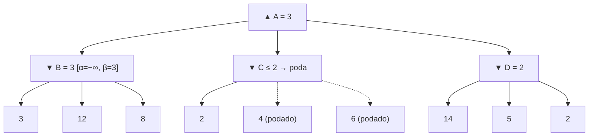

# Alpha–Beta Pruning (Poda alfa–beta)

> **Summary (EN):** Alpha–beta pruning gives exactly the same decision as Minimax but skips branches that cannot change it. α is the best value MAX can already guarantee (a lower bound) and β the best value MIN can already guarantee (an upper bound); when α ≥ β the remaining children of a node are pruned. With the best move ordering the time drops from O(b^m) to O(b^(m/2)), so it can search about twice as deep.

> **En palabras simples (ES):** Es minimax, pero deja de mirar una rama en cuanto se da cuenta de que **no puede cambiar la decisión**. Ejemplo: si ya tengo una jugada que me asegura 3, y en otra rama el rival puede dejarme en 2 o menos, no necesito ver el resto de esa rama: nunca la elegiría. *(Abajo está el pseudocódigo paso a paso, en inglés y en español.)*

## Términos clave

| English | Español | Significado (en simple) |
|---|---|---|
| α (alpha) | Alfa | Lo mínimo que **yo (MAX) ya tengo asegurado** por otra rama. Empieza en −∞. |
| β (beta) | Beta | Lo máximo que **el rival (MIN) ya me tiene limitado** por otra rama. Empieza en +∞. |
| Pruning | Poda | No mirar ramas que no pueden cambiar la decisión. |
| Cut-off | Corte | El momento en que se deja de mirar (cuando α ≥ β). |
| Move ordering | Orden de jugadas | Revisar primero las mejores jugadas hace que se pode más. |

## Explicación

### 1. La idea con un ejemplo de la vida diaria

Estás eligiendo restaurante con un amigo que siempre elige el plato más barato del menú. Ya viste el restaurante A: lo peor que te puede pasar ahí es un plato de 3 puntos. Entras al menú del restaurante B y el primer plato vale 2 puntos. Tu amigo puede elegir ese 2, así que en B te va a ir **2 o peor**. Ya sabes que A (3) es mejor, así que **no necesitas leer el resto del menú de B**. Eso es podar.

### 2. Qué son α y β

- **α (alfa) = "al menos".** Lo mínimo que MAX ya tiene asegurado en el camino actual.
- **β (beta) = "como mucho".** Lo máximo que MIN va a permitir en el camino actual.
- Si en algún momento **α ≥ β**, la rama actual nunca se va a jugar: se poda.

**Reglas de poda (slides 02, s20):**
- En un nodo **MIN**: si su valor ya bajó **hasta α o menos** → podar. MAX nunca vendría aquí; ya tiene algo igual o mejor.
- En un nodo **MAX**: si su valor ya subió **hasta β o más** → podar. MIN nunca dejaría llegar aquí.

```python
def alphabeta(state, depth, alpha, beta, maximizing):
    if terminal(state) or depth == 0:
        return evaluate(state)
    if maximizing:
        value = float('-inf')
        for a in actions(state):
            value = max(value, alphabeta(result(state, a), depth-1, alpha, beta, False))
            alpha = max(alpha, value)
            if alpha >= beta:
                break            # beta cut-off
        return value
    else:
        value = float('inf')
        for a in actions(state):
            value = min(value, alphabeta(result(state, a), depth-1, alpha, beta, True))
            beta = min(beta, value)
            if alpha >= beta:
                break            # alpha cut-off
        return value

# call: alphabeta(root, D, float('-inf'), float('inf'), True)
```

### 3. Ejemplo de AIMA (Fig. 6.5): el mismo árbol de minimax

Hojas: B = {3, 12, 8}, C = {2, 4, 6}, D = {14, 5, 2}.

1. **Rama B:** el rival elige min(3, 12, 8) = 3. Ahora yo tengo asegurado **α = 3**.
2. **Rama C:** la primera hoja es 2. El rival puede dejarme en **2 o menos**, y yo ya tengo 3. Como 3 ≥ 2 (α ≥ β), **no miro 4 ni 6**: se podan.
3. **Rama D:** 14 (D ≤ 14, sigo), 5 (D ≤ 5, sigo), 2 → D = 2. No se pudo podar porque el 2 salió al final.
4. **Resultado:** max(3, ≤2, 2) = **3**, igual que minimax, pero sin revisar 2 hojas.

En fórmula: MINIMAX(raíz) = max(min(3,12,8), min(2,x,y), min(14,5,2)) = max(3, z, 2) con z ≤ 2 = 3. El resultado **no depende** de x ni de y, por eso se pueden saltar.

### 4. El orden importa (AIMA §6.2.4)

- **Orden perfecto** (las mejores jugadas primero): **O(b^(m/2))**. Es como si cada nodo tuviera solo √b hijos (en ajedrez ~6 en vez de 35). Resultado: se puede mirar **el doble de profundo** en el mismo tiempo.
- **Orden al azar:** ≈ O(b^(3m/4)).
- En el ejemplo, D no se pudo podar porque sus peores hojas (para el rival) salieron primero. Si el 2 hubiera salido primero, se podaban las otras dos.
- Trucos para ordenar bien: en ajedrez, probar primero capturas, luego amenazas, avances y retrocesos (queda a un factor ~2 del ideal). **Killer moves:** probar primero las jugadas que funcionaron antes. **Tabla de transposiciones:** guardar el valor de posiciones ya vistas a las que se llega por distinto orden de jugadas; en ajedrez duplica la profundidad alcanzable.

**Aplicación a la tarea.** El gato 4×4 usa minimax sin poda con profundidad 4 "because full minimax is too large". Con alfa–beta y buen orden se podría llegar a ~profundidad 8 con el mismo costo.

### Diagrama

El mismo árbol con alfa–beta: después de ver el 2 bajo C, C ≤ 2 < 3 = α, así que **4 y 6 nunca se revisan**.



## Pseudocódigo intuitivo (para explicar en el examen)

> **Idea (ES):** Es minimax, pero deja de mirar una rama en cuanto se da cuenta de que **no puede cambiar la decisión**. Ejemplo: si ya tengo una jugada que me asegura 3, y en otra rama el rival puede dejarme en 2 o menos, no necesito ver el resto de esa rama: nunca la elegiría.

**Antes de empezar: qué significa cada cosa**

| Símbolo | Qué es (en simple) | English |
|---|---|---|
| α (alfa) | lo mínimo que **yo (MAX) ya tengo asegurado** en otra rama. Empieza en −∞ | best value for MAX so far |
| β (beta) | lo máximo que **el rival (MIN) ya me tiene limitado** en otra rama. Empieza en +∞ | best value for MIN so far |
| v | el valor que va acumulando el nodo actual | current value |
| Podar | no mirar los hijos que faltan, porque no cambian nada | prune |
| −∞ / +∞ | "todavía no hay nada asegurado" | minus / plus infinity |

**Pasos** — en inglés (como lo escribes en el examen) y debajo en español (para entender):

1. Start at the root with α = −∞ and β = +∞.
   - *ES:* Al inicio no hay nada asegurado.
2. Leaf (or depth limit) → return its utility (or EVAL).
   - *ES:* En una hoja, devuelve su puntaje.
3. MAX node: v = −∞. For each child: v = max(v, value of child); α = max(α, v); if α ≥ β → stop, prune the remaining children. Return v.
   - *ES:* En mi turno, voy guardando el mejor valor visto y subo α. Si α llega a ser ≥ β, el rival nunca me dejaría llegar aquí: dejo de mirar.
4. MIN node: v = +∞. For each child: v = min(v, value of child); β = min(β, v); if α ≥ β → stop, prune the remaining children. Return v.
   - *ES:* En el turno del rival, guardo el menor valor visto y bajo β. Si α ≥ β, yo nunca elegiría esta rama: dejo de mirar.
5. Pass α and β down to the children when you visit them.
   - *ES:* Cada hijo recibe los α y β actuales de su padre.

**Ejemplo con números:** mismo árbol que minimax: [3, 12, 8], [2, 4, 6], [14, 5, 2].
1. Primera rama: el rival elige min(3, 12, 8) = 3. Ahora yo tengo asegurado α = 3.
2. Segunda rama: la primera hoja es 2. El rival podrá dejarme en **2 o menos**, y yo ya tengo 3 → α = 3 ≥ β = 2 → **podo** 4 y 6 sin mirarlas.
3. Tercera rama: 14 → 5 → 2; el rival elige 2. No hay poda porque la hoja peor llega al final.
4. Resultado: **3**, igual que minimax, pero sin revisar 2 hojas.

**Say it in the exam (EN):** "Alpha–beta returns exactly the same decision as minimax but skips branches that cannot change it. α is the value MAX can already guarantee and β the value MIN can already guarantee; when α ≥ β the remaining children are pruned. With the best move ordering it examines O(b^(m/2)) nodes, so it can search about twice as deep in the same time."

**Dilo así (ES):** "Alfa–beta da la misma decisión que minimax pero se salta ramas que no pueden cambiarla. α es lo que MAX ya tiene asegurado y β lo que MIN ya tiene asegurado; cuando α ≥ β se podan los hijos restantes. Con el mejor orden revisa O(b^(m/2)) nodos, así que puede mirar el doble de profundo en el mismo tiempo."

## Errores comunes y tips de examen

- Alfa–beta **no cambia el resultado** de minimax: solo ahorra trabajo.
- α solo cambia en nodos MAX y β solo en nodos MIN; los dos se **pasan hacia abajo** a los hijos.
- En el examen, al trazar a mano: escribe [α, β] al lado de cada nodo y tacha las ramas podadas.

## Relacionado

- [Monte Carlo Tree Search](monte-carlo-tree-search.md)
- [Adversarial Search and Minimax](adversarial-search-minimax.md)
- [Tic-tac-toe 4×4 assignment](../assignments/tic-tac-toe-4x4-minimax.md)
- [Search algorithms comparison](../study/search-algorithms-comparison.md)

## Fuentes

- [Slides 02](../sources/slides-02-problem-solving.md), slides 20–22.
- [AIMA 4e](../sources/book-russell-norvig-aima.md) §6.2.3–6.2.4 (ingestado: Fig. 6.5, α/β, orden de jugadas, killer moves, tablas de transposición).
