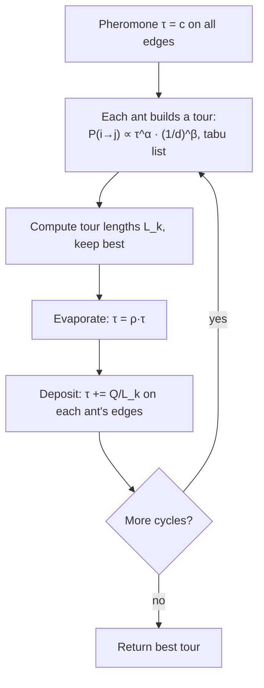

# Ant Colony Optimization (Optimización por colonia de hormigas, ACO / Ant System)

> **Summary (EN):** Inspired by ants that find shortest paths by laying and following pheromone, Ant System (Dorigo, Maniezzo & Colorni, 1996) solves combinatorial problems like the TSP. Each ant builds a tour, choosing the next town with probability ∝ τ^α·η^β (pheromone × visibility 1/d), using a tabu list to avoid revisits. After all ants finish, pheromone evaporates by factor ρ and each ant deposits Q/L_k on its tour's edges, so short tours are reinforced. Best settings in the paper: α = 1, β = 5, ρ = 0.5, one ant per city.

> **En palabras simples (ES):** Las hormigas encuentran el camino más corto dejando un rastro químico (**feromona**). Los caminos cortos se recorren más rápido, así que acumulan más feromona y atraen a más hormigas. En el algoritmo, cada hormiga arma un recorrido eligiendo caminos que están **cerca** y que tienen **mucha feromona**. Al final, la feromona vieja se evapora y los recorridos cortos reciben feromona nueva. *(Abajo está el pseudocódigo paso a paso, en inglés y en español.)*

## Términos clave

| English | Español | Significado |
|---|---|---|
| Pheromone trail τ_ij | Rastro de feromona | Memoria colectiva: cuán bueno ha sido usar la arista (i, j). |
| Visibility η_ij = 1/d_ij | Visibilidad | Heurística greedy: ciudades cercanas son más atractivas. |
| α, β | α, β | Peso de la feromona / de la visibilidad. |
| Evaporation (1 − ρ) | Evaporación | Olvido: debilita caminos poco usados. |
| Tabu list | Lista tabú | Ciudades ya visitadas por la hormiga en el tour actual. |
| Stagnation | Estancamiento | Todas las hormigas hacen el mismo tour. |
| Elitist ants | Hormigas elitistas | Refuerzo extra del mejor tour encontrado. |
| TSP | Problema del viajante | Tour cerrado mínimo que visita cada ciudad una vez. |

## Explicación

**Hormigas reales (slides 04, s13; paper §I).** Al principio caminan al azar. Al encontrar comida vuelven dejando feromona. Otras hormigas tienden a seguir el rastro y lo refuerzan. En el experimento del obstáculo, el camino corto se completa antes → acumula feromona más rápido → atrae más hormigas: **retroalimentación positiva**. La **evaporación** en los caminos débiles permite olvidar las malas decisiones.

**Hormigas artificiales** (diferencias): tienen memoria (lista tabú), no son totalmente ciegas (ven la distancia) y viven en tiempo discreto.

**Regla de transición** (hormiga k en la ciudad i):

```
p_ij^k = [τ_ij]^α · [η_ij]^β  /  Σ_{l ∈ allowed_k} [τ_il]^α · [η_il]^β     if j ∈ allowed_k, else 0
```

**Actualización de feromona** (al terminar el ciclo, *ant-cycle*):

```
τ_ij ← ρ · τ_ij + Σ_k Δτ_ij^k ,     Δτ_ij^k = Q / L_k  if ant k used edge (i,j), else 0
```

**Pseudocódigo (ant-cycle):**

```
initialize τ_ij = c (small) on every edge; place m ants on the n towns
repeat NC_max cycles (or until stagnation):
    for each ant: build a full tour using p_ij^k and its tabu list
    compute each tour length L_k; remember the shortest tour
    evaporate: τ_ij ← ρ·τ_ij;  deposit: τ_ij += Σ_k Q/L_k on used edges
    empty tabu lists
return shortest tour
```

Complejidad O(NC · n² · m) = O(NC · n³) con m ≈ n.

**Parámetros (Oliver30, §IV).**
- Mejor: **α = 1, β = 5, ρ = 0.5**, Q casi irrelevante, **m = n**.
- α = 0 → greedy estocástico con múltiples inicios (sin cooperación).
- α alto → **estancamiento** rápido (todas siguen el mismo camino, a menudo malo).
- Ant-cycle (información global Q/L_k) supera a ant-density (Q por paso) y ant-quantity (Q/d_ij por paso), que usan información local.
- Encontró un tour de 423.741 en Oliver30 (los GA: 424.635).

**Generalidad.** ATSP, Quadratic Assignment, Job-Shop Scheduling; competitivo con tabu search y [simulated annealing](simulated-annealing.md).

### Diagrama



## Pseudocódigo intuitivo (para explicar en el examen)

> **Idea (ES):** Las hormigas encuentran el camino más corto dejando un rastro químico (**feromona**). Los caminos cortos se recorren más rápido, así que acumulan más feromona y atraen a más hormigas. En el algoritmo, cada hormiga arma un recorrido eligiendo caminos que están **cerca** y que tienen **mucha feromona**. Al final, la feromona vieja se evapora y los recorridos cortos reciben feromona nueva.

**Antes de empezar: qué significa cada cosa**

| Símbolo | Qué es (en simple) | English |
|---|---|---|
| τ_ij (tau) | la **feromona** en el camino de la ciudad i a la j: "qué tan popular es" | pheromone |
| d_ij | la distancia de i a j | distance |
| η_ij = 1/d_ij (eta) | la **visibilidad**: más alta si la ciudad está más cerca | visibility (heuristic) |
| α (alfa) | cuánto importa la feromona al elegir | pheromone weight |
| β (beta) | cuánto importa la cercanía al elegir | distance weight |
| ρ (rho) | qué fracción de la feromona **se conserva** en cada ciclo (0.5 = queda la mitad) | trail persistence |
| L_k | el largo total del recorrido de la hormiga k | tour length |
| Q | una constante: cuánta feromona reparte cada hormiga | deposit constant |
| Lista tabú | las ciudades que la hormiga ya visitó y no puede repetir | tabu list |
| ∝ | "proporcional a" | proportional to |

**Pasos** — en inglés (como lo escribes en el examen) y debajo en español (para entender):

1. Put a small amount of pheromone τ on every edge and place the ants on the cities.
   - *ES:* Pon un poquito de feromona en todos los caminos y ubica a las hormigas en las ciudades.
2. Each ant builds a full tour: from city i it moves to an unvisited city j with probability proportional to τ_ij^α · (1/d_ij)^β. A tabu list prevents repeating cities.
   - *ES:* Cada hormiga arma su recorrido. Para elegir la siguiente ciudad calcula un "puntaje" = (feromona)^α × (cercanía)^β para cada ciudad no visitada, y elige al azar dándole más probabilidad a los puntajes altos.
3. Compute each tour length L_k and remember the shortest tour found.
   - *ES:* Mide cuánto midió el recorrido de cada hormiga y guarda el más corto.
4. Evaporate: τ_ij ← ρ · τ_ij on every edge.
   - *ES:* Evaporación: en todos los caminos queda solo una parte de la feromona (con ρ = 0.5, la mitad). Así se olvidan los caminos malos.
5. Deposit: each ant adds Q / L_k to every edge of its tour.
   - *ES:* Cada hormiga deja feromona en los caminos que usó: Q dividido para el largo de su recorrido. Recorrido más corto → más feromona.
6. Repeat steps 2–5 for many cycles and return the shortest tour.
   - *ES:* Repite muchos ciclos y devuelve el recorrido más corto.

**Ejemplo con números:** una hormiga está en la ciudad A y puede ir a B, C o D. Feromona: AB = 1, AC = 2, AD = 1. Distancias: AB = 2, AC = 4, AD = 1. Con α = 1 y β = 2:
- Puntaje B = 1 × (1/2)² = 0.25; C = 2 × (1/4)² = 0.125; D = 1 × (1/1)² = 1. Suma = 1.375.
- Probabilidades: B = 0.25/1.375 = **0.18**, C = **0.09**, D = **0.73**. D gana porque está muy cerca.
- Actualización de AB con ρ = 0.5, Q = 100, y dos hormigas que usaron AB con recorridos de 10 y 20: τ_AB = 0.5·1 + 100/10 + 100/20 = 0.5 + 10 + 5 = **15.5**.

**Say it in the exam (EN):** "Ant Colony Optimization uses stigmergy: ants communicate indirectly through pheromone left on the graph. Each ant builds a tour choosing the next city with probability proportional to pheromone^α times (1/distance)^β, with a tabu list to avoid repeats. After each cycle the pheromone evaporates and each ant deposits Q/L_k on its edges, so short tours are reinforced. Dorigo found α = 1, β = 5, ρ = 0.5 and one ant per city work best."

**Dilo así (ES):** "ACO usa estigmergia: las hormigas se comunican indirectamente con la feromona que dejan en el grafo. Cada hormiga arma un recorrido eligiendo la siguiente ciudad con probabilidad proporcional a feromona^α por (1/distancia)^β, sin repetir ciudades. Después de cada ciclo la feromona se evapora y cada hormiga deja Q/L_k en sus caminos, así los recorridos cortos se refuerzan. Dorigo encontró que α = 1, β = 5, ρ = 0.5 y una hormiga por ciudad funcionan mejor."

## Errores comunes y tips de examen

- ACO es para problemas **combinatorios** (grafos, permutaciones); PSO para **continuos**.
- La visibilidad η es la parte greedy (domina al inicio); la feromona τ es la parte aprendida (domina después).
- Sin evaporación, la feromona crece sin límite y el sistema se estanca.

## Relacionado

- [Swarm Intelligence](swarm-intelligence.md)
- [Optimization Basics](optimization-basics.md)
- [Simulated Annealing](simulated-annealing.md)
- [Heuristics](heuristics.md) (η es una heurística greedy)
- [Metaheuristics comparison](../study/metaheuristics-comparison.md)

## Fuentes

- [Slides 04](../sources/slides-04-optimization.md), slides 12–15.
- [Dorigo, Maniezzo & Colorni 1996](../sources/paper-dorigo-1996-ant-system.md) §I–VII.
