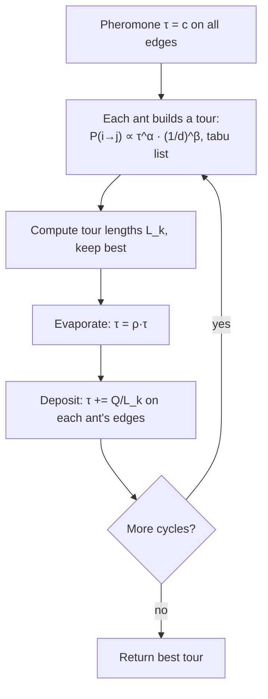

# Ant Colony Optimization (Optimización por colonia de hormigas, ACO / Ant System)

> **Summary (EN):** Real ants find short paths by leaving and following a chemical trail (pheromone). Ant System (Dorigo, Maniezzo and Colorni, 1996) copies this to solve combinatorial problems like the travelling salesman problem (TSP). Each ant builds a tour, choosing the next city with probability proportional to τ^α·η^β (pheromone times closeness 1/d) and using a tabu list so it does not repeat cities. After all ants finish, the pheromone evaporates (only a fraction ρ remains) and each ant adds Q/L_k to the edges of its tour, so short tours get more pheromone. Best settings in the paper: α = 1, β = 5, ρ = 0.5, one ant per city.

> **En palabras simples (ES):** Las hormigas encuentran el camino más corto dejando un rastro químico (**feromona**). Los caminos cortos se recorren más rápido, así que acumulan más feromona y atraen a más hormigas. En el algoritmo, cada hormiga arma un recorrido eligiendo caminos que están **cerca** y que tienen **mucha feromona**. Al final, la feromona vieja se evapora y los recorridos cortos reciben feromona nueva. *(Abajo está el pseudocódigo paso a paso, en inglés y en español.)*

## Términos clave

| English | Español | Significado (en simple) |
|---|---|---|
| TSP | Problema del viajante | Encontrar el recorrido más corto que pase una vez por cada ciudad y vuelva al inicio. |
| Pheromone trail τ_ij (tau) | Rastro de feromona | La "memoria del grupo": qué tan bueno ha sido usar el camino de i a j. |
| Visibility η_ij = 1/d_ij (eta) | Visibilidad | Qué tan cerca está la ciudad j (más cerca = más atractiva). |
| d_ij | Distancia | Distancia entre las ciudades i y j. |
| α (alfa), β (beta) | Pesos | Cuánto importa la feromona / cuánto importa la cercanía. |
| ρ (rho) | Persistencia | Qué fracción de la feromona **se queda** en cada ciclo (1 − ρ es lo que se evapora). |
| Q | Constante | Cuánta feromona reparte cada hormiga. |
| L_k | Largo del recorrido | La distancia total del recorrido de la hormiga k. |
| Tabu list | Lista tabú | Las ciudades que la hormiga ya visitó en este recorrido. |
| Stagnation | Estancamiento | Todas las hormigas terminan haciendo el mismo recorrido. |
| Elitist ants | Hormigas elitistas | Refuerzo extra para el mejor recorrido encontrado. |

## Explicación

### 1. Las hormigas reales (slides 04, s13; paper §I)

1. Al principio caminan **al azar**.
2. Cuando encuentran comida, vuelven al hormiguero dejando **feromona**.
3. Las demás hormigas tienden a seguir el rastro, y al hacerlo lo **refuerzan**.

**El experimento del obstáculo:** si hay dos caminos alrededor de un obstáculo, las hormigas que van por el **corto** vuelven antes, así que ese camino acumula feromona **más rápido** y atrae a más hormigas. Es **retroalimentación positiva**. La feromona de los caminos poco usados se **evapora**, y así la colonia "olvida" las malas decisiones.

**Hormigas artificiales vs. reales:** las del algoritmo tienen **memoria** (la lista tabú), **ven** la distancia a las ciudades y se mueven en pasos de tiempo fijos.

### 2. Cómo elige una hormiga la siguiente ciudad

La hormiga k, que está en la ciudad i, va a la ciudad j con probabilidad:

```
p_ij^k = [τ_ij]^α · [η_ij]^β  /  Σ_{l ∈ allowed_k} [τ_il]^α · [η_il]^β     if j ∈ allowed_k, else 0
```

En palabras:
1. Para cada ciudad j que todavía no visitó, calcula un **puntaje** = (feromona del camino)^α × (cercanía)^β.
2. Divide cada puntaje para la **suma** de todos: eso da probabilidades que suman 1.
3. Elige al azar con esas probabilidades. Las ciudades ya visitadas tienen probabilidad 0.

### 3. Cómo se actualiza la feromona (al terminar todas las hormigas: *ant-cycle*)

```
τ_ij ← ρ · τ_ij + Σ_k Δτ_ij^k ,     Δτ_ij^k = Q / L_k  if ant k used edge (i,j), else 0
```

En palabras:
1. **Evaporación:** en todos los caminos queda solo la fracción ρ de la feromona (con ρ = 0.5, la mitad).
2. **Depósito:** cada hormiga suma Q / L_k en cada camino que usó. Como L_k es el largo de su recorrido, un recorrido **más corto deja más feromona**.

### 4. El algoritmo completo (ant-cycle)

```
initialize τ_ij = c (small) on every edge; place m ants on the n towns
repeat NC_max cycles (or until stagnation):
    for each ant: build a full tour using p_ij^k and its tabu list
    compute each tour length L_k; remember the shortest tour
    evaporate: τ_ij ← ρ·τ_ij;  deposit: τ_ij += Σ_k Q/L_k on used edges
    empty tabu lists
return shortest tour
```

Costo: O(NC · n² · m), que con m ≈ n hormigas es O(NC · n³) (NC = número de ciclos, n = número de ciudades).

### 5. Qué parámetros funcionaron mejor (problema Oliver30, §IV)

- Lo mejor: **α = 1, β = 5, ρ = 0.5**, Q casi no importa, y **una hormiga por ciudad** (m = n).
- Con **α = 0** (ignorar la feromona), cada hormiga solo elige la ciudad más cercana con algo de azar: no hay cooperación.
- Con **α muy alto**, todas siguen muy pronto el mismo camino, muchas veces malo (**estancamiento**).
- Repartir Q/L_k al final del recorrido (*ant-cycle*, información de todo el recorrido) funcionó mejor que dejar feromona en cada paso (*ant-density* y *ant-quantity*, información local).
- Encontró un recorrido de 423.741 para Oliver30 (los algoritmos genéticos llegaban a 424.635).

**También sirve para:** el TSP asimétrico, el problema de asignación cuadrática y horarios de fábricas (*job-shop*). Compite con búsqueda tabú y con el [recocido simulado](simulated-annealing.md).

### Diagrama



## Pseudocódigo intuitivo (para explicar en el examen)

> **Idea (ES):** Las hormigas encuentran el camino más corto dejando un rastro químico (**feromona**). Los caminos cortos se recorren más rápido, así que acumulan más feromona y atraen a más hormigas. En el algoritmo, cada hormiga arma un recorrido eligiendo caminos que están **cerca** y que tienen **mucha feromona**. Al final, la feromona vieja se evapora y los recorridos cortos reciben feromona nueva.

**Antes de empezar: qué significa cada cosa**

| Símbolo | Qué es (en simple) | English |
|---|---|---|
| τ_ij (tau) | la **feromona** en el camino de la ciudad i a la j: "qué tan popular es" | pheromone |
| d_ij | la distancia de i a j | distance |
| η_ij = 1/d_ij (eta) | la **visibilidad**: más alta si la ciudad está más cerca | visibility (heuristic) |
| α (alfa) | cuánto importa la feromona al elegir | pheromone weight |
| β (beta) | cuánto importa la cercanía al elegir | distance weight |
| ρ (rho) | qué fracción de la feromona **se conserva** en cada ciclo (0.5 = queda la mitad) | trail persistence |
| L_k | el largo total del recorrido de la hormiga k | tour length |
| Q | una constante: cuánta feromona reparte cada hormiga | deposit constant |
| Lista tabú | las ciudades que la hormiga ya visitó y no puede repetir | tabu list |
| ∝ | "proporcional a" | proportional to |

**Pasos** — en inglés (como lo escribes en el examen) y debajo en español (para entender):

1. Put a small amount of pheromone τ on every edge and place the ants on the cities.
   - *ES:* Pon un poquito de feromona en todos los caminos y ubica a las hormigas en las ciudades.
2. Each ant builds a full tour: from city i it moves to an unvisited city j with probability proportional to τ_ij^α · (1/d_ij)^β. A tabu list prevents repeating cities.
   - *ES:* Cada hormiga arma su recorrido. Para elegir la siguiente ciudad calcula un "puntaje" = (feromona)^α × (cercanía)^β para cada ciudad no visitada, y elige al azar dándole más probabilidad a los puntajes altos.
3. Compute each tour length L_k and remember the shortest tour found.
   - *ES:* Mide cuánto midió el recorrido de cada hormiga y guarda el más corto.
4. Evaporate: τ_ij ← ρ · τ_ij on every edge.
   - *ES:* Evaporación: en todos los caminos queda solo una parte de la feromona (con ρ = 0.5, la mitad). Así se olvidan los caminos malos.
5. Deposit: each ant adds Q / L_k to every edge of its tour.
   - *ES:* Cada hormiga deja feromona en los caminos que usó: Q dividido para el largo de su recorrido. Recorrido más corto → más feromona.
6. Repeat steps 2–5 for many cycles and return the shortest tour.
   - *ES:* Repite muchos ciclos y devuelve el recorrido más corto.

**Ejemplo con números:** una hormiga está en la ciudad A y puede ir a B, C o D. Feromona: AB = 1, AC = 2, AD = 1. Distancias: AB = 2, AC = 4, AD = 1. Con α = 1 y β = 2:
- Puntaje B = 1 × (1/2)² = 0.25; C = 2 × (1/4)² = 0.125; D = 1 × (1/1)² = 1. Suma = 1.375.
- Probabilidades: B = 0.25/1.375 = **0.18**, C = **0.09**, D = **0.73**. D gana porque está muy cerca.
- Actualización de AB con ρ = 0.5, Q = 100, y dos hormigas que usaron AB con recorridos de 10 y 20: τ_AB = 0.5·1 + 100/10 + 100/20 = 0.5 + 10 + 5 = **15.5**.

**Say it in the exam (EN):** "Ant Colony Optimization uses stigmergy: ants communicate indirectly through pheromone left on the graph. Each ant builds a tour choosing the next city with probability proportional to pheromone^α times (1/distance)^β, with a tabu list to avoid repeats. After each cycle the pheromone evaporates and each ant deposits Q/L_k on its edges, so short tours are reinforced. Dorigo found α = 1, β = 5, ρ = 0.5 and one ant per city work best."

**Dilo así (ES):** "ACO usa estigmergia: las hormigas se comunican indirectamente con la feromona que dejan en el grafo. Cada hormiga arma un recorrido eligiendo la siguiente ciudad con probabilidad proporcional a feromona^α por (1/distancia)^β, sin repetir ciudades. Después de cada ciclo la feromona se evapora y cada hormiga deja Q/L_k en sus caminos, así los recorridos cortos se refuerzan. Dorigo encontró que α = 1, β = 5, ρ = 0.5 y una hormiga por ciudad funcionan mejor."

## Errores comunes y tips de examen

- ACO es para problemas **combinatorios** (rutas, órdenes, grafos); PSO es para problemas **continuos** (números reales).
- La cercanía η es la parte "codiciosa" (pesa más al principio); la feromona τ es lo que el grupo **aprende** (pesa más después).
- Sin evaporación, la feromona crece sin límite y todas las hormigas se estancan en el mismo camino.

## Relacionado

- [Swarm Intelligence](swarm-intelligence.md)
- [Optimization Basics](optimization-basics.md)
- [Simulated Annealing](simulated-annealing.md)
- [Heuristics](heuristics.md) (η es una heurística greedy)
- [Metaheuristics comparison](../study/metaheuristics-comparison.md)

## Fuentes

- [Slides 04](../sources/slides-04-optimization.md), slides 12–15.
- [Dorigo, Maniezzo & Colorni 1996](../sources/paper-dorigo-1996-ant-system.md) §I–VII.
