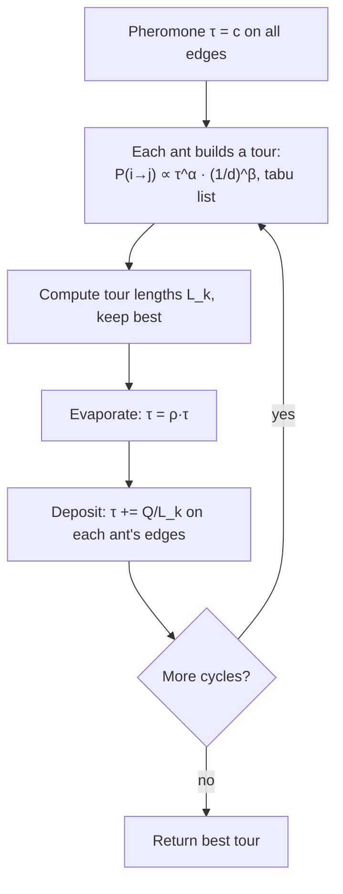

# Ant Colony Optimization (Optimización por colonia de hormigas, ACO / Ant System)

> **Summary (EN):** Inspired by ants that find shortest paths by laying and following pheromone, Ant System (Dorigo, Maniezzo & Colorni, 1996) solves combinatorial problems like the TSP. Each ant builds a tour, choosing the next town with probability ∝ τ^α·η^β (pheromone × visibility 1/d), using a tabu list to avoid revisits. After all ants finish, pheromone evaporates by factor ρ and each ant deposits Q/L_k on its tour's edges, so short tours are reinforced. Best settings in the paper: α = 1, β = 5, ρ = 0.5, one ant per city.

## Términos clave

| English | Español | Significado |
|---|---|---|
| Pheromone trail τ_ij | Rastro de feromona | Memoria colectiva: cuán bueno ha sido usar la arista (i, j). |
| Visibility η_ij = 1/d_ij | Visibilidad | Heurística greedy: ciudades cercanas son más atractivas. |
| α, β | α, β | Peso de la feromona / de la visibilidad. |
| Evaporation (1 − ρ) | Evaporación | Olvido: debilita caminos poco usados. |
| Tabu list | Lista tabú | Ciudades ya visitadas por la hormiga en el tour actual. |
| Stagnation | Estancamiento | Todas las hormigas hacen el mismo tour. |
| Elitist ants | Hormigas elitistas | Refuerzo extra del mejor tour encontrado. |
| TSP | Problema del viajante | Tour cerrado mínimo que visita cada ciudad una vez. |

## Explicación

**Hormigas reales (slides 04, s13; paper §I).** Al principio caminan al azar. Al encontrar comida vuelven dejando feromona. Otras hormigas tienden a seguir el rastro y lo refuerzan. En el experimento del obstáculo, el camino corto se completa antes → acumula feromona más rápido → atrae más hormigas: **retroalimentación positiva**. La **evaporación** en los caminos débiles permite olvidar las malas decisiones.

**Hormigas artificiales** (diferencias): tienen memoria (lista tabú), no son totalmente ciegas (ven la distancia) y viven en tiempo discreto.

**Regla de transición** (hormiga k en la ciudad i):

```
p_ij^k = [τ_ij]^α · [η_ij]^β  /  Σ_{l ∈ allowed_k} [τ_il]^α · [η_il]^β     if j ∈ allowed_k, else 0
```

**Actualización de feromona** (al terminar el ciclo, *ant-cycle*):

```
τ_ij ← ρ · τ_ij + Σ_k Δτ_ij^k ,     Δτ_ij^k = Q / L_k  if ant k used edge (i,j), else 0
```

**Pseudocódigo (ant-cycle):**

```
initialize τ_ij = c (small) on every edge; place m ants on the n towns
repeat NC_max cycles (or until stagnation):
    for each ant: build a full tour using p_ij^k and its tabu list
    compute each tour length L_k; remember the shortest tour
    evaporate: τ_ij ← ρ·τ_ij;  deposit: τ_ij += Σ_k Q/L_k on used edges
    empty tabu lists
return shortest tour
```

Complejidad O(NC · n² · m) = O(NC · n³) con m ≈ n.

**Parámetros (Oliver30, §IV).**
- Mejor: **α = 1, β = 5, ρ = 0.5**, Q casi irrelevante, **m = n**.
- α = 0 → greedy estocástico con múltiples inicios (sin cooperación).
- α alto → **estancamiento** rápido (todas siguen el mismo camino, a menudo malo).
- Ant-cycle (información global Q/L_k) supera a ant-density (Q por paso) y ant-quantity (Q/d_ij por paso), que usan información local.
- Encontró un tour de 423.741 en Oliver30 (los GA: 424.635).

**Generalidad.** ATSP, Quadratic Assignment, Job-Shop Scheduling; competitivo con tabu search y [simulated annealing](simulated-annealing.md).

### Diagrama



## Pseudocódigo intuitivo (para explicar en el examen)

> **Idea (ES):** cada hormiga arma un recorrido eligiendo caminos cortos y con mucha feromona; al final los buenos recorridos reciben más feromona y la vieja se evapora.

```text
ANT SYSTEM for the TSP:
1. Put a small amount of pheromone τ on every edge; place m ants on the cities.
2. Repeat for a number of cycles:
   a. Each ant builds a full tour. From city i it moves to an unvisited city j
      with probability ∝ τ_ij^α · (1/d_ij)^β   (pheromone × closeness).
      A tabu list stops it from revisiting cities.
   b. Compute each tour length L_k; remember the shortest tour.
   c. Evaporate: τ_ij ← ρ · τ_ij on every edge.
   d. Deposit: every ant adds Q / L_k to each edge of its tour.
3. Return the shortest tour found.
```

**Say it in the exam (EN):** "ACO uses stigmergy: ants communicate indirectly through pheromone on the graph. Short tours get more pheromone (positive feedback) and evaporation forgets bad choices. α weighs the pheromone, β the distance heuristic; Dorigo found α = 1, β = 5, ρ = 0.5 and one ant per city work best."

## Errores comunes y tips de examen

- ACO es para problemas **combinatorios** (grafos, permutaciones); PSO para **continuos**.
- La visibilidad η es la parte greedy (domina al inicio); la feromona τ es la parte aprendida (domina después).
- Sin evaporación, la feromona crece sin límite y el sistema se estanca.

## Relacionado

- [Swarm Intelligence](swarm-intelligence.md)
- [Optimization Basics](optimization-basics.md)
- [Simulated Annealing](simulated-annealing.md)
- [Heuristics](heuristics.md) (η es una heurística greedy)
- [Metaheuristics comparison](../study/metaheuristics-comparison.md)

## Fuentes

- [Slides 04](../sources/slides-04-optimization.md), slides 12–15.
- [Dorigo, Maniezzo & Colorni 1996](../sources/paper-dorigo-1996-ant-system.md) §I–VII.
