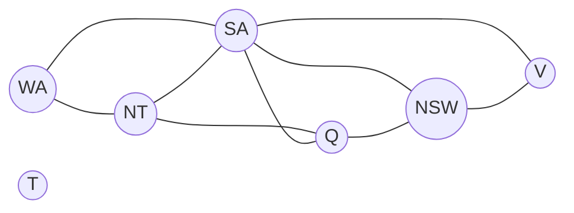

# Constraint Satisfaction Problems (Problemas de satisfacción de restricciones, CSP)

> **Summary (EN):** A CSP describes a problem as variables, the values each can take (domains) and rules between them (constraints); a solution gives every variable a value without breaking any rule. Because the rules are visible, general techniques work for any CSP: constraint propagation (crossing out impossible values, e.g. AC-3), backtracking search with good ordering (MRV and degree for variables, least-constraining value for values), forward checking or MAC during search, smarter backtracking (backjumping), min-conflicts local search, and using the shape of the constraint graph (tree-shaped CSPs are solved in O(n·d²)). Examples: map coloring, Sudoku, N-queens, job scheduling.

> **En palabras simples (ES):** Un CSP es un rompecabezas de "llenar casillas respetando reglas", como colorear un mapa sin que dos vecinos tengan el mismo color, o un Sudoku. Se llena **una casilla a la vez**: empieza por la más difícil (la que tiene menos opciones), prueba primero el valor que menos estorba a los vecinos, y después de cada paso tacha las opciones que ya no sirven. Si te quedas sin opciones, borra el último paso y prueba otra (*backtracking*). *(Abajo está el pseudocódigo paso a paso, en inglés y en español.)*

## Términos clave

| English | Español | Significado (en simple) |
|---|---|---|
| Variables X | Variables | Las "casillas" por llenar (cada región del mapa, cada celda del Sudoku). |
| Domains D | Dominios | Los valores que puede tomar cada casilla ({rojo, verde, azul}, {1..9}). |
| Constraints C | Restricciones | Las reglas (dos vecinos no pueden tener el mismo color). |
| Constraint ⟨scope, rel⟩ | Restricción como pareja | Qué variables toca + qué combinaciones permite, p. ej. ⟨(X₁, X₂), X₁ > X₂⟩. |
| Assignment | Asignación | Darle un valor a una o varias variables. |
| Consistent / complete | Consistente / completa | No rompe ninguna regla / todas las variables tienen valor. |
| Constraint graph | Grafo de restricciones | Dibujo: un punto por variable y una línea por cada regla entre dos variables. |
| Unary / binary / global constraint | Restricción unaria / binaria / global | Toca 1 variable / 2 variables / muchas (como **Alldiff**: "todas distintas"). |
| Node / arc / path consistency | Consistencia de nodo / arco / camino | Niveles de "tachar valores imposibles" (ver tabla abajo). |
| AC-3 | AC-3 | El algoritmo clásico para tachar valores sin pareja válida. |
| MRV / degree | Menos valores restantes / grado | Reglas para elegir **qué variable** llenar primero. |
| LCV | Valor menos restrictivo | Regla para elegir **qué valor** probar primero. |
| Forward checking / MAC | Comprobación hacia adelante / mantener consistencia de arcos | Tachar valores en los vecinos después de cada asignación. |
| Backjumping | Salto atrás | Al fallar, volver directo a la variable culpable (no solo a la última). |
| Min-conflicts | Mínimos conflictos | Búsqueda local: llenar todo y luego ir arreglando. |

## Explicación

### 1. ¿Por qué escribir un problema como CSP? (AIMA §5.1)

En la búsqueda normal, el estado es una "caja negra": solo puedes preguntar "¿ya es la meta?". En un CSP puedes **ver las partes** del estado. Eso permite dos cosas muy útiles:

- En cuanto una asignación a medias rompe una regla, descartas **todas** las formas de completarla de una sola vez.
- Sabes **qué variables** causan el problema.

Ejemplo: al colorear Australia, si fijas SA (Australia del Sur) = azul, sus 5 vecinos pasan de 3⁵ = 243 combinaciones posibles a 2⁵ = 32 (un 87 % menos), porque ninguno puede ser azul.

En general, resolver CSPs es difícil (NP-completo), pero estas técnicas ayudan muchísimo en la práctica.

### 2. Ejemplos

- **Colorear el mapa de Australia:** variables {WA, NT, Q, NSW, V, SA, T} (los estados del país); dominio {rojo, verde, azul}; reglas SA ≠ WA, SA ≠ NT, … (9 fronteras).
- **Sudoku:** 81 variables (las celdas), dominio {1..9}, **27 reglas "todas distintas"** (9 filas, 9 columnas, 9 cajas).
- **N-reinas:** Qᵢ = fila de la reina de la columna i ([N-Queens](n-queens.md)).
- **Horarios de una fábrica (*job-shop scheduling*):** cada variable es la hora de inicio de una tarea; reglas de orden (`AxleF + 10 ≤ WheelRF`: la rueda va después del eje, que tarda 10) y de que dos tareas no usen la misma herramienta a la vez.
- **Criptoaritmética:** TWO + TWO = FOUR, donde cada letra es un dígito distinto (Alldiff(F, T, U, W, R, O)) y se agregan variables para "lo que se lleva" en la suma.

**Variantes:** con dominios finitos (lo normal), infinitos (números enteros) o continuos (números reales, como en programación lineal). Las reglas pueden ser **obligatorias** o **de preferencia** ("prefiero no tener clase el viernes"); con preferencias se vuelve un problema de optimización.

### 3. Tachar valores imposibles: propagación de restricciones (AIMA §5.2)

La idea: antes o durante la búsqueda, **borrar de cada dominio los valores que seguro no pueden funcionar**. Hay varios niveles:

| Nivel | Qué revisa (en simple) | Ejemplo |
|---|---|---|
| **Consistencia de nodo** | Cada valor cumple las reglas de **una sola** variable | Si SA no puede ser verde, su dominio queda {rojo, azul} |
| **Consistencia de arco** | Para cada valor de X existe **al menos un** valor de Y que lo acompañe | Con Y = X² y dígitos 0–9: X ∈ {0,1,2,3}, Y ∈ {0,1,4,9} |
| **Consistencia de camino** | Para cada pareja válida de dos variables existe un valor válido para una **tercera** | Detecta que Australia con 2 colores es imposible (WA, SA y NT se tocan las tres); la de arco no lo detecta |
| **k-consistencia** | Lo mismo con k variables | 1 = nodo, 2 = arco, 3 = camino. Si llegas a "n-consistente" se resuelve sin retroceder, pero lograrlo cuesta demasiado |

**AC-3, paso a paso:**
1. Pon en una lista todos los **arcos** (cada regla entre X e Y da dos arcos: (X, Y) e (Y, X)).
2. Saca un arco (Xᵢ, Xⱼ) y **REVISE**: borra de Xᵢ los valores que no tienen ninguna pareja válida en Xⱼ.
3. Si Xᵢ perdió valores, vuelve a meter en la lista los arcos (Xₖ, Xᵢ) de sus otros vecinos, porque quizá ellos perdieron su pareja.
4. Si algún dominio queda vacío → **no hay solución**.

Costo: **O(c·d³)**, con c = número de arcos y d = tamaño del dominio. AC-3 solo ya resuelve los Sudokus fáciles; los difíciles necesitan búsqueda.

**Reglas globales:** si m variables deben ser todas distintas pero solo hay n valores posibles y m > n, es imposible (por ejemplo, detecta que {WA = rojo, NSW = rojo} falla más adelante). **Propagación de límites**, para recursos: si F₁ ∈ [0, 165], F₂ ∈ [0, 385] y F₁ + F₂ = 420, entonces F₁ ∈ [35, 165] y F₂ ∈ [255, 385].

### 4. Búsqueda con retroceso: *backtracking* (AIMA §5.3)

Un DFS ingenuo probaría las variables en cualquier orden y tendría n!·dⁿ hojas. Pero en un CSP **el orden en que llenas las casillas no cambia el resultado** (es conmutativo), así que basta llenar **una variable por nivel**: dⁿ hojas.

**¿Qué variable llenar primero?**
- **MRV** (*minimum remaining values*, "la más difícil primero"): la que tiene **menos valores posibles**. Si alguna tiene 0, el fallo se detecta enseguida.
- **Grado** (para desempatar): la que tiene **más reglas con variables aún vacías**. En Australia, SA tiene grado 5.

**¿Qué valor probar primero?**
- **LCV** (*least constraining value*): el que **menos opciones les quita a los vecinos**.

¿Por qué la variable "que más falla" pero el valor "que menos falla"? Todas las variables hay que llenarlas igual, así que conviene descubrir pronto si algo no funciona. En cambio, solo necesitamos **una** solución, así que conviene probar primero el valor con más chances.

**Tachar mientras buscas:**
- **Forward checking:** al asignar X, borra de cada **vecino** de X los valores incompatibles. Detecta que {WA = rojo, Q = verde, V = azul} no sirve (SA se queda sin colores). Pero **no** detecta que NT y SA quedaron ambos solo con {azul} siendo vecinos.
- **MAC** (*Maintaining Arc Consistency*): después de asignar, corre AC-3 desde los vecinos y **sigue propagando**. Es más fuerte que forward checking.

**Retroceder mejor:** el retroceso normal vuelve a la **última** variable asignada, aunque no tenga la culpa (¡cambiar el color de Tasmania no arregla SA!). **Backjumping** vuelve directo a la variable que **causó** el conflicto. Además, se pueden **guardar los conflictos encontrados** para no repetirlos (*constraint learning*).

### 5. Búsqueda local: min-conflicts (AIMA §5.4)

Otra estrategia: **llenar todo de una vez** (aunque haya conflictos) y luego **ir arreglando**: elige al azar una variable que rompe alguna regla y dale el valor que **menos reglas rompe**. Repite.

Funciona sorprendentemente bien: resuelve el problema del **millón de reinas en unos 50 pasos**, y redujo la planificación semanal del telescopio Hubble de 3 semanas a ~10 minutos. También sirve para **reparar** un plan cuando cambia un poco el problema (por ejemplo, un horario con un cambio).

### 6. Aprovechar la forma del problema (AIMA §5.5) *(extra)*

- **Partes independientes:** Tasmania no toca a nadie → se resuelve aparte. Dividir en partes hace el trabajo mucho menor.
- **Si el grafo de reglas es un árbol** (sin ciclos): se puede resolver **sin retroceder**, en **O(n·d²)**. Se ordenan las variables de la raíz a las hojas, se tacha de las hojas hacia la raíz y se asigna de la raíz hacia las hojas.
- **Cortar ciclos (*cutset conditioning*):** si quitas SA, Australia queda como un árbol. Pruebas cada valor de SA y resuelves el árbol que queda.
- **Descomposición en árbol:** agrupar variables para formar un árbol; funciona bien si los grupos son pequeños.

## Pseudocódigo

```
function BACKTRACKING-SEARCH(csp) returns a solution or failure
    return BACKTRACK(csp, {})

function BACKTRACK(csp, assignment) returns a solution or failure
    if assignment is complete: return assignment
    var ← SELECT-UNASSIGNED-VARIABLE(csp, assignment)          # MRV, degree
    for each value in ORDER-DOMAIN-VALUES(csp, var, assignment): # LCV
        if value is consistent with assignment:
            add {var = value} to assignment
            inferences ← INFERENCE(csp, var, assignment)        # forward checking / MAC
            if inferences ≠ failure:
                add inferences to csp
                result ← BACKTRACK(csp, assignment)
                if result ≠ failure: return result
                remove inferences from csp
            remove {var = value} from assignment
    return failure

function AC-3(csp) returns false if an inconsistency is found, true otherwise
    queue ← all arcs in csp
    while queue not empty:
        (Xi, Xj) ← POP(queue)
        if REVISE(csp, Xi, Xj):
            if size of Di = 0: return false
            for each Xk in NEIGHBORS(Xi) − {Xj}: add (Xk, Xi) to queue
    return true

function REVISE(csp, Xi, Xj) returns true iff Di was revised
    revised ← false
    for each x in Di:
        if no value y in Dj satisfies the constraint between Xi and Xj:
            delete x from Di;  revised ← true
    return revised

function MIN-CONFLICTS(csp, max_steps) returns a solution or failure
    current ← an initial complete assignment
    for i = 1 to max_steps:
        if current is a solution: return current
        var ← a randomly chosen conflicted variable
        value ← the value v for var that minimizes CONFLICTS(csp, var, v, current)
        set var = value in current
    return failure
```

## Ejemplo — Sudoku de la tarea (HW01, tableros oficiales)

Número de asignaciones que hizo cada versión:

| Tablero | Ingenuo | MRV | Forward checking + MRV |
|---|---|---|---|
| 1 (30 números dados) | 4 208 | 51 | 51 |
| 2 (22 números dados) | 335 637 | 4 036 | **309** |

Por qué: MRV llena primero las celdas con menos opciones (descubre los errores pronto), y forward checking tacha valores en las celdas vecinas, así detecta un callejón sin salida antes de seguir bajando. Ver [HW01](../assignments/deber-1-search-problems.md).

### Diagrama

Grafo de restricciones del mapa de Australia (AIMA Fig. 5.1): SA tiene grado 5 (toca a 5 estados); T (Tasmania) no toca a nadie, así que se resuelve aparte.



## Pseudocódigo intuitivo (para explicar en el examen)

> **Idea (ES):** Un CSP es un rompecabezas de "llenar casillas respetando reglas", como colorear un mapa sin que dos vecinos tengan el mismo color, o un Sudoku. Se llena **una casilla a la vez**: empieza por la más difícil (la que tiene menos opciones), prueba primero el valor que menos estorba a los vecinos, y después de cada paso tacha las opciones que ya no sirven. Si te quedas sin opciones, borra el último paso y prueba otra (*backtracking*).

**Antes de empezar: qué significa cada cosa**

| Palabra | Qué es (en simple) | English |
|---|---|---|
| Variable | una casilla por llenar (una región del mapa) | variable |
| Dominio | los valores que puede tomar (rojo, verde, azul) | domain |
| Restricción | una regla (dos vecinos no pueden tener el mismo color) | constraint |
| Asignación | ponerle un valor a una variable | assignment |
| Backtracking | deshacer el último paso y probar otra opción | backtracking |
| MRV | elige la variable con **menos valores posibles** ("la más difícil primero") | minimum remaining values |
| Grado | para desempatar: la variable con más vecinos sin asignar | degree heuristic |
| LCV | prueba primero el valor que **menos opciones quita** a los vecinos | least constraining value |
| Forward checking | después de asignar, tacha ese valor en los vecinos | forward checking |
| Arco (X, Y) | la regla entre dos variables vista desde X | arc |

**Pasos** — en inglés (como lo escribes en el examen) y debajo en español (para entender):

*Backtracking search*

1. If every variable has a value → return the assignment.
   - *ES:* Si ya llenaste todo, terminaste.
2. Choose the unassigned variable with the FEWEST legal values (MRV); break ties with the one that has the most constraints (degree).
   - *ES:* Elige la casilla con menos opciones (la que más probablemente falle: mejor saberlo pronto).
3. Try its values, starting with the one that removes the fewest options from the neighbors (LCV).
   - *ES:* Prueba primero el valor que deja más libertad a los demás.
4. If the value breaks no rule: assign it, and remove now-impossible values from each neighbor (forward checking). If a neighbor runs out of values → undo and try the next value.
   - *ES:* Ponlo y tacha ese valor en los vecinos. Si un vecino se queda sin opciones, este valor no sirve: quítalo y prueba otro.
5. Call the algorithm again for the next variable. If it fails → undo this value and try the next one. If no value works → return failure (backtrack).
   - *ES:* Sigue con la próxima casilla. Si más adelante todo falla, vuelve, cambia este valor y sigue probando. Si ningún valor sirve, avisa al nivel de arriba que retroceda.

*AC-3 (arc consistency)*

1. Put every arc (X, Y) in a queue.
   - *ES:* Haz una lista con cada pareja de variables conectadas por una regla.
2. Take an arc (X, Y) and delete from X every value that has no compatible value in Y.
   - *ES:* Borra de X los valores que no tienen "pareja válida" en Y.
3. If X lost values → add (Z, X) again for every other neighbor Z of X.
   - *ES:* Si X perdió valores, revisa otra vez a los vecinos de X, porque pueden haberse quedado sin pareja.
4. If a domain becomes empty → no solution. Repeat until the queue is empty.
   - *ES:* Si alguna variable se queda sin valores, no hay solución.

*Min-conflicts (local search)*

1. Start with all variables filled at random; then repeat: pick a variable that breaks a rule and give it the value with the fewest conflicts.
   - *ES:* Llena todo al azar y ve arreglando: toma una casilla con conflicto y ponle el valor que menos reglas rompe.

**Ejemplo con números:** colorear Australia con {rojo, verde, azul}. Pongo WA = rojo → tacho rojo en sus vecinos NT y SA. Pongo Q = verde → tacho verde en NT, SA y NSW. Quedan NT = {azul}, SA = {azul}, NSW = {rojo, azul}. MRV elige NT o SA (solo 1 opción). Ojo: NT y SA son vecinos y ambos solo tienen azul → no hay solución por aquí. Forward checking no lo nota; AC-3 sí lo detecta enseguida.

**Say it in the exam (EN):** "A CSP has variables, domains and constraints; a solution gives every variable a value without breaking any constraint. Backtracking assigns one variable at a time and undoes the last choice when it gets stuck. MRV chooses the variable with the fewest legal values (fail first), LCV tries the value that leaves the most options to the neighbors, and forward checking removes inconsistent values from neighbors after each assignment. AC-3 enforces arc consistency and detects failures earlier."

**Dilo así (ES):** "Un CSP tiene variables, dominios y restricciones; una solución da un valor a cada variable sin romper ninguna restricción. Backtracking asigna una variable a la vez y deshace la última decisión cuando se atasca. MRV elige la variable con menos opciones, LCV prueba el valor que más libertad deja, y forward checking tacha valores imposibles en los vecinos. AC-3 revisa todas las parejas y detecta fallas antes."

## Errores comunes y tips de examen

- MRV elige la **variable**; LCV elige el **valor**; el grado sirve para desempatar MRV.
- Forward checking **no** es lo mismo que consistencia de arco completa: solo revisa los vecinos de la variable que acabas de llenar, sin seguir propagando.
- La consistencia de arco no detecta que "Australia con 2 colores" es imposible; la de camino sí.
- Si el grafo es un árbol → se resuelve en O(n·d²) sin retroceder. Es una pregunta típica de "¿por qué importa la estructura?".
- "Generar todo y luego probar" vs. backtracking: ver la tabla de [N-Queens](n-queens.md) y el cálculo 9⁵⁹ del Sudoku en HW01.

## Relacionado

- [N-Queens](n-queens.md)
- [State Representation](state-representation.md)
- [Uninformed Search](uninformed-search.md) (DFS, backtracking)
- [Local Search and Hill Climbing](local-search-hill-climbing.md) (min-conflicts)
- [Prolog](prolog.md) (Prolog hace backtracking automáticamente)
- [HW01](../assignments/deber-1-search-problems.md)

## Fuentes

- [Slides 02](../sources/slides-02-problem-solving.md), slides 23–24.
- [AIMA 4e](../sources/book-russell-norvig-aima.md) cap. 5 completo (ingestado: §5.1 definiciones y ejemplos, §5.2 AC-3 y consistencias, §5.3 backtracking/heurísticas/FC/MAC/backjumping, §5.4 min-conflicts, §5.5 estructura).
