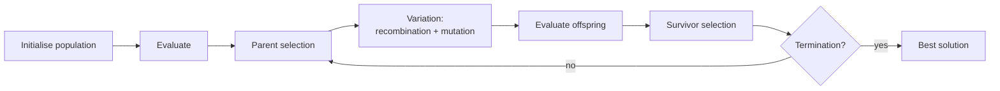

# Evolutionary Computation (Computación evolutiva)

> **Summary (EN):** Evolutionary computation applies the mechanisms of biological evolution — variation, selection and heredity — to optimization. It has several historical dialects: evolutionary programming (Lawrence Fogel, 1960s, evolving finite-state machines), evolution strategies (Rechenberg and Schwefel, 1970s, real-valued parameter optimization) and genetic algorithms (John Holland, 1975, bit strings with crossover). All share the same loop: initialize a population, evaluate fitness, select parents, recombine and mutate, select survivors, repeat.

> **En palabras simples (ES):** Imita la evolución de las especies. Tienes una **población** de soluciones. Las mejores tienen más probabilidad de "tener hijos"; los hijos mezclan partes de sus padres y a veces tienen un cambio al azar. Generación tras generación, la población mejora. *(Abajo está el pseudocódigo paso a paso, en inglés y en español.)*

## Términos clave

| English | Español | Significado |
|---|---|---|
| Population | Población | Conjunto de soluciones candidatas (individuos). |
| Individual / chromosome / genotype | Individuo / cromosoma / genotipo | Una solución codificada. |
| Phenotype | Fenotipo | La solución decodificada (p. ej. (x, y)). |
| Fitness | Aptitud | Calidad de un individuo. |
| Parent / survivor selection | Selección de padres / supervivientes | Quién se reproduce / quién pasa a la siguiente generación. |
| Recombination (crossover) | Recombinación (cruce) | Combinar dos padres. |
| Mutation | Mutación | Cambio aleatorio pequeño. |
| Generation / epoch | Generación / época | Una iteración del ciclo. |

## Explicación

**Principios biológicos (slides 04, s3):** *adaptación* (sobrevivir y comportarse bien en el entorno), *herencia* (pasar rasgos a la siguiente generación), *selección natural* (los más aptos tienen más probabilidad de pasar sus rasgos).

**Esquema general de un algoritmo evolutivo** (Eiben & Smith Fig. 3.1; componentes y selección en [EA Selection](ea-selection-and-population-management.md), operadores en [EA Representation and Variation](ea-representation-and-variation.md)):

```
initialize population with random candidates
evaluate each candidate
repeat until termination:
    select parents
    recombine pairs of parents  -> offspring
    mutate offspring
    evaluate offspring
    select individuals for the next generation
```

**Dialectos históricos:**

| Dialecto | Origen | Representación típica | Operador principal |
|---|---|---|---|
| Evolutionary programming | L. J. Fogel, 1960 | Máquinas de estados finitos | Mutación |
| Evolution strategies | Rechenberg y Schwefel, 1970 | Vectores reales | Mutación gaussiana auto-adaptativa |
| [Genetic algorithms](genetic-algorithms.md) | J. H. Holland, 1975 | Cadenas de bits | Cruce (+ mutación) |
| Genetic programming | Koza, ~1990 (complemento) | Árboles (programas) | Cruce de subárboles |

Holland (1992) explica por qué los primeros intentos de finales de los 50 fallaron: dependían solo de la **mutación**; la clave fue añadir **apareamiento (cruce)**.

**Componentes que hay que especificar (Eiben & Smith §3.2):** representación (genotipo ↔ fenotipo), función de evaluación (aptitud), población (multiconjunto de tamaño fijo), selección de padres, operadores de variación (mutación = aridad 1, recombinación = aridad ≥ 2), selección de supervivientes (reemplazo), inicialización y condición de terminación.

**Evolución natural vs. artificial (Tabla 3.6):**

| | Natural | Artificial (EA) |
|---|---|---|
| Aptitud | Se observa *a posteriori* | Se define *a priori* y guía la selección |
| Selección | Fuerza compleja (entorno, otras especies) | Operador aleatorio con probabilidades según la aptitud |
| Genotipo → fenotipo | Proceso bioquímico complejo | Transformación matemática simple |
| Variación | 1 o 2 padres | 1, 2 o muchos padres |
| Ejecución | Paralela y descentralizada | Centralizada, nacimientos y muertes sincronizados |
| Población | Estructurada espacialmente, tamaño variable | Normalmente sin estructura (*panmictic*), tamaño constante |

"*If you have variation, heredity, and selection, then you must get evolution*" (Dennett).

**¿Por qué usar EAs? (§3.7):** muchos problemas reales se reducen a problemas cuyo número de soluciones crece exponencialmente (TSP: n!/2 tours); los métodos exactos no escalan y los EA dan buenas soluciones aproximadas sin requisitos fuertes sobre la función (no necesitan derivadas ni convexidad).

**Relación con la inteligencia de enjambre.** [PSO](particle-swarm-optimization.md) también usa una población y una medida de aptitud, pero no hay selección ni reproducción: las mismas partículas se mueven. Kennedy y Eberhart lo ubican "entre los GA y la programación evolutiva".

### Diagrama



## Pseudocódigo intuitivo (para explicar en el examen)

> **Idea (ES):** Imita la evolución de las especies. Tienes una **población** de soluciones. Las mejores tienen más probabilidad de "tener hijos"; los hijos mezclan partes de sus padres y a veces tienen un cambio al azar. Generación tras generación, la población mejora.

**Antes de empezar: qué significa cada cosa**

| Palabra | Qué es (en simple) | English |
|---|---|---|
| Individuo | una solución candidata | individual |
| Población | el grupo de soluciones en una generación | population |
| Aptitud (fitness) | la nota de cada solución: qué tan buena es | fitness |
| Generación | una vuelta completa del ciclo | generation |
| Selección | elegir quién se reproduce o sobrevive (los mejores tienen ventaja) | selection |
| Recombinación (cruce) | mezclar dos padres para formar hijos | recombination / crossover |
| Mutación | un cambio pequeño al azar en un hijo | mutation |

**Pasos** — en inglés (como lo escribes en el examen) y debajo en español (para entender):

1. Create a random population and compute everyone's fitness.
   - *ES:* Crea soluciones al azar y ponle nota a cada una.
2. SELECT parents: better fitness → more chances.
   - *ES:* Elige padres, dando más oportunidad a los de mejor nota.
3. RECOMBINE pairs of parents to make children.
   - *ES:* Mezcla cada pareja de padres para crear hijos.
4. MUTATE the children a little.
   - *ES:* Cambia un poquito a los hijos al azar (para probar cosas nuevas).
5. EVALUATE the children, and SELECT who survives into the next generation.
   - *ES:* Ponle nota a los hijos y decide quién pasa a la siguiente generación.
6. Repeat steps 2–5 until the solution is good enough or the time runs out; return the best individual.
   - *ES:* Repite muchas generaciones y devuelve la mejor solución encontrada.

**Ejemplo con números:** buscar el mínimo de f(x, y) = (x + 2)² + (y − 2)² + 10. Cada individuo es un punto (x, y); su nota es f (más baja = mejor). Si (−1, 3) tiene f = 12 y (5, 5) tiene f = 68, el primero tendrá más hijos. Con las generaciones, la población se junta cerca de (−2, 2), donde f = 10.

**Say it in the exam (EN):** "Evolutionary algorithms keep a population of candidate solutions. Each generation they select parents by fitness, recombine and mutate them to create children, and select survivors. Variation (recombination and mutation) creates diversity; selection pushes quality up. The main families differ in representation: bit strings in genetic algorithms, real vectors in evolution strategies, finite-state machines in evolutionary programming, and trees in genetic programming."

**Dilo así (ES):** "Los algoritmos evolutivos mantienen una población de soluciones. En cada generación eligen padres según su aptitud, los cruzan y mutan para crear hijos, y eligen quién sobrevive. La variación (cruce y mutación) crea diversidad y la selección sube la calidad. Las familias se diferencian por cómo representan las soluciones: bits en GA, vectores reales en estrategias evolutivas, máquinas de estados en programación evolutiva y árboles en programación genética."

## Errores comunes y tips de examen

- Fogel → 1960 (EP); Rechenberg/Schwefel → 1970 (ES); Holland → **1975** (GA).
- Genotipo (código) ≠ fenotipo (solución decodificada).

## Relacionado

- [EA Representation and Variation](ea-representation-and-variation.md)
- [EA Selection and Population Management](ea-selection-and-population-management.md)
- [Genetic Algorithms](genetic-algorithms.md)
- [Swarm Intelligence](swarm-intelligence.md)
- [Optimization Basics](optimization-basics.md)
- [History of AI](history-of-ai.md)

## Fuentes

- [Slides 04](../sources/slides-04-optimization.md), slides 2–3.
- [Holland 1992](../sources/paper-holland-1992-genetic-algorithms.md).
- [Eiben & Smith](../sources/book-eiben-smith-evolutionary-computing.md) cap. 3 (ingestado); caps. 2 y 6 pendientes.
