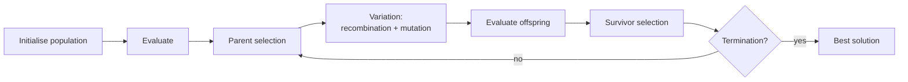

# Evolutionary Computation (Computación evolutiva)

> **Summary (EN):** Evolutionary computation copies biological evolution (variation, selection and inheritance) to solve optimization problems. It has several historical families: evolutionary programming (Lawrence Fogel, 1960s, evolving finite-state machines), evolution strategies (Rechenberg and Schwefel, 1970s, real-valued parameters) and genetic algorithms (John Holland, 1975, bit strings with crossover). All share the same loop: create a population, score it, select parents, recombine and mutate them, select who survives, and repeat.

> **En palabras simples (ES):** Imita la evolución de las especies. Tienes una **población** de soluciones. Las mejores tienen más probabilidad de "tener hijos"; los hijos mezclan partes de sus padres y a veces tienen un cambio al azar. Generación tras generación, la población mejora. *(Abajo está el pseudocódigo paso a paso, en inglés y en español.)*

## Términos clave

| English | Español | Significado (en simple) |
|---|---|---|
| Population | Población | El grupo de soluciones de una generación. |
| Individual / chromosome / genotype | Individuo / cromosoma / genotipo | Una solución escrita en "código" (por ejemplo, una cadena de bits). |
| Phenotype | Fenotipo | La misma solución "traducida" a lo que significa (por ejemplo, el punto (x, y)). |
| Fitness | Aptitud | La nota de una solución: qué tan buena es. |
| Parent selection | Selección de padres | Quiénes tienen hijos. |
| Survivor selection | Selección de supervivientes | Quiénes pasan a la siguiente generación. |
| Recombination (crossover) | Recombinación (cruce) | Mezclar dos padres para formar hijos. |
| Mutation | Mutación | Un cambio pequeño al azar. |
| Generation / epoch | Generación / época | Una vuelta completa del ciclo. |

## Explicación

### 1. Las tres ideas de la biología (slides 04, s3)

- **Adaptación:** los seres vivos que se ajustan bien a su entorno sobreviven.
- **Herencia:** los hijos reciben rasgos de sus padres.
- **Selección natural:** los más aptos tienen más probabilidad de pasar sus rasgos.

Un algoritmo evolutivo copia esto con soluciones: las "más aptas" (mejor nota) tienen más hijos, y los hijos heredan partes de ellas.

### 2. El ciclo general (Eiben & Smith Fig. 3.1)

```
initialize population with random candidates
evaluate each candidate
repeat until termination:
    select parents
    recombine pairs of parents  -> offspring
    mutate offspring
    evaluate offspring
    select individuals for the next generation
```

En español: crea soluciones al azar y ponles nota; luego repite: elige padres, mézclalos, cambia un poco a los hijos, ponles nota y decide quién sigue. Más detalle de la selección en [EA Selection](ea-selection-and-population-management.md) y de los operadores en [EA Representation and Variation](ea-representation-and-variation.md).

### 3. Las familias históricas

| Familia | Quién y cuándo | Cómo guarda las soluciones | Operador principal |
|---|---|---|---|
| Programación evolutiva | L. J. Fogel, 1960 | Máquinas de estados finitos (pequeños autómatas) | Mutación |
| Estrategias evolutivas | Rechenberg y Schwefel, 1970 | Listas de números reales | Mutación con ruido gaussiano que se ajusta sola |
| [Algoritmos genéticos](genetic-algorithms.md) | J. H. Holland, 1975 | Cadenas de bits | Cruce (+ mutación) |
| Programación genética | Koza, ~1990 (complemento) | Árboles (programas) | Cruce de ramas del árbol |

Holland (1992) explica por qué fallaron los primeros intentos de finales de los años 50: solo usaban **mutación**. La clave fue agregar el **cruce** (mezclar padres).

### 4. Lo que hay que decidir para armar uno (Eiben & Smith §3.2)

1. **Representación:** cómo se escribe una solución (genotipo) y cómo se traduce (fenotipo).
2. **Función de evaluación:** cómo se le pone nota.
3. **Población:** cuántas soluciones hay (normalmente un número fijo).
4. **Selección de padres:** cómo se eligen.
5. **Operadores de variación:** mutación (cambia **un** individuo) y recombinación (mezcla **dos o más**).
6. **Selección de supervivientes:** quién sigue.
7. **Inicialización y condición para parar.**

### 5. Evolución natural vs. artificial (Tabla 3.6)

| | Natural | Artificial (algoritmo) |
|---|---|---|
| Aptitud | Se ve después (quién sobrevivió) | Se define antes con una fórmula y guía la selección |
| Selección | Fuerzas complicadas (clima, depredadores) | Un sorteo con probabilidades según la nota |
| Del código a la solución | Proceso bioquímico complejo | Una conversión matemática simple |
| Padres por hijo | 1 o 2 | 1, 2 o muchos |
| Cómo ocurre | En paralelo, sin control central | Controlado: todos nacen y mueren al mismo tiempo |
| Población | Repartida en el espacio, tamaño variable | Todos con todos, tamaño fijo |

"*If you have variation, heredity, and selection, then you must get evolution*" (Dennett): si hay variación, herencia y selección, necesariamente hay evolución.

### 6. ¿Por qué usarlos? (§3.7)

Muchos problemas reales tienen una cantidad de soluciones que crece muchísimo: en el problema del viajante (TSP) con n ciudades hay n!/2 recorridos. Los métodos exactos no alcanzan, y los algoritmos evolutivos dan **buenas soluciones aproximadas** sin pedir nada especial a la función (no necesitan derivadas ni que tenga un solo valle).

**Relación con los enjambres.** [PSO](particle-swarm-optimization.md) también usa una población y una nota, pero no hay selección ni hijos: las mismas partículas se mueven. Kennedy y Eberhart lo ubican "entre los GA y la programación evolutiva".

### Diagrama



## Pseudocódigo intuitivo (para explicar en el examen)

> **Idea (ES):** Imita la evolución de las especies. Tienes una **población** de soluciones. Las mejores tienen más probabilidad de "tener hijos"; los hijos mezclan partes de sus padres y a veces tienen un cambio al azar. Generación tras generación, la población mejora.

**Antes de empezar: qué significa cada cosa**

| Palabra | Qué es (en simple) | English |
|---|---|---|
| Individuo | una solución candidata | individual |
| Población | el grupo de soluciones en una generación | population |
| Aptitud (fitness) | la nota de cada solución: qué tan buena es | fitness |
| Generación | una vuelta completa del ciclo | generation |
| Selección | elegir quién se reproduce o sobrevive (los mejores tienen ventaja) | selection |
| Recombinación (cruce) | mezclar dos padres para formar hijos | recombination / crossover |
| Mutación | un cambio pequeño al azar en un hijo | mutation |

**Pasos** — en inglés (como lo escribes en el examen) y debajo en español (para entender):

1. Create a random population and compute everyone's fitness.
   - *ES:* Crea soluciones al azar y ponle nota a cada una.
2. SELECT parents: better fitness → more chances.
   - *ES:* Elige padres, dando más oportunidad a los de mejor nota.
3. RECOMBINE pairs of parents to make children.
   - *ES:* Mezcla cada pareja de padres para crear hijos.
4. MUTATE the children a little.
   - *ES:* Cambia un poquito a los hijos al azar (para probar cosas nuevas).
5. EVALUATE the children, and SELECT who survives into the next generation.
   - *ES:* Ponle nota a los hijos y decide quién pasa a la siguiente generación.
6. Repeat steps 2–5 until the solution is good enough or the time runs out; return the best individual.
   - *ES:* Repite muchas generaciones y devuelve la mejor solución encontrada.

**Ejemplo con números:** buscar el mínimo de f(x, y) = (x + 2)² + (y − 2)² + 10. Cada individuo es un punto (x, y); su nota es f (más baja = mejor). Si (−1, 3) tiene f = 12 y (5, 5) tiene f = 68, el primero tendrá más hijos. Con las generaciones, la población se junta cerca de (−2, 2), donde f = 10.

**Say it in the exam (EN):** "Evolutionary algorithms keep a population of candidate solutions. Each generation they select parents by fitness, recombine and mutate them to create children, and select survivors. Variation (recombination and mutation) creates diversity; selection pushes quality up. The main families differ in representation: bit strings in genetic algorithms, real vectors in evolution strategies, finite-state machines in evolutionary programming, and trees in genetic programming."

**Dilo así (ES):** "Los algoritmos evolutivos mantienen una población de soluciones. En cada generación eligen padres según su aptitud, los cruzan y mutan para crear hijos, y eligen quién sobrevive. La variación (cruce y mutación) crea diversidad y la selección sube la calidad. Las familias se diferencian por cómo representan las soluciones: bits en GA, vectores reales en estrategias evolutivas, máquinas de estados en programación evolutiva y árboles en programación genética."

## Errores comunes y tips de examen

- Fogel → 1960 (programación evolutiva); Rechenberg y Schwefel → 1970 (estrategias evolutivas); Holland → **1975** (algoritmos genéticos).
- Genotipo (el código, p. ej. bits) ≠ fenotipo (lo que significa, p. ej. el punto (x, y)).

## Relacionado

- [EA Representation and Variation](ea-representation-and-variation.md)
- [EA Selection and Population Management](ea-selection-and-population-management.md)
- [Genetic Algorithms](genetic-algorithms.md)
- [Swarm Intelligence](swarm-intelligence.md)
- [Optimization Basics](optimization-basics.md)
- [History of AI](history-of-ai.md)

## Fuentes

- [Slides 04](../sources/slides-04-optimization.md), slides 2–3.
- [Holland 1992](../sources/paper-holland-1992-genetic-algorithms.md).
- [Eiben & Smith](../sources/book-eiben-smith-evolutionary-computing.md) cap. 3 (ingestado); caps. 2 y 6 pendientes.
