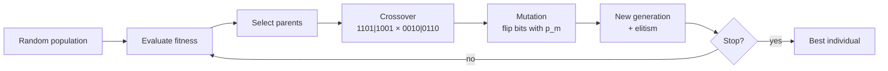

# Genetic Algorithms (Algoritmos genéticos, GA)

> **Summary (EN):** A genetic algorithm evolves a population of chromosomes (classically bit strings) using selection by fitness, crossover between parents (single-, two- or k-point) and bit-flip mutation with a small probability. Holland's explanation of why it works is implicit parallelism: every string samples many schemata (regions like 1**0*) at once, and short, compact building blocks with above-average fitness survive crossover and multiply. In the course assignment, a 16-bit GA minimizes (x+2)² + (y−2)² + 10 and reaches the optimum (−2, 2).

> **En palabras simples (ES):** Un algoritmo genético guarda cada solución como una **cadena de bits (unos y ceros)**, como si fuera su ADN. Las cadenas con mejor nota tienen más hijos. Un hijo se forma cortando a los dos padres en un mismo punto y pegando el principio de uno con el final del otro (cruce). Después, cada bit del hijo tiene una probabilidad pequeña de cambiar (mutación). Esto se repite muchas generaciones. *(Abajo está el pseudocódigo paso a paso, en inglés y en español.)*

## Términos clave

| English | Español | Significado |
|---|---|---|
| Chromosome / gene / allele | Cromosoma / gen / alelo | Cadena completa / posición / valor (0 o 1). |
| Encoding | Codificación | Cómo una solución se representa en bits. |
| Fitness function | Función de aptitud | Evalúa a cada individuo. |
| Selection (roulette, tournament, truncation) | Selección (ruleta, torneo, truncamiento) | Elegir padres según aptitud. |
| Crossover (single/two/k-point, uniform) | Cruce (uno/dos/k puntos, uniforme) | Intercambiar segmentos de bits entre padres. |
| Mutation (bit flip) | Mutación (inversión de bit) | Cada bit cambia con probabilidad p_m. |
| Elitism | Elitismo | Copiar los mejores sin cambios a la siguiente generación. |
| Schema / building block | Esquema / bloque constructor | Patrón como `1**0*`; región del espacio. |
| Implicit parallelism | Paralelismo implícito | Una población pequeña muestrea muchísimos esquemas. |

## Explicación

**Los tres principios (slides 04, s5):** variación, selección, herencia.
- **Individuos:** cadenas de bits (un número decimal en binario).
- **Evaluación:** función de aptitud que busca el valor más alto o más bajo.
- **Reproducción:** cruce.
- **Variación:** mutación = invertir un bit con cierta probabilidad.

**Cruce de un punto (s6, Holland):** los padres se alinean, se elige un punto al azar y se intercambian las partes:

```
parent1 = 1101|1001        child1 = 1101|0110
parent2 = 0010|0110   ->   child2 = 0010|1001
```

Se generaliza a dos puntos o k puntos.

**Mutación:** para cada bit, con probabilidad p_m, cambiarlo (Holland: ≈ 1 de cada 10 000 símbolos; en la práctica p_m ≈ 1/L). "La mutación sola no avanza la búsqueda, pero es un seguro contra una población uniforme."

```python
def genetic_algorithm():
    population = [random_bits(L) for _ in range(POP)]
    for generation in range(EPOCHS):
        parents = select(population, fitness)            # roulette / tournament / truncation
        next_pop = elites(population)                    # optional elitism
        while len(next_pop) < POP:
            p1, p2 = random.choice(parents), random.choice(parents)
            c1, c2 = crossover(p1, p2)                   # single-point
            next_pop += [mutate(c1), mutate(c2)]         # bit flip with p_m
        population = next_pop[:POP]
    return best(population, fitness)
```

**Codificar números reales en bits.** La tarea usa 8 bits por variable en **signo-magnitud**: 1 bit de signo + 7 bits de magnitud → rango [−127, 127] (con un "−0" redundante). Alternativas: binario con desplazamiento, **código Gray** (vecinos difieren en un bit), o representación real directa (Eiben & Smith cap. 4; ver [EA Representation and Variation](ea-representation-and-variation.md)).

**Métodos de selección** (Eiben & Smith cap. 5; detalle en [EA Selection](ea-selection-and-population-management.md)):
- **Ruleta** (proporcional a la aptitud): sensible a la escala de f.
- **Torneo**: tomar k al azar y quedarse con el mejor; presión controlada por k.
- **Truncamiento**: quedarse con los K mejores (lo que hace la tarea: K = 10 de 100) — presión de selección muy alta.

**Por qué funciona — teoría de esquemas (Holland).** La cadena `11011001` pertenece a las regiones `11******`, `1*******`, `**0**00*`, etc. Una población de pocos miles de cadenas muestrea así un número enorme de regiones (**paralelismo implícito**); las regiones de mayor aptitud media reciben más descendencia. Los **bloques compactos** (bits definidos cercanos) tienen menos riesgo de ser cortados por el cruce y se propagan. Forma cuantitativa (Teorema de esquemas, complemento):

```
m(H, t+1) ≥ m(H, t) · f(H)/f̄ · [1 − p_c·δ(H)/(L−1) − o(H)·p_m]
```

δ(H) = longitud definida, o(H) = orden (nº de bits fijos).

**Aplicaciones (Holland 1992):** classifier systems, estrategias del Dilema del Prisionero (redescubrieron *tit for tat*), control de un gasoducto, diseño de turbinas de motores a reacción.

### La visión de AIMA (§4.1.4): GA = stochastic beam search + cruce

Los algoritmos evolutivos son variantes de [stochastic beam search](local-search-hill-climbing.md) motivadas por la selección natural. Se diferencian en:

| Decisión de diseño | Opciones |
|---|---|
| Tamaño de la población | — |
| Representación | **GA**: cadena sobre un alfabeto finito (bits); **estrategias evolutivas**: números reales; **programación genética**: programas |
| *Mixing number* ρ | Nº de padres por hijo; lo común es ρ = 2; **ρ = 1 = stochastic beam search** (reproducción asexual) |
| Selección | Proporcional a la aptitud, o elegir n al azar y quedarse con los ρ mejores (**torneo**) |
| Recombinación | Punto de cruce aleatorio |
| Tasa de mutación | Cada bit se invierte con esa probabilidad |
| Próxima generación | Solo hijos, o hijos + mejores padres (**elitismo**: la aptitud nunca baja); *culling*: descartar a todos bajo un umbral |

**Ejemplo de AIMA — 8 reinas con GA (Fig. 4.6).** Cada individuo es una cadena de 8 dígitos (dígito c = fila de la reina en la columna c). Aptitud = nº de pares de reinas que **no** se atacan (28 = solución).

| Individuo | Aptitud | Probabilidad de selección |
|---|---|---|
| 24748552 | 24 | 24/78 = 31 % |
| 32752411 | 23 | 29 % |
| 24415124 | 20 | 26 % |
| 32543213 | 11 | 14 % |

Se eligen parejas según esas probabilidades (un individuo puede salir dos veces y otro ninguna), se cruzan en un punto aleatorio (p. ej. `327|52411` × `247|48552` → `32748552`) y cada dígito puede mutar con una probabilidad pequeña (= mover una reina al azar dentro de su columna).

Al principio la población es diversa y el cruce da **pasos grandes**; con las generaciones la población se parece más y los pasos se achican (igual que el enfriamiento en SA).

**¿Por qué ayuda el cruce?** Solo si existen **bloques** útiles: p. ej. poner las 3 primeras reinas en 2, 4, 6 (sin atacarse). El **esquema** `246*****` describe todos esos estados; si la aptitud media de sus instancias está sobre la media, su número crece con el tiempo. Si los genes se permutaran al azar (bloques sin sentido), el cruce no daría ventaja.

```
function GENETIC-ALGORITHM(population, fitness) returns an individual
    repeat
        weights ← WEIGHTED-BY(population, fitness)
        population2 ← empty list
        for i = 1 to SIZE(population) do
            parent1, parent2 ← WEIGHTED-RANDOM-CHOICES(population, weights, 2)
            child ← REPRODUCE(parent1, parent2)
            if (small random probability) then child ← MUTATE(child)
            add child to population2
        population ← population2
    until some individual is fit enough, or enough time has elapsed
    return the best individual in population, according to fitness

function REPRODUCE(parent1, parent2) returns an individual
    n ← LENGTH(parent1);  c ← random number from 1 to n
    return APPEND(SUBSTRING(parent1, 1, c), SUBSTRING(parent2, c + 1, n))
```

*Curiosidad (AIMA):* el **efecto Baldwin** — el aprendizaje durante la vida "suaviza" el paisaje de aptitud y acelera la evolución (simulado por Hinton y Nowlan, 1987).

### Un ciclo a mano (Eiben & Smith §3.3): maximizar x² con x ∈ [0, 31]

Representación de 5 bits, selección proporcional, cruce de un punto, bit-flip, reemplazo generacional completo.

| # | Población inicial | x | f = x² | P(sel) | Esperado f/f̄ | Copias reales |
|---|---|---|---|---|---|---|
| 1 | 01101 | 13 | 169 | 0.14 | 0.58 | 1 |
| 2 | 11000 | 24 | 576 | 0.49 | 1.97 | 2 |
| 3 | 01000 | 8 | 64 | 0.06 | 0.22 | 0 |
| 4 | 10011 | 19 | 361 | 0.31 | 1.23 | 1 |
| | **Suma / media / máx.** | | 1170 / 293 / 576 | | | |

Cruce (parejas 1–2 con punto 4 y 2–4 con punto 2): `0110|1 × 1100|0 → 01100 (12, 144), 11001 (25, 625)`; `11|000 × 10|011 → 11011 (27, 729), 10000 (16, 256)` → suma 1754, media 439, máx. 729.

Mutación (un bit en dos hijos): `01100 → 11100` y `10000 → 10100`. Correctamente decodificados son **28 (784)** y **20 (400)**, con lo que la media sería **634.5**. ⚠️ El libro imprime 26 (676) y 18 (324) y media 588.5 — un error de la Tabla 3.3 (ver [errata](../study/errata.md)). La conclusión no cambia: en una generación la media pasa de 293 a > 580 y el máximo de 576 a 729.

### Lo que añade Eiben & Smith (caps. 3–5)

- **Dos fuerzas:** la variación crea diversidad; la selección sube la calidad. La aptitud puede verse como algo a **optimizar** o como **adaptación** al entorno.
- **Comportamiento típico (§3.5):** al inicio la población está dispersa, luego "sube colinas" y al final se concentra en unos pocos picos (quizá subóptimos → **convergencia prematura**). Curva **anytime**: gran progreso al principio y luego meseta → la inicialización heurística y las corridas muy largas rara vez valen la pena.
- **No Free Lunch:** promediado sobre "todos" los problemas, ningún algoritmo de caja negra supera a la búsqueda aleatoria; los EA son buenos "generalistas", los algoritmos específicos son mejores en su problema.
- **Condición de terminación:** óptimo alcanzado (± ε) **o** límite de CPU / de evaluaciones / sin mejora por X generaciones / diversidad muy baja.
- **EA para 8 reinas (Tabla 3.4):** permutaciones, cruce *cut-and-crossfill* (100 %), mutación swap (80 %), padres = los 2 mejores de 5 al azar, reemplazar a los peores, población 100, parar con solución o 10 000 evaluaciones.

## Ejemplo del curso

[Tarea GA](../assignments/genetic-algorithm-task.md): población 100, 16 bits, 100 épocas, selección por truncamiento K = 10 + elitismo, cruce de un punto, p_m = 0.1 por bit. Con `random.seed(0)`, el mejor llegó a f = 11 en la época 1 y al óptimo (x, y) = (−2, 2), f = 10, en la época 20.

### Diagrama



## Pseudocódigo intuitivo (para explicar en el examen)

> **Idea (ES):** Un algoritmo genético guarda cada solución como una **cadena de bits (unos y ceros)**, como si fuera su ADN. Las cadenas con mejor nota tienen más hijos. Un hijo se forma cortando a los dos padres en un mismo punto y pegando el principio de uno con el final del otro (cruce). Después, cada bit del hijo tiene una probabilidad pequeña de cambiar (mutación). Esto se repite muchas generaciones.

**Antes de empezar: qué significa cada cosa**

| Símbolo / palabra | Qué es (en simple) | English |
|---|---|---|
| Cromosoma | la cadena de bits que representa una solución, p. ej. 16 bits | chromosome |
| Decodificar | convertir los bits en números (x, y) para poder calcular la nota | decode |
| Aptitud (fitness) | la nota de la solución; aquí f(x, y), y más baja es mejor porque minimizamos | fitness |
| N | cuántos cromosomas hay en la población | population size |
| G | cuántas generaciones se repite el ciclo | number of generations |
| Elitismo | copiar los mejores sin cambios a la siguiente generación, para no perderlos | elitism |
| Punto de corte | dónde se cortan los padres para cruzarlos | crossover point |
| p_m | probabilidad de que **cada bit** cambie (0 ↔ 1) | mutation rate |
| Esquema | un patrón de bits como 1\*\*0 (\* = cualquier valor): un "bloque" bueno que se hereda | schema |

**Pasos** — en inglés (como lo escribes en el examen) y debajo en español (para entender):

1. Create N random bit strings (chromosomes); decode each one and compute its fitness.
   - *ES:* Crea N cadenas de bits al azar. Convierte cada una en números (x, y) y calcula su nota.
2. Selection: pick parents, giving better chromosomes more chances (roulette wheel or tournaments). Optionally copy the best ones unchanged to the next generation (elitism).
   - *ES:* Elige a los padres; los de mejor nota tienen más probabilidad. Puedes guardar a los mejores tal cual para no perderlos.
3. Crossover: for each pair of parents, pick a random cut point and swap the ends → two children.
   - *ES:* Corta a los dos padres en el mismo lugar al azar e intercambia los finales: salen dos hijos que mezclan partes buenas de ambos.
4. Mutation: flip each bit of each child with a small probability p_m.
   - *ES:* Cada bit de cada hijo tiene una probabilidad pequeña de cambiar de 0 a 1 o de 1 a 0. Así aparece algo nuevo (variedad).
5. The children form the new population. Repeat steps 2–5 for G generations and return the best chromosome found.
   - *ES:* Los hijos son la nueva generación. Repite y al final devuelve la mejor cadena encontrada.

**Ejemplo con números:**
- **Decodificar (16 bits, 8 para x y 8 para y; en cada grupo el primer bit es el signo, 1 = negativo, y los otros 7 bits son el valor):** `1000001000000010` → x: `1` (negativo) `0000010` (= 2) → **x = −2**; y: `0` (positivo) `0000010` (= 2) → **y = 2**. f = (−2 + 2)² + (2 − 2)² + 10 = **10**: es el mínimo.
- **Cruce en el punto 3:** padre 1 = `110|10110`, padre 2 = `001|11001` → hijo 1 = `110` + `11001` = **`11011001`**, hijo 2 = `001` + `10110` = **`00110110`**.
- **Mutación:** con 16 bits y p_m = 1/16, en promedio cambia 1 bit por hijo.

**Say it in the exam (EN):** "A genetic algorithm evolves a population of bit strings. Each generation it selects parents by fitness, combines them with crossover (cut both parents at a random point and swap the ends) and applies bit-flip mutation with a small probability. Elitism keeps the best solutions. Crossover combines good building blocks (schemata) from different parents, and mutation keeps diversity. Holland explained this with implicit parallelism: each string tests many schemata at once."

**Dilo así (ES):** "Un algoritmo genético hace evolucionar una población de cadenas de bits. En cada generación elige padres según su aptitud, los cruza (corta en un punto al azar e intercambia los finales) y muta bits con una probabilidad pequeña. El elitismo guarda a los mejores. El cruce junta bloques buenos de distintos padres y la mutación mantiene la variedad. Holland lo explicó con el paralelismo implícito: cada cadena prueba muchos esquemas a la vez."

## Errores comunes y tips de examen

- Selección = **quién** se reproduce; cruce = **cómo** se combinan; mutación = **diversidad**.
- Elitismo garantiza que el mejor nunca empeora (curva de mejor aptitud monótona).
- p_m muy alta → búsqueda aleatoria; muy baja → convergencia prematura.
- La tarea minimiza: "fitness" más bajo = mejor (hay que decirlo explícitamente en el examen).

## Relacionado

- [EA Representation and Variation](ea-representation-and-variation.md)
- [EA Selection and Population Management](ea-selection-and-population-management.md)
- [Local Search and Hill Climbing](local-search-hill-climbing.md)
- [Evolutionary Computation](evolutionary-computation.md)
- [Optimization Basics](optimization-basics.md)
- [Particle Swarm Optimization](particle-swarm-optimization.md) (comparación)
- [GA assignment](../assignments/genetic-algorithm-task.md)
- [Metaheuristics comparison](../study/metaheuristics-comparison.md)

## Fuentes

- [Slides 04](../sources/slides-04-optimization.md), slides 5–7.
- [Holland 1992](../sources/paper-holland-1992-genetic-algorithms.md).
- [AIMA 4e](../sources/book-russell-norvig-aima.md) §4.1.4 (ingestado: diseño de EAs, ejemplo de 8 reinas, esquemas, pseudocódigo).
- [Eiben & Smith](../sources/book-eiben-smith-evolutionary-computing.md) caps. 3–5 (ingestado: ciclo x², 8 reinas, comportamiento de un EA, operadores y selección); cap. 16 (teorema de esquemas, pendiente).
