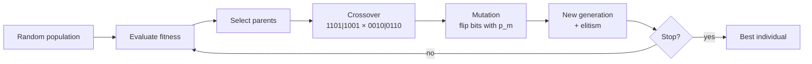

# Genetic Algorithms (Algoritmos genéticos, GA)

> **Summary (EN):** A genetic algorithm evolves a population of chromosomes, classically strings of bits. Each generation it picks parents according to fitness, mixes them with crossover (cut at one or more points and swap the pieces) and flips each bit with a small probability (mutation). Holland explained why it works with implicit parallelism: each string belongs to many schemata (patterns like 1**0*) at once, and short, compact good patterns survive crossover and spread. In the course assignment, a 16-bit GA minimizes (x+2)² + (y−2)² + 10 and reaches the optimum (−2, 2).

> **En palabras simples (ES):** Un algoritmo genético guarda cada solución como una **cadena de bits (unos y ceros)**, como si fuera su ADN. Las cadenas con mejor nota tienen más hijos. Un hijo se forma cortando a los dos padres en un mismo punto y pegando el principio de uno con el final del otro (cruce). Después, cada bit del hijo tiene una probabilidad pequeña de cambiar (mutación). Esto se repite muchas generaciones. *(Abajo está el pseudocódigo paso a paso, en inglés y en español.)*

## Términos clave

| English | Español | Significado (en simple) |
|---|---|---|
| Chromosome | Cromosoma | La cadena de bits completa que representa una solución. |
| Gene / allele | Gen / alelo | Una posición de la cadena / el valor en esa posición (0 o 1). |
| Encoding | Codificación | Cómo se escribe una solución en bits. |
| Fitness function | Función de aptitud | La fórmula que le pone nota a cada solución. |
| Selection (roulette, tournament, truncation) | Selección (ruleta, torneo, truncamiento) | Formas de elegir a los padres según su nota. |
| Crossover (one/two/k-point, uniform) | Cruce (uno/dos/k puntos, uniforme) | Cortar a los padres y combinar sus pedazos. |
| Mutation (bit flip) | Mutación (cambio de bit) | Cada bit cambia (0 ↔ 1) con una probabilidad pequeña p_m. |
| p_m | Tasa de mutación | La probabilidad de que cada bit cambie. |
| Elitism | Elitismo | Copiar a los mejores sin cambios a la siguiente generación. |
| Schema / building block | Esquema / bloque constructor | Un patrón como `1**0*` (\* = cualquier valor): un "pedazo bueno" que se hereda. |
| Implicit parallelism | Paralelismo implícito | Cada cadena "prueba" muchos patrones a la vez. |

## Explicación

### 1. Las piezas de un GA (slides 04, s5)

Se basa en tres ideas: **variación, selección y herencia**.
- **Individuos:** cadenas de bits (un número escrito en binario).
- **Evaluación:** una función de aptitud que dice qué tan buena es cada cadena (buscando el valor más alto o el más bajo).
- **Reproducción:** cruce entre dos padres.
- **Variación:** mutación, es decir, cambiar un bit con cierta probabilidad.

### 2. El cruce de un punto (s6, Holland)

Se ponen los dos padres uno debajo del otro, se elige un punto de corte al azar y se **intercambian los finales**:

```
parent1 = 1101|1001        child1 = 1101|0110
parent2 = 0010|0110   ->   child2 = 0010|1001
```

El hijo 1 tiene el principio del padre 1 y el final del padre 2; el hijo 2, al revés. También se puede cortar en dos o más puntos.

### 3. La mutación

Para cada bit, con probabilidad p_m, se cambia (0 → 1 o 1 → 0). Holland usaba más o menos 1 de cada 10 000 bits; en la práctica se usa p_m ≈ 1/L (L = largo de la cadena), o sea, en promedio un bit por hijo. Como dice Holland: "la mutación sola no hace avanzar la búsqueda, pero es un **seguro** para que la población no se vuelva toda igual".

```python
def genetic_algorithm():
    population = [random_bits(L) for _ in range(POP)]
    for generation in range(EPOCHS):
        parents = select(population, fitness)            # roulette / tournament / truncation
        next_pop = elites(population)                    # optional elitism
        while len(next_pop) < POP:
            p1, p2 = random.choice(parents), random.choice(parents)
            c1, c2 = crossover(p1, p2)                   # single-point
            next_pop += [mutate(c1), mutate(c2)]         # bit flip with p_m
        population = next_pop[:POP]
    return best(population, fitness)
```

Cómo leerlo: crea una población de cadenas al azar; en cada generación elige padres, guarda a los mejores (si usas elitismo), y llena el resto cruzando parejas de padres y mutando a los hijos. Al final devuelve la mejor cadena.

### 4. ¿Cómo guardar números (con signo) en bits?

La tarea usa **8 bits por variable** en formato **signo-magnitud**: el primer bit es el signo (1 = negativo) y los otros 7 bits son el valor (de 0 a 127). Así cada variable va de −127 a 127 (y hay un "−0" que sobra).

Ejemplo: `10000010` → signo `1` (negativo), valor `0000010` = 2 → **−2**.

Otras opciones: binario con desplazamiento, **código Gray** (dos números seguidos difieren en un solo bit, así un cambio pequeño en bits es un cambio pequeño en el número) o guardar directamente números reales (Eiben & Smith cap. 4; ver [EA Representation and Variation](ea-representation-and-variation.md)).

### 5. Cómo elegir a los padres

Más detalle en [EA Selection](ea-selection-and-population-management.md) (Eiben & Smith cap. 5).
- **Ruleta:** cada individuo tiene una probabilidad proporcional a su nota. Cambia mucho si la escala de la nota cambia.
- **Torneo:** sacas k individuos al azar y gana el mejor. Con k más grande, los mejores ganan más seguido.
- **Truncamiento:** te quedas solo con los K mejores (lo que hace la tarea: K = 10 de 100). Favorece muchísimo a los mejores.

### 6. ¿Por qué funciona? La teoría de esquemas (Holland)

Un **esquema** es un patrón con huecos: `1*******` significa "todas las cadenas que empiezan con 1". La cadena `11011001` pertenece a muchos esquemas a la vez: `11******`, `1*******`, `**0**00*`, etc.

- Por eso, una población de unos pocos miles de cadenas está "probando" muchísimos patrones al mismo tiempo (**paralelismo implícito**).
- Los patrones con mejor nota promedio reciben más hijos, así que se multiplican.
- Los patrones **compactos** (bits fijos cercanos entre sí) tienen menos riesgo de que el cruce los corte por la mitad, así que se heredan mejor. Son los "bloques constructores".

Fórmula (teorema de esquemas, complemento):

```
m(H, t+1) ≥ m(H, t) · f(H)/f̄ · [1 − p_c·δ(H)/(L−1) − o(H)·p_m]
```

En palabras: la cantidad de cadenas con el patrón H en la próxima generación es al menos la cantidad actual × (nota promedio del patrón / nota promedio de todos) × (probabilidad de que el cruce y la mutación no lo rompan). Aquí δ(H) es la distancia entre el primer y el último bit fijo del patrón, o(H) es cuántos bits fijos tiene, p_c es la probabilidad de cruce y L el largo de la cadena.

**Aplicaciones (Holland 1992):** sistemas de reglas que aprenden (*classifier systems*), estrategias para el Dilema del Prisionero (redescubrieron la estrategia "ojo por ojo", *tit for tat*), control de un gasoducto y diseño de turbinas de aviones.

### 7. La visión del libro (AIMA §4.1.4): un GA es una búsqueda en haz con cruce

AIMA dice que los algoritmos evolutivos son una [búsqueda en haz estocástica](local-search-hill-climbing.md) (llevar varias soluciones a la vez) inspirada en la evolución. Las decisiones de diseño son:

| Decisión | Opciones |
|---|---|
| Tamaño de la población | — |
| Representación | **GA**: cadena de símbolos (bits); **estrategias evolutivas**: números reales; **programación genética**: programas |
| Padres por hijo (ρ) | Lo normal es 2; con ρ = 1 (un solo padre) es simplemente una búsqueda en haz estocástica |
| Selección | Proporcional a la nota, o sacar n al azar y quedarse con los mejores (**torneo**) |
| Cruce | Punto de corte al azar |
| Tasa de mutación | Probabilidad de que cada bit cambie |
| Próxima generación | Solo los hijos, o hijos + los mejores padres (**elitismo**: la mejor nota nunca baja); también se puede descartar a todos los que estén bajo cierta nota |

**Ejemplo de AIMA: 8 reinas con un GA (Fig. 4.6).** Cada individuo es una cadena de 8 dígitos: el dígito de la posición c es la fila de la reina de la columna c. La nota es el **número de pares de reinas que no se atacan** (28 = solución perfecta).

| Individuo | Nota | Probabilidad de ser elegido |
|---|---|---|
| 24748552 | 24 | 24/78 = 31 % |
| 32752411 | 23 | 29 % |
| 24415124 | 20 | 26 % |
| 32543213 | 11 | 14 % |

(78 es la suma de las cuatro notas.) Se forman parejas según esas probabilidades (uno puede salir dos veces y otro ninguna), se cruzan en un punto al azar (p. ej. `327|52411` × `247|48552` → `32748552`) y cada dígito puede mutar con una probabilidad pequeña (eso equivale a mover una reina a otra fila de su columna).

Al principio la población es variada y el cruce produce **saltos grandes**; con las generaciones todos se parecen más y los saltos se achican (parecido a cuando se enfría el recocido simulado).

**¿Cuándo ayuda el cruce?** Solo si hay **bloques** con sentido. Por ejemplo, poner las 3 primeras reinas en las filas 2, 4 y 6 (que no se atacan) es un buen bloque; el esquema `246*****` describe todos los tableros que lo tienen. Si ese bloque tiene buena nota en promedio, se va multiplicando. Si los dígitos estuvieran en un orden sin sentido, el cruce no ayudaría.

```
function GENETIC-ALGORITHM(population, fitness) returns an individual
    repeat
        weights ← WEIGHTED-BY(population, fitness)
        population2 ← empty list
        for i = 1 to SIZE(population) do
            parent1, parent2 ← WEIGHTED-RANDOM-CHOICES(population, weights, 2)
            child ← REPRODUCE(parent1, parent2)
            if (small random probability) then child ← MUTATE(child)
            add child to population2
        population ← population2
    until some individual is fit enough, or enough time has elapsed
    return the best individual in population, according to fitness

function REPRODUCE(parent1, parent2) returns an individual
    n ← LENGTH(parent1);  c ← random number from 1 to n
    return APPEND(SUBSTRING(parent1, 1, c), SUBSTRING(parent2, c + 1, n))
```

*Curiosidad (AIMA):* el **efecto Baldwin**: si los individuos pueden aprender durante su vida, la evolución avanza más rápido (lo simularon Hinton y Nowlan en 1987).

### 8. Una generación a mano (Eiben & Smith §3.3): maximizar x² con x entre 0 y 31

Cada individuo es un número de 5 bits. Selección por ruleta, cruce de un punto, mutación de bits y toda la población se reemplaza por los hijos.

| # | Población inicial | x | f = x² | Probabilidad (f / suma) | Copias esperadas (f / promedio) | Copias que salieron |
|---|---|---|---|---|---|---|
| 1 | 01101 | 13 | 169 | 0.14 | 0.58 | 1 |
| 2 | 11000 | 24 | 576 | 0.49 | 1.97 | 2 |
| 3 | 01000 | 8 | 64 | 0.06 | 0.22 | 0 |
| 4 | 10011 | 19 | 361 | 0.31 | 1.23 | 1 |
| | **Suma / promedio / máximo** | | 1170 / 293 / 576 | | | |

**Cruce** (parejas 1–2 cortando después del bit 4, y 2–4 cortando después del bit 2):
- `0110|1 × 1100|0` → `01100` (12, f = 144) y `11001` (25, f = 625)
- `11|000 × 10|011` → `11011` (27, f = 729) y `10000` (16, f = 256)
- Suma 1754, promedio 439, máximo 729.

**Mutación** (un bit en dos de los hijos): `01100 → 11100` y `10000 → 10100`. Bien convertidos, son **28 (f = 784)** y **20 (f = 400)**, y el promedio queda en **634.5**. ⚠️ El libro imprime 26 (676), 18 (324) y promedio 588.5: es un error de la Tabla 3.3 (ver [errata](../study/errata.md)). La conclusión es la misma: en una sola generación el promedio sube de 293 a más de 580 y el mejor de 576 a 729.

### 9. Lo que agrega Eiben & Smith (caps. 3–5)

- **Dos fuerzas:** la variación (cruce y mutación) **crea diversidad**; la selección **sube la calidad**.
- **Cómo se comporta (§3.5):** al principio la población está dispersa; luego "sube las colinas"; al final se junta en unos pocos picos, que pueden no ser los mejores (**convergencia prematura**). La mejor nota mejora mucho al principio y luego casi nada; por eso pocas veces vale la pena correrlo muchísimo tiempo.
- **No Free Lunch ("no hay almuerzo gratis"):** en promedio sobre todos los problemas posibles, ningún algoritmo genérico es mejor que buscar al azar. Los algoritmos evolutivos son buenos "todoterreno"; un algoritmo hecho para un problema específico le gana en ese problema.
- **Cuándo parar:** cuando se llega al óptimo (o muy cerca), o cuando se acaba el tiempo, se alcanza un número de evaluaciones, no hay mejora en X generaciones, o la población es casi toda igual.
- **GA para 8 reinas (Tabla 3.4):** permutaciones, cruce *cut-and-crossfill* (siempre), mutación por intercambio (80 %), padres = los 2 mejores de 5 elegidos al azar, reemplazar a los peores, población de 100, parar con una solución o a las 10 000 evaluaciones.

## Ejemplo del curso

[Tarea GA](../assignments/genetic-algorithm-task.md): población 100, 16 bits, 100 épocas, selección por truncamiento K = 10 + elitismo, cruce de un punto, p_m = 0.1 por bit. Con `random.seed(0)`, el mejor llegó a f = 11 en la época 1 y al óptimo (x, y) = (−2, 2), f = 10, en la época 20.

### Diagrama



## Pseudocódigo intuitivo (para explicar en el examen)

> **Idea (ES):** Un algoritmo genético guarda cada solución como una **cadena de bits (unos y ceros)**, como si fuera su ADN. Las cadenas con mejor nota tienen más hijos. Un hijo se forma cortando a los dos padres en un mismo punto y pegando el principio de uno con el final del otro (cruce). Después, cada bit del hijo tiene una probabilidad pequeña de cambiar (mutación). Esto se repite muchas generaciones.

**Antes de empezar: qué significa cada cosa**

| Símbolo / palabra | Qué es (en simple) | English |
|---|---|---|
| Cromosoma | la cadena de bits que representa una solución, p. ej. 16 bits | chromosome |
| Decodificar | convertir los bits en números (x, y) para poder calcular la nota | decode |
| Aptitud (fitness) | la nota de la solución; aquí f(x, y), y más baja es mejor porque minimizamos | fitness |
| N | cuántos cromosomas hay en la población | population size |
| G | cuántas generaciones se repite el ciclo | number of generations |
| Elitismo | copiar los mejores sin cambios a la siguiente generación, para no perderlos | elitism |
| Punto de corte | dónde se cortan los padres para cruzarlos | crossover point |
| p_m | probabilidad de que **cada bit** cambie (0 ↔ 1) | mutation rate |
| Esquema | un patrón de bits como 1\*\*0 (\* = cualquier valor): un "bloque" bueno que se hereda | schema |

**Pasos** — en inglés (como lo escribes en el examen) y debajo en español (para entender):

1. Create N random bit strings (chromosomes); decode each one and compute its fitness.
   - *ES:* Crea N cadenas de bits al azar. Convierte cada una en números (x, y) y calcula su nota.
2. Selection: pick parents, giving better chromosomes more chances (roulette wheel or tournaments). Optionally copy the best ones unchanged to the next generation (elitism).
   - *ES:* Elige a los padres; los de mejor nota tienen más probabilidad. Puedes guardar a los mejores tal cual para no perderlos.
3. Crossover: for each pair of parents, pick a random cut point and swap the ends → two children.
   - *ES:* Corta a los dos padres en el mismo lugar al azar e intercambia los finales: salen dos hijos que mezclan partes buenas de ambos.
4. Mutation: flip each bit of each child with a small probability p_m.
   - *ES:* Cada bit de cada hijo tiene una probabilidad pequeña de cambiar de 0 a 1 o de 1 a 0. Así aparece algo nuevo (variedad).
5. The children form the new population. Repeat steps 2–5 for G generations and return the best chromosome found.
   - *ES:* Los hijos son la nueva generación. Repite y al final devuelve la mejor cadena encontrada.

**Ejemplo con números:**
- **Decodificar (16 bits, 8 para x y 8 para y; en cada grupo el primer bit es el signo, 1 = negativo, y los otros 7 bits son el valor):** `1000001000000010` → x: `1` (negativo) `0000010` (= 2) → **x = −2**; y: `0` (positivo) `0000010` (= 2) → **y = 2**. f = (−2 + 2)² + (2 − 2)² + 10 = **10**: es el mínimo.
- **Cruce en el punto 3:** padre 1 = `110|10110`, padre 2 = `001|11001` → hijo 1 = `110` + `11001` = **`11011001`**, hijo 2 = `001` + `10110` = **`00110110`**.
- **Mutación:** con 16 bits y p_m = 1/16, en promedio cambia 1 bit por hijo.

**Say it in the exam (EN):** "A genetic algorithm evolves a population of bit strings. Each generation it selects parents by fitness, combines them with crossover (cut both parents at a random point and swap the ends) and applies bit-flip mutation with a small probability. Elitism keeps the best solutions. Crossover combines good building blocks (schemata) from different parents, and mutation keeps diversity. Holland explained this with implicit parallelism: each string tests many schemata at once."

**Dilo así (ES):** "Un algoritmo genético hace evolucionar una población de cadenas de bits. En cada generación elige padres según su aptitud, los cruza (corta en un punto al azar e intercambia los finales) y muta bits con una probabilidad pequeña. El elitismo guarda a los mejores. El cruce junta bloques buenos de distintos padres y la mutación mantiene la variedad. Holland lo explicó con el paralelismo implícito: cada cadena prueba muchos esquemas a la vez."

## Errores comunes y tips de examen

- Selección = **quién** tiene hijos; cruce = **cómo** se mezclan; mutación = **variedad**.
- Con elitismo, la mejor nota **nunca empeora** de una generación a otra.
- p_m muy alta → es casi una búsqueda al azar; muy baja → todos se parecen demasiado pronto (convergencia prematura).
- La tarea **minimiza**: una nota más baja es mejor. En el examen hay que decirlo explícitamente.

## Relacionado

- [EA Representation and Variation](ea-representation-and-variation.md)
- [EA Selection and Population Management](ea-selection-and-population-management.md)
- [Local Search and Hill Climbing](local-search-hill-climbing.md)
- [Evolutionary Computation](evolutionary-computation.md)
- [Optimization Basics](optimization-basics.md)
- [Particle Swarm Optimization](particle-swarm-optimization.md) (comparación)
- [GA assignment](../assignments/genetic-algorithm-task.md)
- [Metaheuristics comparison](../study/metaheuristics-comparison.md)

## Fuentes

- [Slides 04](../sources/slides-04-optimization.md), slides 5–7.
- [Holland 1992](../sources/paper-holland-1992-genetic-algorithms.md).
- [AIMA 4e](../sources/book-russell-norvig-aima.md) §4.1.4 (ingestado: diseño de EAs, ejemplo de 8 reinas, esquemas, pseudocódigo).
- [Eiben & Smith](../sources/book-eiben-smith-evolutionary-computing.md) caps. 3–5 (ingestado: ciclo x², 8 reinas, comportamiento de un EA, operadores y selección); cap. 16 (teorema de esquemas, pendiente).
