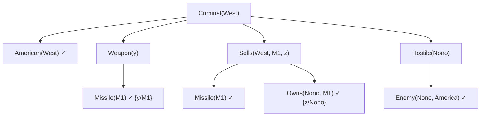

# Horn Clauses and Backward Chaining (Cláusulas de Horn y encadenamiento hacia atrás)

> **Summary (EN):** A Horn clause has at most one positive literal. Definite clauses (exactly one) read as rules A ∧ B ⇒ C; facts are definite clauses with an empty body; goal clauses (no positive literal) are queries. This restriction makes knowledge bases read as implications and allows inference by chaining — forward from facts or backward from the query — with propositional entailment linear in the size of the KB. Prolog is backward chaining over first-order definite clauses, depth first and left to right.

> **En palabras simples (ES):** Una cláusula de Horn es una regla simple del tipo "si pasa esto **y** esto, entonces aquello", o un hecho ("Héctor es padre de Ana"). Para **probar** algo, se trabaja hacia atrás: busca una regla que lo concluya y luego prueba cada una de sus condiciones, hasta llegar a hechos conocidos. Así razona Prolog. *(Abajo está el pseudocódigo paso a paso, en inglés y en español.)*

## Términos clave

| English | Español | Significado |
|---|---|---|
| Horn clause | Cláusula de Horn | A lo sumo un literal positivo. |
| Definite clause | Cláusula definida | Exactamente un literal positivo: una **regla**. |
| Fact | Hecho | Cláusula definida sin cuerpo: `True ⇒ C`. |
| Goal clause | Cláusula objetivo | Ningún literal positivo: una **consulta**. |
| Forward chaining | Encadenamiento hacia adelante | De los hechos hacia la consulta (dirigido por datos). |
| Backward chaining | Encadenamiento hacia atrás | De la consulta hacia los hechos (dirigido por metas). |
| AND–OR graph | Grafo Y–O | Arcos unidos = conjunción; enlaces separados = alternativas. |

## Explicación

**Las tres formas (slides XX, s4):**

| Forma clausal | Como implicación | Nombre | En Prolog |
|---|---|---|---|
| `¬A ∨ ¬B ∨ C` | `A ∧ B ⇒ C` | Definite clause (regla) | `c :- a, b.` |
| `C` | `True ⇒ C` | Fact | `c.` |
| `¬A ∨ ¬B` | `A ∧ B ⇒ False` | Goal clause (consulta) | `?- a, b.` |

**No todo es Horn.** `P ∨ Q` tiene dos literales positivos: no tiene forma de Horn. Ese es el precio de la eficiencia: **Prolog no puede decir "uno de estos, no sé cuál"**.

**Por qué importan (s5):**
1. Se leen como implicaciones (`L ∧ B ⇒ M` es más claro que `¬L ∨ ¬B ∨ M`).
2. La inferencia es por encadenamiento (forward o backward).
3. El entailment es **lineal** en el tamaño de una KB proposicional de cláusulas definidas. En primer orden sigue siendo semidecidible, pero la búsqueda es mucho más barata que resolución completa.

**Backward chaining (s6).** Desde la consulta: buscar una cláusula cuya cabeza coincida, y probar recursivamente su cuerpo hasta llegar a hechos — en profundidad, de izquierda a derecha. Solo toca hechos relevantes para la consulta y el espacio es lineal en el tamaño de la prueba.

**Ejemplo — ¿Es West un criminal? (AIMA Fig. 9.7)**

```
Criminal(West)
├── American(West)                 ✓ fact
├── Weapon(y)      ← Missile(y)    ✓ Missile(M1)   {y/M1}
├── Sells(West, M1, z) ← Missile(M1) ∧ Owns(Nono, M1)   ✓ ✓   {z/Nono}
└── Hostile(Nono)  ← Enemy(Nono, America)   ✓ fact
```

**Forward vs. backward** (complemento, AIMA §9.3–9.4): forward chaining deriva todo lo derivable (útil para monitoreo, sistemas de producción); backward solo lo necesario para la meta (útil para responder preguntas, es lo que hace Prolog).

### Diagrama



## Pseudocódigo intuitivo (para explicar en el examen)

> **Idea (ES):** Una cláusula de Horn es una regla simple del tipo "si pasa esto **y** esto, entonces aquello", o un hecho ("Héctor es padre de Ana"). Para **probar** algo, se trabaja hacia atrás: busca una regla que lo concluya y luego prueba cada una de sus condiciones, hasta llegar a hechos conocidos. Así razona Prolog.

**Antes de empezar: qué significa cada cosa**

| Palabra | Qué es (en simple) | English |
|---|---|---|
| Hecho | algo que se sabe que es verdad: `parent(hector, ana).` | fact |
| Regla | "cabeza es verdad si el cuerpo es verdad": `c :- a, b.` = "c si a y b" | rule (definite clause) |
| Cabeza / cuerpo | la conclusión (izquierda de `:-`) / las condiciones (derecha) | head / body |
| Meta | lo que queremos probar (la pregunta) | goal / query |
| Cláusula de Horn | cláusula con **como mucho un** literal positivo (un hecho, una regla o una pregunta) | Horn clause |
| Unificar | encontrar valores para las variables que hagan iguales dos expresiones | unify |

**Pasos** — en inglés (como lo escribes en el examen) y debajo en español (para entender):

1. If the goal G is a known fact → success.
   - *ES:* Si lo que quiero probar ya es un hecho, listo.
2. Otherwise, find a rule whose head matches G (unify them).
   - *ES:* Si no, busca una regla cuya conclusión encaje con lo que quiero probar.
3. Prove each condition of the rule's body, left to right, using the values found.
   - *ES:* Prueba cada condición de esa regla, de izquierda a derecha, con los valores que ya encontraste.
4. If a condition fails → try the next rule that matches G.
   - *ES:* Si una condición no se puede probar, prueba con otra regla.
5. If no rule works → G fails.
   - *ES:* Si ninguna regla sirve, no se puede probar.

**Ejemplo con números:** hechos `parent(hector, ana).` y `parent(ana, sofia).` Regla: `grandparent(X, Z) :- parent(X, Y), parent(Y, Z).` ("X es abuelo de Z si X es padre de Y y Y es padre de Z").
Pregunta: ¿`grandparent(hector, sofia)`?
1. Encaja con la regla: X = hector, Z = sofia.
2. Primera condición: `parent(hector, Y)` → el hecho da Y = ana ✓.
3. Segunda condición: `parent(ana, sofia)` → es un hecho ✓.
4. Respuesta: **sí**.

**Say it in the exam (EN):** "A Horn clause has at most one positive literal, so knowledge is written as rules (A ∧ B ⇒ C), facts and goals. With Horn clauses, inference is done by chaining: forward chaining starts from the facts and derives new ones; backward chaining starts from the goal and looks for rules that prove it. Prolog uses backward chaining, depth-first and left to right."

**Dilo así (ES):** "Una cláusula de Horn tiene como mucho un literal positivo, así que el conocimiento se escribe como reglas, hechos y preguntas. Se razona encadenando: hacia adelante, desde los hechos; o hacia atrás, desde la pregunta buscando reglas que la prueben. Prolog encadena hacia atrás, en profundidad y de izquierda a derecha."

## Errores comunes y tips de examen

- Una cláusula de Horn tiene **a lo sumo** uno positivo (0 o 1), una definida **exactamente** uno.
- Backward chaining en profundidad puede entrar en bucles con reglas recursivas por la izquierda (ver [Prolog](prolog.md), SLD).

## Relacionado

- [Propositional and First-Order Logic](propositional-and-first-order-logic.md)
- [Unification](unification.md)
- [Prolog](prolog.md)
- [Uninformed Search](uninformed-search.md) (DFS)

## Fuentes

- [Slides XX](../sources/slides-xx-logic-programming-prolog.md), slides 4–7.
- [AIMA 4e](../sources/book-russell-norvig-aima.md) §7.5.3 (Fig. 7.16) y §9.4 (Fig. 9.7).
- [Luger 6e](../sources/book-luger-ai.md) §14.2.
