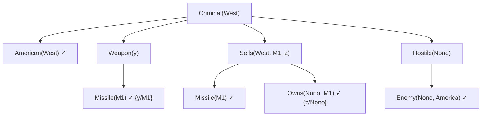

# Horn Clauses and Backward Chaining (Cláusulas de Horn y encadenamiento hacia atrás)

> **Summary (EN):** A Horn clause has at most one positive literal. With exactly one, it is a rule (A ∧ B ⇒ C) or a fact (C); with none, it is a query. This restriction lets knowledge read as "if… then…" rules and allows reasoning by chaining: forward, from the facts toward new conclusions, or backward, from the question toward the facts. For propositional Horn knowledge bases this takes time linear in their size. Prolog is backward chaining over first-order Horn rules, depth first and left to right.

> **En palabras simples (ES):** Una cláusula de Horn es una regla simple del tipo "si pasa esto **y** esto, entonces aquello", o un hecho ("Héctor es padre de Ana"). Para **probar** algo, se trabaja hacia atrás: busca una regla que lo concluya y luego prueba cada una de sus condiciones, hasta llegar a hechos conocidos. Así razona Prolog. *(Abajo está el pseudocódigo paso a paso, en inglés y en español.)*

## Términos clave

| English | Español | Significado (en simple) |
|---|---|---|
| Literal (positive / negative) | Literal (positivo / negativo) | Un símbolo solo (A) / negado (¬A). |
| Horn clause | Cláusula de Horn | Cláusula con **como mucho un** literal positivo. |
| Definite clause | Cláusula definida | Con **exactamente uno** positivo: una **regla** "si… entonces…". |
| Fact | Hecho | Una regla sin condiciones: algo que simplemente es verdad. |
| Goal clause | Cláusula objetivo | Sin literal positivo: una **pregunta**. |
| Forward chaining | Encadenamiento hacia adelante | Partir de los hechos y sacar todas las conclusiones posibles. |
| Backward chaining | Encadenamiento hacia atrás | Partir de la pregunta y buscar qué hace falta para probarla. |
| AND–OR graph | Grafo Y–O | Dibujo de la prueba: condiciones que se necesitan todas (Y) o alternativas (O). |

## Explicación

### 1. Las tres formas de una cláusula de Horn (slides XX, s4)

Una cláusula de Horn es un "o" de literales con **como mucho uno sin negar**. Se puede leer de tres maneras:

| Forma con "o" | Leída como "si… entonces…" | Nombre | En Prolog |
|---|---|---|---|
| `¬A ∨ ¬B ∨ C` | `A ∧ B ⇒ C` ("si A y B, entonces C") | Regla (cláusula definida) | `c :- a, b.` |
| `C` | `True ⇒ C` ("C es verdad") | Hecho | `c.` |
| `¬A ∨ ¬B` | `A ∧ B ⇒ False` ("¿son verdad A y B?") | Pregunta (cláusula objetivo) | `?- a, b.` |

**No todo es Horn.** `P ∨ Q` ("P o Q") tiene **dos** literales positivos, así que no es de Horn. Ese es el precio de la rapidez: **Prolog no puede decir "es uno de estos dos, pero no sé cuál"**.

### 2. ¿Por qué son útiles? (s5)

1. Se leen fácil como reglas: `L ∧ B ⇒ M` se entiende mejor que `¬L ∨ ¬B ∨ M`.
2. Se razona **encadenando** reglas, hacia adelante o hacia atrás.
3. En lógica proposicional, decidir si algo se deduce tarda un tiempo **proporcional al tamaño** de lo que sabes (lineal). En primer orden puede no terminar, pero buscar es mucho más barato que con resolución completa.

### 3. Encadenamiento hacia atrás (s6)

Para probar una pregunta:
1. Busca una regla cuya **conclusión** encaje con la pregunta.
2. Ahora tienes que probar las **condiciones** de esa regla, una por una, de izquierda a derecha.
3. Repite con cada condición hasta llegar a **hechos**.

Ventaja: solo mira lo que sirve para la pregunta, y usa memoria proporcional al tamaño de la prueba.

### 4. Ejemplo: ¿West es un criminal? (AIMA Fig. 9.7)

Regla: "es criminal quien es estadounidense y le vende un arma a una nación hostil". Hechos: West es estadounidense; Nono tiene el misil M1; los misiles son armas; Nono es enemigo de América, y los enemigos son hostiles.

```
Criminal(West)
├── American(West)                 ✓ fact
├── Weapon(y)      ← Missile(y)    ✓ Missile(M1)   {y/M1}
├── Sells(West, M1, z) ← Missile(M1) ∧ Owns(Nono, M1)   ✓ ✓   {z/Nono}
└── Hostile(Nono)  ← Enemy(Nono, America)   ✓ fact
```

Cómo leerlo: para probar `Criminal(West)` hay que probar 4 condiciones. La primera es un hecho. Para "Weapon(y)" se usa la regla "los misiles son armas" y se encuentra que y = M1. Para "Sells" se usa otra regla y se encuentra que z = Nono. Para "Hostile(Nono)" se usa "los enemigos son hostiles". Todo se cumple → **West es criminal**.

### 5. Hacia adelante vs. hacia atrás (complemento, AIMA §9.3–9.4)

- **Hacia adelante:** desde los hechos, saca **todas** las conclusiones posibles. Útil para vigilar algo que cambia (sistemas de alarmas, reglas de producción).
- **Hacia atrás:** desde la pregunta, saca **solo** lo necesario para responderla. Útil para responder preguntas; es lo que hace Prolog.

### Diagrama



## Pseudocódigo intuitivo (para explicar en el examen)

> **Idea (ES):** Una cláusula de Horn es una regla simple del tipo "si pasa esto **y** esto, entonces aquello", o un hecho ("Héctor es padre de Ana"). Para **probar** algo, se trabaja hacia atrás: busca una regla que lo concluya y luego prueba cada una de sus condiciones, hasta llegar a hechos conocidos. Así razona Prolog.

**Antes de empezar: qué significa cada cosa**

| Palabra | Qué es (en simple) | English |
|---|---|---|
| Hecho | algo que se sabe que es verdad: `parent(hector, ana).` | fact |
| Regla | "cabeza es verdad si el cuerpo es verdad": `c :- a, b.` = "c si a y b" | rule (definite clause) |
| Cabeza / cuerpo | la conclusión (izquierda de `:-`) / las condiciones (derecha) | head / body |
| Meta | lo que queremos probar (la pregunta) | goal / query |
| Cláusula de Horn | cláusula con **como mucho un** literal positivo (un hecho, una regla o una pregunta) | Horn clause |
| Unificar | encontrar valores para las variables que hagan iguales dos expresiones | unify |

**Pasos** — en inglés (como lo escribes en el examen) y debajo en español (para entender):

1. If the goal G is a known fact → success.
   - *ES:* Si lo que quiero probar ya es un hecho, listo.
2. Otherwise, find a rule whose head matches G (unify them).
   - *ES:* Si no, busca una regla cuya conclusión encaje con lo que quiero probar.
3. Prove each condition of the rule's body, left to right, using the values found.
   - *ES:* Prueba cada condición de esa regla, de izquierda a derecha, con los valores que ya encontraste.
4. If a condition fails → try the next rule that matches G.
   - *ES:* Si una condición no se puede probar, prueba con otra regla.
5. If no rule works → G fails.
   - *ES:* Si ninguna regla sirve, no se puede probar.

**Ejemplo con números:** hechos `parent(hector, ana).` y `parent(ana, sofia).` Regla: `grandparent(X, Z) :- parent(X, Y), parent(Y, Z).` ("X es abuelo de Z si X es padre de Y y Y es padre de Z").
Pregunta: ¿`grandparent(hector, sofia)`?
1. Encaja con la regla: X = hector, Z = sofia.
2. Primera condición: `parent(hector, Y)` → el hecho da Y = ana ✓.
3. Segunda condición: `parent(ana, sofia)` → es un hecho ✓.
4. Respuesta: **sí**.

**Say it in the exam (EN):** "A Horn clause has at most one positive literal, so knowledge is written as rules (A ∧ B ⇒ C), facts and goals. With Horn clauses, inference is done by chaining: forward chaining starts from the facts and derives new ones; backward chaining starts from the goal and looks for rules that prove it. Prolog uses backward chaining, depth-first and left to right."

**Dilo así (ES):** "Una cláusula de Horn tiene como mucho un literal positivo, así que el conocimiento se escribe como reglas, hechos y preguntas. Se razona encadenando: hacia adelante, desde los hechos; o hacia atrás, desde la pregunta buscando reglas que la prueben. Prolog encadena hacia atrás, en profundidad y de izquierda a derecha."

## Errores comunes y tips de examen

- Una cláusula de Horn tiene **como mucho** un literal positivo (0 o 1); una cláusula definida tiene **exactamente** uno.
- El encadenamiento hacia atrás en profundidad puede quedarse en un bucle infinito con reglas que se llaman a sí mismas por la izquierda (ver [Prolog](prolog.md)).

## Relacionado

- [Propositional and First-Order Logic](propositional-and-first-order-logic.md)
- [Unification](unification.md)
- [Prolog](prolog.md)
- [Uninformed Search](uninformed-search.md) (DFS)

## Fuentes

- [Slides XX](../sources/slides-xx-logic-programming-prolog.md), slides 4–7.
- [AIMA 4e](../sources/book-russell-norvig-aima.md) §7.5.3 (Fig. 7.16) y §9.4 (Fig. 9.7).
- [Luger 6e](../sources/book-luger-ai.md) §14.2.
