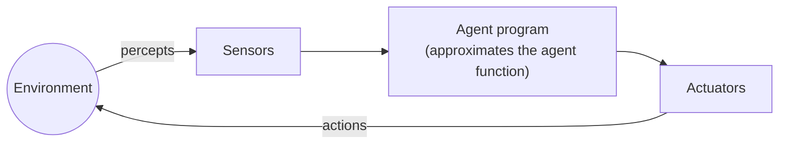

# Intelligent Agents (Agentes inteligentes)

> **Summary (EN):** An agent perceives its environment through sensors and acts on it through actuators. Its behavior is described by an agent function (percept history → action) and implemented by an agent program that approximates that function compactly. A rational agent chooses, at each moment, the action that maximizes the expected value of a performance measure given its percepts and built-in knowledge. Task environments are specified with PEAS.

> **En palabras simples (ES):** Un agente es cualquier cosa que **percibe** su entorno y **actúa** sobre él, como un robot aspiradora: mira si hay suciedad (percibe) y decide aspirar o moverse (actúa). Repite ese ciclo para siempre; lo que cambia entre agentes es *cómo* decide. *(Abajo está el pseudocódigo paso a paso, en inglés y en español.)*

## Términos clave

| English | Español | Significado |
|---|---|---|
| Agent | Agente | Algo que percibe y actúa. |
| Sensor / Actuator | Sensor / Actuador | Mecanismos para percibir / actuar. |
| Percept / percept history | Percepción / historia de percepciones | Lo que el agente percibe en un instante / todo lo percibido hasta ahora. |
| Agent function | Función del agente | Especificación abstracta: historia → acción (una tabla, en teoría). |
| Agent program | Programa del agente | Implementación concreta que corre en una arquitectura física. |
| Rational agent | Agente racional | Maximiza el valor esperado de la medida de desempeño. |
| Performance measure | Medida de desempeño | Criterio externo, definido por el diseñador. |
| PEAS | PEAS | Performance, Environment, Actuators, Sensors. |

## Explicación

**Agente = percibir → decidir → actuar.** Un humano (ojos → cerebro → manos), un robot (cámaras → procesador → motores) o un programa (teclado/archivos → código → pantalla/red).

**Función vs. programa.** La *función del agente* dice qué hacer en **cada** situación posible: mapea la historia de percepciones a una acción. Podría escribirse como una tabla gigante, pero en el mundo de la aspiradora la tabla crece exponencialmente con el tiempo → intratable. El *programa del agente* es lo que realmente escribimos: aproxima esa función de forma compacta. "Todo el diseño de IA es la búsqueda de buenos programas que aproximen la función ideal."

**Vacuum World (mundo de la aspiradora).** Dos cuartos A y B, cada uno sucio o limpio. Sensores: posición y estado del cuarto. Actuadores: izquierda, derecha, aspirar. Programa reflejo típico:

```
function REFLEX-VACUUM-AGENT([location, status]) returns action
    if status = Dirty then return Suck
    else if location = A then return Right
    else if location = B then return Left
```

**Racionalidad.** Un agente racional, en cada momento, elige la acción que maximiza el valor **esperado** de la medida de desempeño, dada su historia de percepciones y su conocimiento incorporado. También debe **explorar** (recolectar información útil) y **aprender** de sus percepciones.

**Lo racional en cada momento depende de cuatro cosas** (AIMA §2.2.2):
1. La medida de desempeño (criterio de éxito).
2. El conocimiento previo del agente sobre el entorno.
3. Las acciones que puede realizar.
4. Su secuencia de percepciones hasta ahora.

> *Definición (AIMA):* "For each possible percept sequence, a rational agent should select an action that is expected to maximize its performance measure, given the evidence provided by the percept sequence and whatever built-in knowledge the agent has."

**Racional ≠ omnisciente ≠ perfecto.** La racionalidad maximiza el desempeño *esperado*; la perfección maximizaría el desempeño *real* (haría falta una bola de cristal). Ejemplo del libro: cruzar la calle mirando a ambos lados es racional aunque luego caiga la puerta de un avión. Pero cruzar **sin mirar** no es racional: un agente racional hace acciones de **recolección de información** (*information gathering*) — "mirar" — para mejorar sus percepciones futuras, y debe **aprender** de lo que percibe. Un agente que depende solo del conocimiento de su diseñador y no de sus percepciones carece de **autonomía**.

**¿Es racional la aspiradora reflejo?** Depende de los supuestos: si la medida da 1 punto por cuadro limpio por paso en 1000 pasos, la geografía es conocida y solo hay Left/Right/Suck, **sí**. Si cada movimiento costara 1 punto, no: oscilaría inútilmente cuando todo está limpio.

**Consecuencialismo.** La IA evalúa al agente por las **consecuencias** de sus acciones: la secuencia de estados del entorno que produce.

**La medida de desempeño la define el diseñador** — "you get what you ask for". AIMA recomienda: "design performance measures according to what one actually wants to be achieved in the environment, rather than according to how one thinks the agent should behave" (premiar *suelo limpio*, no *suciedad aspirada*). Si premiamos "cantidad de suciedad aspirada", un agente racional podría ensuciar para volver a aspirar. Una medida mal especificada o incompleta produce comportamiento no deseado.

**PEAS.** Para especificar un entorno de tarea: *Performance* (criterio de éxito), *Environment* (el mundo), *Actuators*, *Sensors*. Ejemplo clásico (AIMA): taxi automático — P: seguridad, rapidez, legalidad, comodidad; E: calles, tráfico, peatones; A: volante, acelerador, freno, bocina; S: cámaras, GPS, velocímetro, sonar.

### Diagrama



## Pseudocódigo intuitivo (para explicar en el examen)

> **Idea (ES):** Un agente es cualquier cosa que **percibe** su entorno y **actúa** sobre él, como un robot aspiradora: mira si hay suciedad (percibe) y decide aspirar o moverse (actúa). Repite ese ciclo para siempre; lo que cambia entre agentes es *cómo* decide.

**Antes de empezar: qué significa cada cosa**

| Palabra | Qué es (en simple) | English |
|---|---|---|
| Percepción | lo que el agente "ve" en este momento con sus sensores, p. ej. [A, Sucio] | percept |
| Historial de percepciones | todo lo que ha visto desde que empezó | percept history |
| Sensores / actuadores | por dónde recibe información / con qué actúa (cámara / ruedas) | sensors / actuators |
| Medida de desempeño | la "nota" con la que juzgamos si el agente lo hace bien | performance measure |
| Racional | elige la acción con la mejor nota **esperada** según lo que sabe | rational |

**Pasos** — en inglés (como lo escribes en el examen) y debajo en español (para entender):

*The loop of every agent*

1. Read the current percept from the sensors.
   - *ES:* Mira qué está pasando ahora.
2. Add it to what the agent knows (percept history or internal state).
   - *ES:* Guárdalo junto con lo que ya sabías.
3. Choose the action with the best expected performance, given what it knows.
   - *ES:* Elige la acción que, según lo que sabes, debería dar la mejor nota.
4. Send the action to the actuators, and go back to step 1.
   - *ES:* Haz la acción y vuelve a empezar.

*Example: reflex vacuum agent (two squares, A and B)*

1. If my square is dirty → Suck.
   - *ES:* Si mi cuadro está sucio, aspiro.
2. Else, if I am in A → move Right.
   - *ES:* Si está limpio y estoy en A, me muevo a la derecha (a B).
3. Else (I am in B) → move Left.
   - *ES:* Si está limpio y estoy en B, me muevo a la izquierda (a A).

**Ejemplo con números:** el agente percibe [A, Sucio] → aspira. Luego percibe [A, Limpio] → se mueve a B. Percibe [B, Sucio] → aspira. Si la nota es +1 por cada cuadro limpio en cada momento, este agente es racional: nadie lo haría mejor sabiendo lo mismo.

**Say it in the exam (EN):** "An agent perceives its environment through sensors and acts through actuators. The agent function maps the whole percept history to an action; the agent program is the code that implements it. A rational agent chooses the action with the highest expected performance given what it has perceived — it is not omniscient, so it can still have bad luck."

**Dilo así (ES):** "Un agente percibe con sensores y actúa con actuadores. La función del agente dice qué acción tomar para cada historial de percepciones; el programa del agente es el código que la implementa. Un agente racional elige la acción con mejor desempeño esperado según lo que sabe; no es omnisciente, así que puede tener mala suerte y seguir siendo racional."

## Errores comunes y tips de examen

- Racional ≠ omnisciente ≠ exitoso siempre: se evalúa con la información disponible y en **valor esperado**.
- La medida de desempeño es **externa**: la define el diseñador, no el agente.
- Saber distinguir *función* (matemática, abstracta) de *programa* (código, concreto).

## Relacionado

- [Task Environments](task-environments.md)
- [Agent Types](agent-types.md)
- [State Representation](state-representation.md)
- [Problem Formulation](problem-formulation.md) — el agente de resolución de problemas
- [What Is AI?](what-is-ai.md)

## Fuentes

- [Slides 03](../sources/slides-03-intelligent-agents.md), slides 2–6.
- [AIMA 4e](../sources/book-russell-norvig-aima.md) §2.1–2.2 (ingestado: definición, cuatro factores, omnisciencia, consecuencialismo; ejemplo del taxi y pseudocódigo).
