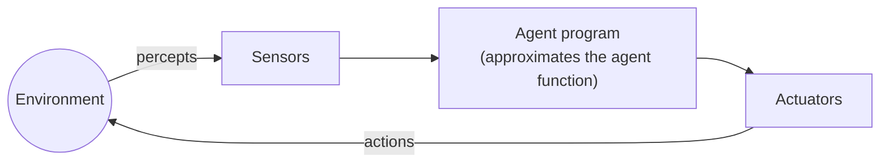

# Intelligent Agents (Agentes inteligentes)

> **Summary (EN):** An agent perceives its environment through sensors and acts on it through actuators. The agent function says which action to take for every possible percept history; the agent program is the code that implements it. A rational agent chooses the action with the highest expected performance, given what it has perceived and what it already knows. Task environments are described with PEAS: Performance, Environment, Actuators, Sensors.

> **En palabras simples (ES):** Un agente es cualquier cosa que **percibe** su entorno y **actúa** sobre él, como un robot aspiradora: mira si hay suciedad (percibe) y decide aspirar o moverse (actúa). Repite ese ciclo para siempre; lo que cambia entre agentes es *cómo* decide. *(Abajo está el pseudocódigo paso a paso, en inglés y en español.)*

## Términos clave

| English | Español | Significado (en simple) |
|---|---|---|
| Agent | Agente | Algo que percibe su entorno y actúa sobre él. |
| Sensor / Actuator | Sensor / Actuador | Por dónde recibe información (cámara, micrófono) / con qué actúa (ruedas, brazo, pantalla). |
| Percept | Percepción | Lo que el agente capta en un instante, p. ej. "[cuarto A, sucio]". |
| Percept history | Historial de percepciones | Todo lo que ha captado desde que empezó. |
| Agent function | Función del agente | La regla ideal: para cada historial posible, qué acción tomar (como una tabla gigante). |
| Agent program | Programa del agente | El código real que corre en el robot y hace lo que dice esa regla. |
| Performance measure | Medida de desempeño | La "nota" con la que el diseñador juzga si el agente lo hace bien. |
| Rational agent | Agente racional | El que elige la acción con mejor nota **esperada** según lo que sabe. |
| PEAS | PEAS | Lista para describir una tarea: Performance (nota), Environment (entorno), Actuators, Sensors. |

## Explicación

### 1. Agente = percibir → decidir → actuar

Un agente repite siempre tres cosas:

| | Humano | Robot | Programa |
|---|---|---|---|
| **Percibe** con… | ojos, oídos | cámaras, sensores | teclado, archivos |
| **Decide** con… | cerebro | procesador | código |
| **Actúa** con… | manos, voz | motores, ruedas | pantalla, red |

### 2. Función del agente vs. programa del agente

- La **función del agente** es la idea teórica: una tabla que dice qué hacer **para cada historial de percepciones posible**. El problema es que esa tabla sería gigantesca. Por ejemplo, en el mundo de la aspiradora crece cada vez que pasa un paso de tiempo.
- El **programa del agente** es lo que de verdad escribimos: un código corto que hace lo mismo que esa tabla sin tener que guardarla entera.

Por eso se dice: "todo el diseño de IA consiste en encontrar buenos programas que imiten la función ideal".

### 3. Ejemplo: el mundo de la aspiradora (*Vacuum World*)

- Hay **dos cuartos**, A y B. Cada uno puede estar sucio o limpio.
- **Sensores:** la aspiradora sabe en qué cuarto está y si ese cuarto está sucio.
- **Acciones:** moverse a la izquierda, moverse a la derecha o aspirar.

Programa reflejo (en inglés, como en el libro):

```
function REFLEX-VACUUM-AGENT([location, status]) returns action
    if status = Dirty then return Suck
    else if location = A then return Right
    else if location = B then return Left
```

En español: "si está sucio, aspira; si está limpio y estoy en A, voy a la derecha; si estoy en B, voy a la izquierda".

### 4. ¿Qué es ser racional?

Un agente **racional** elige, en cada momento, la acción que debería darle **la mejor nota en promedio** (el valor *esperado*), según lo que ha percibido y lo que ya sabía.

Lo racional en cada momento depende de **cuatro cosas** (AIMA §2.2.2):
1. **La nota:** cómo se mide el éxito.
2. **Lo que el agente ya sabe** del entorno antes de empezar.
3. **Las acciones** que puede hacer.
4. **Todo lo que ha percibido** hasta ahora.

> *Definición (AIMA):* "For each possible percept sequence, a rational agent should select an action that is expected to maximize its performance measure, given the evidence provided by the percept sequence and whatever built-in knowledge the agent has."

### 5. Racional no es lo mismo que perfecto

- **Perfecto (omnisciente)** sería saber el futuro: elegir siempre lo que *de verdad* sale mejor. Eso es imposible.
- **Racional** es elegir lo que *se espera* que salga mejor con la información disponible.

Ejemplo del libro: miras a ambos lados, cruzas la calle y te cae encima la puerta de un avión. Fue **racional** cruzar (no podías saberlo). En cambio, cruzar **sin mirar** no es racional. Un agente racional también **busca información** (mirar antes de cruzar) y **aprende** de lo que percibe. Si solo usa lo que el programador le dio y nunca aprende de sus percepciones, le falta **autonomía**.

**¿La aspiradora reflejo es racional?** Depende de la nota:
- Si gana 1 punto por cada cuarto limpio en cada paso de tiempo (1000 pasos), conoce el mapa y solo puede ir izquierda/derecha/aspirar → **sí** es racional.
- Si además cada movimiento le **resta** 1 punto → **no**, porque sigue yendo de un cuarto a otro aunque todo esté limpio.

### 6. La nota la pone el diseñador: "obtienes lo que pides"

La IA juzga al agente por las **consecuencias** de lo que hace (cómo queda el entorno). Si la nota está mal pensada, el agente hará cosas raras:

- Si premias "cantidad de suciedad aspirada", un agente racional podría **ensuciar para volver a aspirar**.
- Mejor premiar "**piso limpio**". AIMA: "design performance measures according to what one actually wants to be achieved in the environment, rather than according to how one thinks the agent should behave".

### 7. PEAS: cómo describir una tarea

Antes de diseñar un agente, llena estas cuatro casillas. Ejemplo del libro, un **taxi automático**:

| Letra | Significa | Taxi automático |
|---|---|---|
| **P** | Performance (la nota) | seguridad, rapidez, respetar las leyes, comodidad |
| **E** | Environment (el entorno) | calles, tráfico, peatones |
| **A** | Actuators (con qué actúa) | volante, acelerador, freno, bocina |
| **S** | Sensors (con qué percibe) | cámaras, GPS, velocímetro, sonar |

### Diagrama



## Pseudocódigo intuitivo (para explicar en el examen)

> **Idea (ES):** Un agente es cualquier cosa que **percibe** su entorno y **actúa** sobre él, como un robot aspiradora: mira si hay suciedad (percibe) y decide aspirar o moverse (actúa). Repite ese ciclo para siempre; lo que cambia entre agentes es *cómo* decide.

**Antes de empezar: qué significa cada cosa**

| Palabra | Qué es (en simple) | English |
|---|---|---|
| Percepción | lo que el agente "ve" en este momento con sus sensores, p. ej. [A, Sucio] | percept |
| Historial de percepciones | todo lo que ha visto desde que empezó | percept history |
| Sensores / actuadores | por dónde recibe información / con qué actúa (cámara / ruedas) | sensors / actuators |
| Medida de desempeño | la "nota" con la que juzgamos si el agente lo hace bien | performance measure |
| Racional | elige la acción con la mejor nota **esperada** según lo que sabe | rational |

**Pasos** — en inglés (como lo escribes en el examen) y debajo en español (para entender):

*The loop of every agent*

1. Read the current percept from the sensors.
   - *ES:* Mira qué está pasando ahora.
2. Add it to what the agent knows (percept history or internal state).
   - *ES:* Guárdalo junto con lo que ya sabías.
3. Choose the action with the best expected performance, given what it knows.
   - *ES:* Elige la acción que, según lo que sabes, debería dar la mejor nota.
4. Send the action to the actuators, and go back to step 1.
   - *ES:* Haz la acción y vuelve a empezar.

*Example: reflex vacuum agent (two squares, A and B)*

1. If my square is dirty → Suck.
   - *ES:* Si mi cuadro está sucio, aspiro.
2. Else, if I am in A → move Right.
   - *ES:* Si está limpio y estoy en A, me muevo a la derecha (a B).
3. Else (I am in B) → move Left.
   - *ES:* Si está limpio y estoy en B, me muevo a la izquierda (a A).

**Ejemplo con números:** el agente percibe [A, Sucio] → aspira. Luego percibe [A, Limpio] → se mueve a B. Percibe [B, Sucio] → aspira. Si la nota es +1 por cada cuadro limpio en cada momento, este agente es racional: nadie lo haría mejor sabiendo lo mismo.

**Say it in the exam (EN):** "An agent perceives its environment through sensors and acts through actuators. The agent function maps the whole percept history to an action; the agent program is the code that implements it. A rational agent chooses the action with the highest expected performance given what it has perceived — it is not omniscient, so it can still have bad luck."

**Dilo así (ES):** "Un agente percibe con sensores y actúa con actuadores. La función del agente dice qué acción tomar para cada historial de percepciones; el programa del agente es el código que la implementa. Un agente racional elige la acción con mejor desempeño esperado según lo que sabe; no es omnisciente, así que puede tener mala suerte y seguir siendo racional."

## Errores comunes y tips de examen

- **Racional ≠ omnisciente ≠ siempre exitoso.** Se juzga con la información disponible y por el resultado **esperado**.
- La medida de desempeño la define **el diseñador**, no el agente.
- No confundas *función* del agente (la tabla ideal, teórica) con *programa* del agente (el código real).

## Relacionado

- [Task Environments](task-environments.md)
- [Agent Types](agent-types.md)
- [State Representation](state-representation.md)
- [Problem Formulation](problem-formulation.md) — el agente de resolución de problemas
- [What Is AI?](what-is-ai.md)

## Fuentes

- [Slides 03](../sources/slides-03-intelligent-agents.md), slides 2–6.
- [AIMA 4e](../sources/book-russell-norvig-aima.md) §2.1–2.2 (ingestado: definición, cuatro factores, omnisciencia, consecuencialismo; ejemplo del taxi y pseudocódigo).
