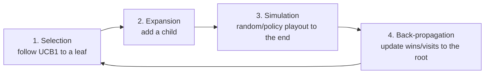

# Monte Carlo Tree Search (Búsqueda de árbol Monte Carlo, MCTS)

> **Summary (EN):** MCTS judges a game position not with an evaluation formula but by playing many fast simulated games (playouts) from it and averaging the results. It grows a search tree by repeating four steps: selection, expansion, simulation and back-propagation. Selection uses UCB1 (UCT), which balances moves that have won often (exploitation) with moves that have been tried little (exploration). It replaced alpha–beta in Go, where there are about 361 possible moves at the start and no good evaluation formula; AlphaGo and AlphaZero combine MCTS with neural networks trained by playing against themselves.

> **En palabras simples (ES):** En vez de usar una fórmula para saber si una posición es buena, juega **muchas partidas rápidas al azar** desde ella y cuenta cuántas ganas. Si desde una jugada ganas 7 de 10, probablemente es buena. Para no probar solo las que ya parecen buenas, de vez en cuando prueba las que casi no has probado. *(Abajo está el pseudocódigo paso a paso, en inglés y en español.)*

## Términos clave

| English | Español | Significado (en simple) |
|---|---|---|
| Playout / rollout / simulation | Simulación | Jugar una partida rápida, desde una posición hasta el final. |
| Playout policy | Política de simulación | Cómo se eligen las jugadas en esa partida rápida (al azar, o prefiriendo jugadas buenas). |
| Selection policy | Política de selección | Cómo se decide por qué rama bajar en el árbol. |
| UCT / UCB1 | UCT / UCB1 | La fórmula que equilibra "lo que ha funcionado" con "lo que casi no he probado". |
| U(n), N(n) | — | Victorias acumuladas pasando por n / veces que se visitó n. |
| Back-propagation | Retropropagación | Subir el resultado de la partida, actualizando los contadores hasta la raíz. |
| Pure Monte Carlo search | Monte Carlo puro | Solo hacer muchas simulaciones desde la posición actual, sin construir árbol. |
| Type A / Type B strategy (Shannon) | Estrategia tipo A / tipo B | A: mirar **todas** las jugadas pero a poca profundidad. B: mirar **solo las prometedoras**, pero muy profundo. |

## Explicación

### 1. ¿Por qué no basta alfa–beta en Go? (AIMA §6.4)

1. Al principio hay **361** jugadas posibles por turno, así que alfa–beta solo alcanza a mirar 4 o 5 jugadas adelante.
2. Es muy difícil escribir una **función de evaluación** para Go: contar piedras no dice quién va ganando, y la partida puede cambiar hasta el final.

### 2. La idea: probar jugando

Para saber qué tan buena es una posición, **juega muchas partidas rápidas desde ella y cuenta cuántas ganas**. Para saber quién ganó solo hacen falta las **reglas del juego**, no una fórmula que podría estar equivocada.

Detalle: si las partidas rápidas fueran totalmente al azar, estaríamos respondiendo "¿cuál es la mejor jugada si los dos juegan al azar?". Por eso se usa una **política de simulación** que prefiere jugadas razonables (en Go, aprendida con redes neuronales jugando contra sí misma).

### 3. Los cuatro pasos (AIMA Fig. 6.10), repetidos mientras haya tiempo

1. **Selección:** desde la raíz, baja eligiendo en cada nivel el hijo con mayor UCB1, hasta llegar a una hoja del árbol.
2. **Expansión:** agrega un hijo nuevo a esa hoja (con 0 victorias de 0 visitas).
3. **Simulación:** desde ese hijo nuevo, juega una partida rápida hasta el final. Estas jugadas **no** se guardan en el árbol.
4. **Retropropagación:** sube por el mismo camino sumando **+1 visita** a cada nodo y **+1 victoria** a los nodos del jugador que ganó.

Al final se juega la jugada con **más visitas** (no la de mejor porcentaje: 65 de 100 es más confiable que 2 de 3).

### 4. La fórmula UCB1

```
UCB1(n) = U(n) / N(n)  +  C · sqrt( ln N(PARENT(n)) / N(n) )
          └ exploitation ┘   └──────── exploration ────────┘
```

- **Primera parte, U(n)/N(n):** el porcentaje de victorias. "¿Qué tan bien le ha ido a esta jugada?" (**explotar**).
- **Segunda parte:** "¿qué tan poco la he probado?" (**explorar**). Es grande cuando N(n), las visitas de este hijo, es pequeño. Usa el logaritmo natural (ln) de las visitas del **padre**.
- **C** decide cuánto premiar la exploración. La teoría sugiere C = √2 ≈ 1.41; en la práctica se ajusta. AlphaZero agrega además la probabilidad de la jugada según una red neuronal.

**Ejemplo verificado (AIMA Fig. 6.10):** la raíz tiene 100 visitas (ln 100 ≈ 4.605). Tres hijos:

| Hijo (victorias/visitas) | % de victorias | Exploración con C = 1.4 | UCB1 (C = 1.4) | UCB1 (C = 1.5) |
|---|---|---|---|---|
| 60/79 | 0.759 | 1.4·√(4.605/79) = 0.338 | **1.097** | 1.121 |
| 1/10 | 0.100 | 1.4·√(4.605/10) = 0.950 | 1.050 | 1.118 |
| 2/11 | 0.182 | 1.4·√(4.605/11) = 0.906 | 1.088 | **1.152** |

Con C = 1.4 gana el 60/79 (el que más ha ganado: explotar). Con C = 1.5 gana el 2/11 (poco probado: explorar). Exactamente lo que dice el libro.

### 5. MCTS vs. alfa–beta

Con 32 jugadas por turno, partidas de 100 jugadas y un presupuesto de 10⁹ posiciones: minimax mira 6 jugadas adelante, alfa–beta con orden perfecto 12, y MCTS hace 10 millones de partidas rápidas. Cada partida rápida es barata: una jugada por nivel.

| | Alfa–beta con evaluación | MCTS |
|---|---|---|
| ¿Cómo valora las hojas? | Con una fórmula de evaluación | Con el promedio de partidas rápidas |
| Mejor cuando… | Hay pocas jugadas por turno y una buena fórmula (ajedrez) | Hay muchas jugadas o no hay buena fórmula (Go), o el juego es nuevo |
| Debilidad | Un error de la fórmula en un nodo puede decidir la jugada | Puede no probar una jugada única que lo decide todo; tarda en confirmar posiciones "obviamente" ganadas |

## Pseudocódigo

```
function MONTE-CARLO-TREE-SEARCH(state) returns an action
    tree ← NODE(state)
    while IS-TIME-REMAINING():
        leaf  ← SELECT(tree)              # follow UCB1 down to a leaf
        child ← EXPAND(leaf)              # add a new child node
        result ← SIMULATE(child)          # playout to a terminal state
        BACK-PROPAGATE(result, child)     # update wins/playouts up to the root
    return the move in ACTIONS(state) whose node has the highest number of playouts
```

## Ajedrez vs. Go (conecta con HW01)

- **Ajedrez:** Deep Blue le ganó a Kasparov en 1997 con alfa–beta: revisaba más de 100 millones de posiciones por segundo y en algunas líneas miraba hasta 40 jugadas adelante. Programas como Stockfish logran que, en la práctica, cada posición tenga menos de 3 jugadas que valga la pena mirar (en vez de 35). En 2017, **AlphaZero** (MCTS + red neuronal, aprendiendo contra sí mismo) le ganó a Stockfish 155 a 6 en 1000 partidas.
- **Go:** hasta 2015 los programas jugaban como aficionados. **AlphaGo** (Silver et al., 2016) combinó reconocimiento de patrones, aprendizaje por refuerzo, redes neuronales y MCTS, y le ganó a Lee Sedol 4–1 (marzo de 2016; AIMA dice "2015", ver [errata](../study/errata.md)) y a Ke Jie 3–0 (2017).
- Kasparov dijo que AlphaZero se parece al enfoque humano **tipo B** con el que soñaban Shannon y Turing (mirar pocas jugadas, pero buenas), en vez de la fuerza bruta.

### Diagrama



## Pseudocódigo intuitivo (para explicar en el examen)

> **Idea (ES):** En vez de usar una fórmula para saber si una posición es buena, juega **muchas partidas rápidas al azar** desde ella y cuenta cuántas ganas. Si desde una jugada ganas 7 de 10, probablemente es buena. Para no probar solo las que ya parecen buenas, de vez en cuando prueba las que casi no has probado.

**Antes de empezar: qué significa cada cosa**

| Símbolo | Qué es (en simple) | English |
|---|---|---|
| Playout (simulación) | una partida rápida, con jugadas al azar, hasta el final | playout / rollout |
| U(n) | cuántas partidas se ganaron pasando por el nodo n | wins (utility) |
| N(n) | cuántas veces se visitó (probó) el nodo n | visits |
| N(padre) | cuántas veces se visitó el nodo de arriba | parent visits |
| U(n)/N(n) | el porcentaje de victorias: qué tan buena parece la jugada | win rate (exploitation) |
| C | un número que decide cuánto premiar lo poco probado (p. ej. √2 ≈ 1.41) | exploration constant |
| ln | logaritmo natural (en la calculadora: tecla "ln") | natural log |

**Pasos** — en inglés (como lo escribes en el examen) y debajo en español (para entender):

1. SELECTION: from the root, go down choosing the child with the highest UCB1 until you reach a node with untried moves.
   - *ES:* Baja por el árbol eligiendo en cada nivel el hijo con mayor UCB1 (buen porcentaje **o** pocas visitas).
2. EXPANSION: add one new child to that node.
   - *ES:* Agrega una jugada nueva al árbol.
3. SIMULATION: play a fast random game from the new child until the end.
   - *ES:* Desde ahí juega una partida rápida al azar hasta que alguien gane.
4. BACK-PROPAGATION: go back up to the root adding 1 visit to every node on the path, and 1 win to the nodes of the player who won.
   - *ES:* Sube por el mismo camino sumando una visita a cada nodo y una victoria a los del jugador que ganó.
5. Repeat steps 1–4 until time runs out; then play the root move with the MOST visits.
   - *ES:* Repite mientras haya tiempo. Al final juega la jugada que más se visitó.

**La fórmula UCB1:** UCB1(n) = U(n)/N(n) + C · √( ln N(padre) / N(n) )
- *ES:* primera parte = "qué tan bien le ha ido" (explotar). Segunda parte = "qué poco la he probado" (explorar): se hace grande cuando N(n) es pequeño.

**Ejemplo con números:** el padre tiene N = 15 visitas (ln 15 ≈ 2.708). Hijos: A ganó 7 de 10, B ganó 3 de 4, C ganó 0 de 1. Con C = 1:
- A: 7/10 + √(2.708/10) = 0.70 + 0.52 = **1.22**
- B: 3/4 + √(2.708/4) = 0.75 + 0.82 = **1.57**
- C: 0/1 + √(2.708/1) = 0 + 1.65 = **1.65** ← se elige C: casi no se ha probado.

**Say it in the exam (EN):** "MCTS estimates how good a move is by averaging the results of many random playouts instead of using an evaluation function. Each iteration has four steps: selection, expansion, simulation and back-propagation. Selection uses UCB1, which balances exploitation (high win rate) and exploration (few visits). It works for games with huge branching factors and no good evaluation function, like Go; AlphaGo combined it with neural networks."

**Dilo así (ES):** "MCTS estima qué tan buena es una jugada promediando muchas partidas aleatorias, en vez de usar una función de evaluación. Cada iteración tiene cuatro pasos: selección, expansión, simulación y retropropagación. La selección usa UCB1, que equilibra explotar (buen porcentaje) y explorar (pocas visitas). Sirve para juegos con muchísimas jugadas y sin buena evaluación, como Go."

## Errores comunes y tips de examen

- MCTS **no necesita** función de evaluación (solo las reglas del juego), aunque se puede combinar con una (cortar la partida rápida y evaluar).
- Al final se juega la jugada con **más visitas**, no la de mejor porcentaje.
- En UCB1, la exploración usa el **logaritmo de las visitas del padre** dividido para las **visitas del hijo**.
- Es otro caso de **explorar vs. explotar**, igual que en [optimización](optimization-basics.md).

## Relacionado

- [Adversarial Search and Minimax](adversarial-search-minimax.md)
- [Alpha–Beta Pruning](alpha-beta-pruning.md)
- [Stochastic and Partially Observable Games](stochastic-and-partially-observable-games.md)
- [Neural Networks](neural-networks.md)
- [HW01 (Chess vs. Go)](../assignments/deber-1-search-problems.md)

## Fuentes

- [AIMA 4e](../sources/book-russell-norvig-aima.md) §6.4 (MCTS, UCT, Fig. 6.10–6.11) y notas históricas del cap. 6 (Deep Blue, Stockfish, AlphaGo, AlphaZero).
