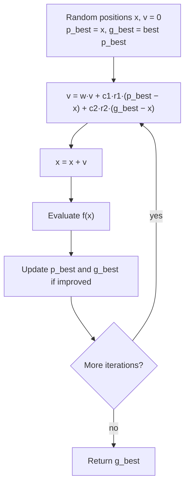

# Particle Swarm Optimization (Optimización por enjambre de partículas, PSO)

> **Summary (EN):** PSO (Kennedy & Eberhart, 1995) keeps a swarm of particles, each with a position x (a candidate solution), a velocity v and a personal best p_best; the swarm shares a global best g_best. Each step, velocity is pulled toward p_best (cognitive term) and g_best (social term) with random weights, and the particle moves: x ← x + v. The original update is v ← v + 2·rand·(p_best − x) + 2·rand·(g_best − x); later versions add an inertia weight w. Momentum causes overshooting (exploration) while the attraction terms exploit good regions.

> **En palabras simples (ES):** Imagina una bandada de pájaros buscando comida. Cada pájaro (partícula) recuerda **el mejor lugar que encontró él** y sabe **el mejor lugar que encontró toda la bandada**. En cada paso, su nueva velocidad mezcla tres cosas: seguir como venía (inercia), volver hacia su mejor lugar, e ir hacia el mejor lugar del grupo. *(Abajo está el pseudocódigo paso a paso, en inglés y en español.)*

## Términos clave

| English | Español | Significado |
|---|---|---|
| Particle | Partícula | Solución candidata que se mueve en el espacio. |
| Position x_t / velocity v_t | Posición / velocidad | Dónde está / cómo se mueve. |
| Personal best p_best | Mejor personal | Mejor posición que visitó esa partícula ("nostalgia"). |
| Global best g_best | Mejor global | Mejor posición encontrada por el enjambre ("norma social"). |
| Cognitive / social term | Término cognitivo / social | Atracción hacia p_best / g_best. |
| Inertia weight w | Peso de inercia | Cuánto conserva de su velocidad anterior (variante posterior). |
| φ₁, φ₂ | φ₁, φ₂ | Números aleatorios ~ U[0, 1]. |

## Explicación

**Origen (paper §3).** Empezó como simulación de bandadas: *velocity matching* con el vecino + "craziness". Al añadir un "campo de maíz" (*cornfield*), cada agente recordaba su mejor posición (p_best) y conocía la mejor del grupo (g_best). Luego se eliminó lo innecesario (craziness, vecinos) y la bandada se volvió un **enjambre** que encuentra el óptimo.

**Ecuaciones.**

Versión original (1995, §3.6):
```
v ← v + 2·rand()·(p_best − x) + 2·rand()·(g_best − x)
x ← x + v
```
El factor 2 da media 1: las partículas "sobrevuelan" el objetivo la mitad del tiempo.

Versión con inercia (la de la tarea; Shi & Eberhart 1998, complemento):
```
v ← w·v + a₁·φ₁·(p_best − x) + a₂·φ₂·(g_best − x),   φ₁, φ₂ ~ U[0,1]
x ← x + v
```

**Algoritmo (tal como en la [tarea PSO](../assignments/pso-task.md)):**

```python
S = uniform(lower, upper, (N, D)); V = zeros((N, D)); P = S.copy()
f_P = [f(p) for p in P];  g = argmin(f_P)
for t in range(max_iter):
    phi1, phi2 = rand(N, D), rand(N, D)
    V = w*V + a1*phi1*(P - S) + a2*phi2*(P[g] - S)
    S = clip(S + V, lower, upper)
    f_S = [f(s) for s in S]
    improved = f_S < f_P
    P[improved], f_P[improved] = S[improved], f_S[improved]
    g = argmin(f_P)
return P[g], f_P[g]
```

**Exploración vs. explotación (slide 10).**
- p_increment ≫ g_increment → individuos vagan aislados (demasiada exploración).
- g_increment ≫ p_increment → el enjambre corre prematuramente a un mínimo local.
- Valores aproximadamente iguales funcionan mejor.
- **Quitar el momentum** (la velocidad anterior) hace al algoritmo "bastante ineficaz" para óptimos globales: la inercia es lo que explora.

**Resultados del paper.** Entrenó una red XOR 2-3-1 (13 pesos) en 30.7 iteraciones con 20 agentes; Iris tan bien como backprop; EEG 92 % vs. 89 %; encontró el óptimo global de Schaffer f6 en cada corrida.

## Ejemplo del curso

Tarea: N = 20 partículas, D = 2, límites [−10, 10], 100 iteraciones, w = 0.5, a₁ = a₂ = 1, minimizar (x+2)² + (y−2)² + 10. Con `np.random.seed(0)`: mejor x = (−2.00000001, 1.99999998), f = 10.0.

### Diagrama



## Pseudocódigo intuitivo (para explicar en el examen)

> **Idea (ES):** Imagina una bandada de pájaros buscando comida. Cada pájaro (partícula) recuerda **el mejor lugar que encontró él** y sabe **el mejor lugar que encontró toda la bandada**. En cada paso, su nueva velocidad mezcla tres cosas: seguir como venía (inercia), volver hacia su mejor lugar, e ir hacia el mejor lugar del grupo.

**Antes de empezar: qué significa cada cosa**

| Símbolo | Qué es (en simple) | English |
|---|---|---|
| x | la **posición** de la partícula: una solución, p. ej. (x, y) = (1, 1) | position |
| v | la **velocidad**: cuánto y hacia dónde se moverá en el próximo paso | velocity |
| p_best | el mejor lugar que **esta** partícula ha visitado | personal best |
| g_best | el mejor lugar que **todo el enjambre** ha visitado | global best |
| w | inercia: qué tanto conserva de su velocidad anterior (p. ej. 0.5) | inertia weight |
| c₁ | cuánto la atrae su propio recuerdo (parte "cognitiva") | cognitive coefficient |
| c₂ | cuánto la atrae el mejor del grupo (parte "social") | social coefficient |
| r₁, r₂ | números al azar entre 0 y 1, nuevos en cada paso | random numbers |
| f | la función que queremos minimizar | objective |

**Pasos** — en inglés (como lo escribes en el examen) y debajo en español (para entender):

1. Place N particles at random positions with zero velocity. Each particle's p_best is its starting position; g_best is the best of them.
   - *ES:* Pon partículas al azar, quietas. Cada una recuerda su posición inicial como su mejor lugar; el mejor del grupo es el mejor de todos.
2. For each particle, draw two random numbers r₁ and r₂ between 0 and 1.
   - *ES:* Saca dos números al azar.
3. Update the velocity: v ← w·v + c₁·r₁·(p_best − x) + c₂·r₂·(g_best − x).
   - *ES:* Velocidad nueva = **inercia** (w × velocidad anterior) + **recuerdo propio** (c₁ × r₁ × distancia hacia su mejor lugar) + **grupo** (c₂ × r₂ × distancia hacia el mejor del grupo).
4. Move: x ← x + v (and keep it inside the limits).
   - *ES:* Posición nueva = posición actual + velocidad.
5. If f(x) is better than f(p_best) → p_best ← x. If it is better than f(g_best) → g_best ← x.
   - *ES:* Si el nuevo lugar es mejor que su récord, actualiza su récord. Si es mejor que el récord del grupo, actualiza el del grupo.
6. Repeat steps 2–5 for many iterations and return g_best.
   - *ES:* Repite muchas veces y devuelve el mejor lugar del grupo.

**Ejemplo con números:** f(x, y) = (x + 2)² + (y − 2)² + 10. Partícula en x = (1, 1) con v = (0.5, −0.5); su mejor lugar p_best = (0, 2); el mejor del grupo g_best = (−2, 2); w = 0.5, c₁ = c₂ = 1, r₁ = 0.5, r₂ = 0.2.
- Inercia: 0.5 · (0.5, −0.5) = (0.25, −0.25).
- Recuerdo propio: 1 · 0.5 · ((0, 2) − (1, 1)) = 0.5 · (−1, 1) = (−0.5, 0.5).
- Grupo: 1 · 0.2 · ((−2, 2) − (1, 1)) = 0.2 · (−3, 1) = (−0.6, 0.2).
- Velocidad nueva: suma = **(−0.85, 0.45)**. Posición nueva: (1, 1) + (−0.85, 0.45) = **(0.15, 1.45)**.
- f pasó de 20 a **14.925**: mejoró. (No supera su récord p_best, que vale 14.)

**Say it in the exam (EN):** "PSO moves a swarm of particles, each a candidate solution, through the search space. Each particle remembers its personal best, and the swarm shares a global best. The new velocity combines inertia, attraction to the personal best (cognitive term) and attraction to the global best (social term), each scaled by a random number; then the particle moves by its velocity. The original 1995 version had no inertia weight and used coefficients of 2."

**Dilo así (ES):** "PSO mueve un enjambre de partículas, cada una una solución candidata. Cada partícula recuerda su mejor lugar y el enjambre comparte el mejor global. La nueva velocidad suma inercia, atracción a su mejor lugar (cognitiva) y atracción al mejor del grupo (social), cada una con un número al azar; luego la partícula se mueve según esa velocidad. La versión original de 1995 no tenía inercia y usaba coeficientes de 2."

## Errores comunes y tips de examen

- PSO **no** tiene selección, cruce ni mutación: las mismas partículas sobreviven y se mueven.
- p_best es por partícula; g_best es uno para todo el enjambre (en la variante *global*; existe *lbest* con vecindarios — complemento).
- La ecuación original no tiene w; si en el examen aparece w, es la variante con inercia.
- Relación con GA: el ajuste hacia p_best/g_best es "conceptualmente similar al cruce" (paper §6).

## Relacionado

- [Swarm Intelligence](swarm-intelligence.md)
- [Genetic Algorithms](genetic-algorithms.md)
- [Optimization Basics](optimization-basics.md)
- [Neural Networks](neural-networks.md)
- [PSO assignment](../assignments/pso-task.md)
- [Metaheuristics comparison](../study/metaheuristics-comparison.md)

## Fuentes

- [Slides 04](../sources/slides-04-optimization.md), slides 8–11.
- [Kennedy & Eberhart 1995](../sources/paper-kennedy-eberhart-1995-pso.md) §3–6.
