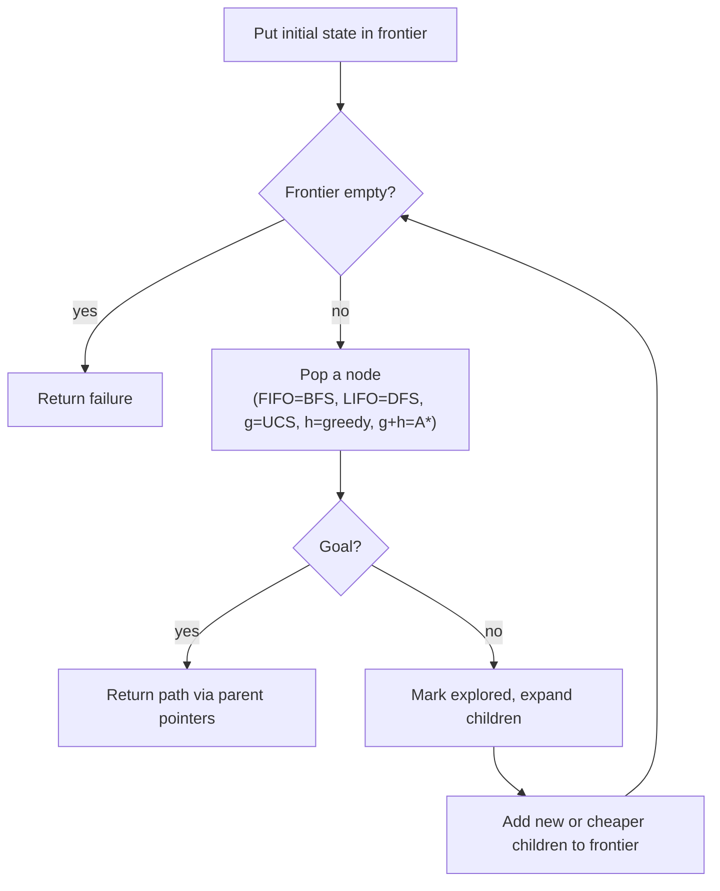

# Problem Formulation and State Space (Formulación de problemas y espacio de estados)

> **Summary (EN):** A problem-solving agent is a goal-based agent: it describes the problem, searches for a sequence of actions that reaches the goal, and then executes it. A problem has five parts: initial state, actions, transition model Result(s, a), goal test and action costs. Together they define the state space, a graph that the search explores step by step. Because the same state can be reached by several paths, search keeps a frontier (pending nodes) and a set of reached states to avoid going in circles.

> **En palabras simples (ES):** Buscar es como planear un viaje en un mapa: sabes dónde empiezas, a dónde quieres llegar y qué caminos hay. Todos los algoritmos de búsqueda hacen el mismo ciclo: tienen una lista de lugares pendientes por revisar y sacan uno a la vez. **Lo único que cambia entre algoritmos es cuál sacan primero.** *(Abajo está el pseudocódigo paso a paso, en inglés y en español.)*

## Términos clave

| English | Español | Significado (en simple) |
|---|---|---|
| Problem-solving agent | Agente que resuelve problemas | Agente basado en metas que planea una secuencia de acciones antes de actuar. |
| Initial state | Estado inicial | Dónde empieza (Arad). |
| Actions | Acciones | Qué puede hacer en cada estado (ir a Sibiu, a Zerind…). |
| Transition model `Result(s, a)` | Modelo de transición | A qué estado llego si hago la acción `a` en el estado `s`. |
| Goal test | Prueba de meta | La pregunta "¿ya llegué?". |
| Action cost / path cost | Costo de acción / de camino | Cuánto cuesta un paso / la suma de todos los pasos (km). |
| State space | Espacio de estados | Todos los estados posibles y cómo se conectan: un grafo (un mapa de puntos y flechas). |
| Search tree | Árbol de búsqueda | El registro de lo que el algoritmo fue probando; un mismo estado puede aparecer varias veces. |
| Node | Nodo | Un estado + de dónde vine + qué acción usé + cuánto llevo pagado. |
| Frontier | Frontera | La lista de pendientes: descubiertos pero aún no revisados. |
| Explored / reached set | Explorados / alcanzados | Los estados ya vistos, para no repetirlos. |
| Branching factor *b* | Factor de ramificación | Cuántos hijos (vecinos) tiene cada nodo como máximo. |
| Depth *d* / max depth *m* | Profundidad de la solución / máxima | Cuántos pasos hay hasta la meta más cercana / el camino más largo posible. |

## Explicación

### 1. El ciclo del agente: formular → buscar → ejecutar

1. **Formular:** decidir exactamente cuál es el problema ("ir de Arad a Bucarest gastando lo menos posible").
2. **Buscar:** encontrar una **secuencia** de acciones que llegue a la meta (no una sola acción).
3. **Ejecutar:** seguir el plan.

Esto funciona cuando el mundo es **observable, determinista, discreto y estático** ([Task Environments](task-environments.md)): el agente puede planear todo antes y ejecutar "con los ojos cerrados".

### 2. Las cinco partes de un problema

Con el mapa de Rumania:

```
Problem:
  initial_state                  e.g. "Arad"
  actions(s)                     e.g. {Go(Sibiu), Go(Timisoara), Go(Zerind)}
  result(s, a) -> s'             e.g. result(Arad, Go(Sibiu)) = Sibiu
  is_goal(s)                     e.g. s == "Bucharest"
  action_cost(s, a, s')          e.g. 140 km
```

En español: empiezo en Arad; desde Arad puedo ir a Sibiu, Timisoara o Zerind; si voy a Sibiu llego a Sibiu; termino cuando estoy en Bucarest; ir de Arad a Sibiu cuesta 140 km.

### 3. El espacio de estados es un mapa (grafo)

- Cada **punto** es un estado ("estoy en Sibiu").
- Cada **flecha** es una acción con su costo.

Casi nunca se dibuja entero porque es enorme: el 8-puzzle tiene 181 440 estados alcanzables, y el 80-puzzle de la tarea muchísimos más. Por eso el algoritmo lo **va descubriendo poco a poco**.

### 4. Grafo vs. árbol de búsqueda: el problema de dar vueltas

- El **grafo** es el problema: cada estado aparece una vez.
- El **árbol de búsqueda** es lo que el algoritmo va probando: si llegas a Sibiu por dos caminos distintos, Sibiu aparece dos veces. Incluso puedes ir Arad → Sibiu → Arad → Sibiu… para siempre.

Para no dar vueltas se guardan dos listas:

- **Frontera:** los pendientes (descubiertos pero no revisados).
- **Explorados:** los ya revisados; no se vuelven a agregar.

Sin esta precaución, el algoritmo puede no terminar **aunque exista solución**. Con ella, cada estado se revisa como mucho una vez.

```
function GRAPH-SEARCH(problem):
    frontier ← {Node(problem.initial)}
    explored ← ∅
    loop:
        if frontier is empty: return failure
        node ← frontier.pop()              # the ORDER of pop defines the algorithm
        if problem.is_goal(node.state): return solution(node)
        explored.add(node.state)
        for each child in expand(problem, node):
            if child.state not in explored and not in frontier:
                frontier.add(child)
```

### 5. Cómo lo escribe el libro: *best-first search* (AIMA 4e §3.3)

El libro usa una sola plantilla para casi todos los algoritmos: **siempre saca de la frontera el nodo con el menor valor de un número f(n)**. Cambiando qué es f, obtienes cada algoritmo (f = costo → UCS; f = estimación → greedy; f = costo + estimación → A\*).

```
function BEST-FIRST-SEARCH(problem, f) returns a solution node or failure
    node ← NODE(STATE = problem.INITIAL)
    frontier ← priority queue ordered by f, containing node
    reached ← lookup table {problem.INITIAL: node}
    while frontier is not empty:
        node ← POP(frontier)
        if problem.IS-GOAL(node.STATE): return node          # late goal test
        for each child in EXPAND(problem, node):
            s ← child.STATE
            if s not in reached or child.PATH-COST < reached[s].PATH-COST:
                reached[s] ← child
                add child to frontier                        # re-add if cheaper path
    return failure
```

- **Un nodo** guarda cuatro cosas: el estado (`STATE`), de dónde vine (`PARENT`), qué acción usé (`ACTION`) y cuánto llevo pagado (`PATH-COST`, también llamado g(n)). Para reconstruir la solución, vas de la meta hacia atrás siguiendo los `PARENT`.
- **Tres tipos de lista para la frontera:** de prioridad (sale el de menor f: UCS, A\*), cola FIFO (sale el más antiguo: BFS) y pila LIFO (sale el más nuevo: DFS).

### 6. Caminos repetidos (redundantes)

Un **camino redundante** es una forma más larga de llegar al mismo lugar: ir a Sibiu por Arad–Zerind–Oradea–Sibiu (297) en vez de directo (140). Un ciclo (Arad → Sibiu → Arad) es un caso especial. Pueden ser muchísimos: en una cuadrícula de 10×10 hay más de 100 millones de caminos de 9 pasos, pero solo 100 casillas. Recordar lo visitado acelera la búsqueda ~un millón de veces. "Algorithms that cannot remember the past are doomed to repeat it."

| Opción | Nombre | Cuándo conviene |
|---|---|---|
| Recordar todos los estados alcanzados (`reached`) | **Graph search** | Hay muchos caminos repetidos y cabe en memoria |
| No recordar nada | **Tree-like search** | Casi no hay caminos repetidos; ahorra memoria |
| Solo evitar repetir estados del camino actual | Punto medio | DFS e IDS |

**Alcanzado vs. frontera.** Un estado está *alcanzado* (*reached*) en cuanto se descubre, se haya revisado o no. La frontera es la "orilla" entre lo ya revisado (adentro) y lo no descubierto (afuera).

### 7. ¿Cuándo preguntar "¿ya llegué?"? (prueba de meta temprana vs. tardía)

- **BFS** puede preguntar al **descubrir** un nodo (*early goal test*): como avanza por niveles, nunca va a encontrar un camino con menos pasos.
- **UCS y A\*** deben preguntar al **sacarlo** de la frontera (*late goal test*). Si preguntaran al descubrirlo, podrían devolver un camino más caro, porque un camino más barato puede aparecer después (ejemplo Sibiu → Bucarest en [Uninformed Search](uninformed-search.md)).

**Ejemplos del curso:** mapa de Rumania (Arad → Bucarest), 8-puzzle, 80-puzzle, granjero–lobo–cabra–col, N-reinas (ver [Deber 1](../assignments/deber-1-search-problems.md)).

### Diagrama



## Pseudocódigo intuitivo (para explicar en el examen)

> **Idea (ES):** Buscar es como planear un viaje en un mapa: sabes dónde empiezas, a dónde quieres llegar y qué caminos hay. Todos los algoritmos de búsqueda hacen el mismo ciclo: tienen una lista de lugares pendientes por revisar y sacan uno a la vez. **Lo único que cambia entre algoritmos es cuál sacan primero.**

**Antes de empezar: qué significa cada cosa**

| Palabra | Qué es (en simple) | English |
|---|---|---|
| Estado | una situación del problema, p. ej. "estoy en Arad" | state |
| Estado inicial / meta | dónde empiezo / a dónde quiero llegar (Arad / Bucarest) | initial state / goal |
| Acción | un movimiento posible, p. ej. "ir a Sibiu" | action |
| Costo del paso | cuánto cuesta una acción, p. ej. 140 km | step / action cost |
| Nodo | un estado + cómo llegué ahí (de dónde vine y cuánto llevo pagado) | node |
| Frontera | la lista de nodos **descubiertos pero aún no revisados** ("pendientes") | frontier |
| Expandir | revisar un nodo: generar todos los lugares a los que puedo ir desde él | expand |
| Explorados | los nodos ya revisados, para no volver a ellos y no dar vueltas | explored / reached set |
| g(n) | lo que ya pagué para llegar a n (km recorridos) | path cost |

**Pasos** — en inglés (como lo escribes en el examen) y debajo en español (para entender):

1. Put the initial state in the frontier.
   - *ES:* Pon el punto de partida en la lista de pendientes.
2. If the frontier is empty → return failure.
   - *ES:* Si ya no quedan pendientes, no hay solución.
3. Take ONE node out of the frontier. The rule for choosing which one defines the algorithm.
   - *ES:* Saca un pendiente. Aquí está la diferencia entre algoritmos: el más antiguo (BFS), el más nuevo (DFS), el más barato (UCS), el que parece más cerca (greedy) o el mejor balance (A\*).
4. If it is the goal → return the path, following the parent links back to the start.
   - *ES:* Si es la meta, termina y reconstruye el camino yendo "hacia atrás" de hijo a padre.
5. Mark it as explored and expand it: for each action, create the child node with its cost, and add it to the frontier if it is new or reached more cheaply.
   - *ES:* Márcalo como revisado. Mira a dónde puedes ir desde ahí y agrega esos lugares a pendientes (si son nuevos o si ahora llegas más barato). Vuelve al paso 2.

**Ejemplo con números:** problema de Rumania. Estado inicial: Arad. Acciones desde Arad: ir a Sibiu (140 km), Timisoara (118) o Zerind (75). Meta: Bucarest. Costo: los km. Al expandir Arad, la frontera queda con Sibiu, Timisoara y Zerind.

**Say it in the exam (EN):** "A search problem has five parts: initial state, actions, transition model (the result of each action), goal test and action costs. Search keeps a frontier of generated but not yet expanded nodes and an explored set to avoid loops. Every algorithm uses the same loop; only the order of the frontier changes: FIFO is BFS, LIFO is DFS, lowest g is UCS, lowest h is greedy, lowest g + h is A*."

**Dilo así (ES):** "Un problema de búsqueda tiene cinco partes: estado inicial, acciones, modelo de transición, prueba de meta y costos. La búsqueda guarda una frontera de nodos pendientes y un conjunto de explorados para no dar vueltas. Todos los algoritmos usan el mismo ciclo; solo cambia el orden de la frontera: FIFO es BFS, LIFO es DFS, menor g es UCS, menor h es greedy y menor g + h es A\*."

## Errores comunes y tips de examen

- Todos los algoritmos de búsqueda son iguales **excepto en el orden** en que sacan nodos de la frontera: FIFO → BFS, LIFO → DFS, menor g → UCS, menor h → greedy, menor g+h → A\*.
- Estado ≠ nodo: el nodo guarda además padre, acción y costo g.
- Para comparar algoritmos se usan siempre 4 criterios: **¿es completo? ¿es óptimo? ¿cuánto tiempo? ¿cuánta memoria?** (ver [Uninformed Search](uninformed-search.md)).

## Relacionado

- [Uninformed Search](uninformed-search.md)
- [A* Search](a-star-search.md)
- [Agent Types](agent-types.md)
- [State Representation](state-representation.md)
- [Search algorithms comparison](../study/search-algorithms-comparison.md)

## Fuentes

- [Slides 02](../sources/slides-02-problem-solving.md), slides 2–5.
- [AIMA 4e](../sources/book-russell-norvig-aima.md) §3.1–3.3 (ingestado: best-first genérico, estructura de nodo, colas, caminos redundantes, graph vs. tree-like search).
