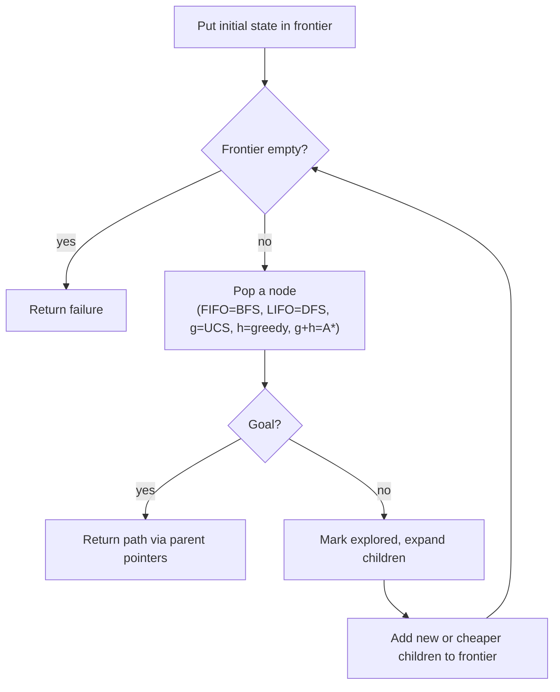

# Problem Formulation and State Space (Formulación de problemas y espacio de estados)

> **Summary (EN):** A problem-solving agent is a goal-based agent that formulates a problem, searches for a sequence of actions that reaches the goal, and executes it. A problem is defined by an initial state, actions, a transition model Result(s, a), a goal test and an action-cost function; together they define the state space, a graph explored incrementally. Because the same state can be reached by several paths, search keeps a frontier and an explored set to avoid infinite loops.

> **En palabras simples (ES):** Buscar es como planear un viaje en un mapa: sabes dónde empiezas, a dónde quieres llegar y qué caminos hay. Todos los algoritmos de búsqueda hacen el mismo ciclo: tienen una lista de lugares pendientes por revisar y sacan uno a la vez. **Lo único que cambia entre algoritmos es cuál sacan primero.** *(Abajo está el pseudocódigo paso a paso, en inglés y en español.)*

## Términos clave

| English | Español | Significado |
|---|---|---|
| Problem-solving agent | Agente de resolución de problemas | Agente basado en objetivos que planifica una secuencia de acciones. |
| Initial state | Estado inicial | Donde arranca el agente. |
| Actions | Acciones | Lo que se puede hacer en cada estado. |
| Transition model `Result(s, a)` | Modelo de transición | Estado resultante de aplicar `a` en `s`. |
| Goal test | Prueba de objetivo | ¿Es este estado una meta? |
| Path / action cost | Costo de camino / acción | Define la calidad de la solución. |
| State space | Espacio de estados | Todos los estados alcanzables; un grafo. |
| Search tree | Árbol de búsqueda | Registro del proceso de búsqueda; un estado puede repetirse. |
| Frontier | Frontera | Nodos generados pero aún no expandidos. |
| Explored set (closed list) | Conjunto de explorados | Estados ya expandidos; no se vuelven a generar. |
| Branching factor *b* | Factor de ramificación | Máximo número de sucesores de un nodo. |
| Depth *d* / max depth *m* | Profundidad de la solución / máxima | Para medir complejidad. |

## Explicación

**Ciclo del agente.** (1) ¿Cuál es exactamente el problema? → *formular*. (2) ¿Cuál es la mejor forma de resolverlo? → *buscar* una secuencia de acciones. (3) *Ejecutar* el plan. Supone un entorno **observable, determinista, discreto y estático** ([Task Environments](task-environments.md)). La solución es **una secuencia** de acciones, no una sola.

**Los cinco componentes** definen el espacio de estados:

```
Problem:
  initial_state                  e.g. "Arad"
  actions(s)                     e.g. {Go(Sibiu), Go(Timisoara), Go(Zerind)}
  result(s, a) -> s'             e.g. result(Arad, Go(Sibiu)) = Sibiu
  is_goal(s)                     e.g. s == "Bucharest"
  action_cost(s, a, s')          e.g. 140 km
```

**Espacio de estados = grafo.** Nodos = estados del mundo; aristas = acciones con costo. Casi nunca se construye completo (es enorme: el 8-puzzle tiene 9!/2 = 181 440 estados alcanzables; el 80-puzzle de la tarea, astronómicamente más). El agente lo explora **progresivamente**.

**Grafo vs. árbol.** El grafo de estados representa el *problema* (cada estado una vez). El árbol de búsqueda representa el *proceso*: el mismo estado aparece varias veces si se llega por caminos distintos, lo que puede causar ciclos infinitos. Solución: mantener

- **Frontier:** generados, no explorados.
- **Explored set:** ya expandidos; nunca se vuelven a generar.

Sin control de estados repetidos, el algoritmo puede no terminar **aunque exista solución**; con control, cada estado se explora a lo sumo una vez.

```
function GRAPH-SEARCH(problem):
    frontier ← {Node(problem.initial)}
    explored ← ∅
    loop:
        if frontier is empty: return failure
        node ← frontier.pop()              # the ORDER of pop defines the algorithm
        if problem.is_goal(node.state): return solution(node)
        explored.add(node.state)
        for each child in expand(problem, node):
            if child.state not in explored and not in frontier:
                frontier.add(child)
```

### Cómo lo formaliza AIMA 4e (§3.3)

**Best-first search** es el esquema general: siempre expandir el nodo de la frontera con menor valor de una **función de evaluación f(n)**. Cambiando f se obtienen casi todos los algoritmos del capítulo.

```
function BEST-FIRST-SEARCH(problem, f) returns a solution node or failure
    node ← NODE(STATE = problem.INITIAL)
    frontier ← priority queue ordered by f, containing node
    reached ← lookup table {problem.INITIAL: node}
    while frontier is not empty:
        node ← POP(frontier)
        if problem.IS-GOAL(node.STATE): return node          # late goal test
        for each child in EXPAND(problem, node):
            s ← child.STATE
            if s not in reached or child.PATH-COST < reached[s].PATH-COST:
                reached[s] ← child
                add child to frontier                        # re-add if cheaper path
    return failure
```

**Un nodo** tiene cuatro campos: `STATE`, `PARENT`, `ACTION` y `PATH-COST` (= g(n)). Siguiendo los `PARENT` desde la meta se reconstruye la solución.

**Tres tipos de cola:** prioridad (best-first, UCS, A\*), FIFO (BFS), LIFO / pila (DFS).

**Caminos redundantes.** Un ciclo (Arad→Sibiu→Arad) es un caso especial de camino redundante (llegar a Sibiu por Arad–Zerind–Oradea–Sibiu, 297 millas, en vez de 140). En una cuadrícula 10×10 con 8 movimientos hay más de 100 millones de caminos de longitud 9 pero solo 100 casillas: eliminar redundancias acelera ~un millón de veces. "Algorithms that cannot remember the past are doomed to repeat it." Tres opciones:

| Opción | Nombre | Cuándo |
|---|---|---|
| Recordar todos los estados alcanzados (`reached`) | **Graph search** | Muchos caminos redundantes y la tabla cabe en memoria |
| No recordar nada | **Tree-like search** | Caminos redundantes raros o imposibles; ahorra memoria |
| Solo revisar ciclos en el camino actual (siguiendo `PARENT`) | Compromiso | DFS / IDS |

**Reached vs. frontera.** Un estado está *alcanzado* (*reached*) si se generó un nodo para él (esté o no expandido). La frontera **separa** el interior (expandido) del exterior (no alcanzado).

**Prueba de meta temprana vs. tardía.** BFS puede probar la meta al **generar** un nodo (*early goal test*) porque nunca encontrará un camino más corto a ese estado. UCS y A\* deben probarla al **expandir** (*late goal test*), si no pueden devolver un camino más caro (ver el ejemplo Sibiu→Bucarest en [Uninformed Search](uninformed-search.md)).

**Ejemplos del curso.** Mapa de Rumania (Arad → Bucarest), 8-puzzle, 80-puzzle, granjero–lobo–cabra–col, N-Reinas (ver [Deber 1](../assignments/deber-1-search-problems.md)).

### Diagrama



## Pseudocódigo intuitivo (para explicar en el examen)

> **Idea (ES):** Buscar es como planear un viaje en un mapa: sabes dónde empiezas, a dónde quieres llegar y qué caminos hay. Todos los algoritmos de búsqueda hacen el mismo ciclo: tienen una lista de lugares pendientes por revisar y sacan uno a la vez. **Lo único que cambia entre algoritmos es cuál sacan primero.**

**Antes de empezar: qué significa cada cosa**

| Palabra | Qué es (en simple) | English |
|---|---|---|
| Estado | una situación del problema, p. ej. "estoy en Arad" | state |
| Estado inicial / meta | dónde empiezo / a dónde quiero llegar (Arad / Bucarest) | initial state / goal |
| Acción | un movimiento posible, p. ej. "ir a Sibiu" | action |
| Costo del paso | cuánto cuesta una acción, p. ej. 140 km | step / action cost |
| Nodo | un estado + cómo llegué ahí (de dónde vine y cuánto llevo pagado) | node |
| Frontera | la lista de nodos **descubiertos pero aún no revisados** ("pendientes") | frontier |
| Expandir | revisar un nodo: generar todos los lugares a los que puedo ir desde él | expand |
| Explorados | los nodos ya revisados, para no volver a ellos y no dar vueltas | explored / reached set |
| g(n) | lo que ya pagué para llegar a n (km recorridos) | path cost |

**Pasos** — en inglés (como lo escribes en el examen) y debajo en español (para entender):

1. Put the initial state in the frontier.
   - *ES:* Pon el punto de partida en la lista de pendientes.
2. If the frontier is empty → return failure.
   - *ES:* Si ya no quedan pendientes, no hay solución.
3. Take ONE node out of the frontier. The rule for choosing which one defines the algorithm.
   - *ES:* Saca un pendiente. Aquí está la diferencia entre algoritmos: el más antiguo (BFS), el más nuevo (DFS), el más barato (UCS), el que parece más cerca (greedy) o el mejor balance (A\*).
4. If it is the goal → return the path, following the parent links back to the start.
   - *ES:* Si es la meta, termina y reconstruye el camino yendo "hacia atrás" de hijo a padre.
5. Mark it as explored and expand it: for each action, create the child node with its cost, and add it to the frontier if it is new or reached more cheaply.
   - *ES:* Márcalo como revisado. Mira a dónde puedes ir desde ahí y agrega esos lugares a pendientes (si son nuevos o si ahora llegas más barato). Vuelve al paso 2.

**Ejemplo con números:** problema de Rumania. Estado inicial: Arad. Acciones desde Arad: ir a Sibiu (140 km), Timisoara (118) o Zerind (75). Meta: Bucarest. Costo: los km. Al expandir Arad, la frontera queda con Sibiu, Timisoara y Zerind.

**Say it in the exam (EN):** "A search problem has five parts: initial state, actions, transition model (the result of each action), goal test and action costs. Search keeps a frontier of generated but not yet expanded nodes and an explored set to avoid loops. Every algorithm uses the same loop; only the order of the frontier changes: FIFO is BFS, LIFO is DFS, lowest g is UCS, lowest h is greedy, lowest g + h is A*."

**Dilo así (ES):** "Un problema de búsqueda tiene cinco partes: estado inicial, acciones, modelo de transición, prueba de meta y costos. La búsqueda guarda una frontera de nodos pendientes y un conjunto de explorados para no dar vueltas. Todos los algoritmos usan el mismo ciclo; solo cambia el orden de la frontera: FIFO es BFS, LIFO es DFS, menor g es UCS, menor h es greedy y menor g + h es A\*."

## Errores comunes y tips de examen

- Los algoritmos de búsqueda difieren **solo en el orden** en que sacan nodos de la frontera (FIFO → BFS, LIFO → DFS, prioridad g → UCS, h → greedy, g+h → A\*).
- Estado ≠ nodo: un nodo del árbol guarda estado + padre + acción + costo g.
- Criterios para comparar: **completitud, optimalidad, tiempo, espacio** (ver [Uninformed Search](uninformed-search.md)).

## Relacionado

- [Uninformed Search](uninformed-search.md)
- [A* Search](a-star-search.md)
- [Agent Types](agent-types.md)
- [State Representation](state-representation.md)
- [Search algorithms comparison](../study/search-algorithms-comparison.md)

## Fuentes

- [Slides 02](../sources/slides-02-problem-solving.md), slides 2–5.
- [AIMA 4e](../sources/book-russell-norvig-aima.md) §3.1–3.3 (ingestado: best-first genérico, estructura de nodo, colas, caminos redundantes, graph vs. tree-like search).
