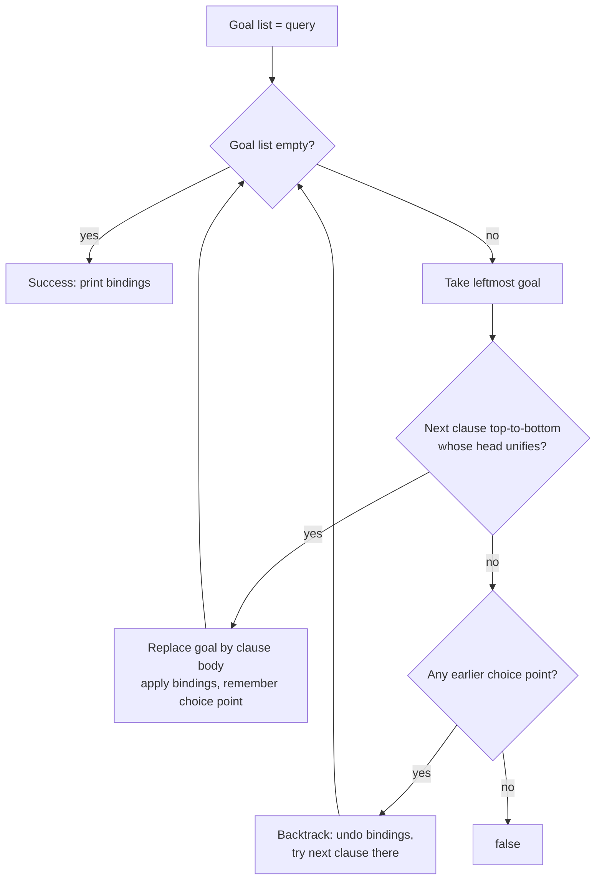

# Prolog (Programación lógica con Prolog)

> **Summary (EN):** Prolog ("programmation en logique", Marseille 1972, Colmerauer and Roussel, based on Kowalski's theory) lets you write facts and if-then rules instead of step-by-step instructions. To answer a question, it searches for a proof using SLD resolution: backward chaining, depth first, left to right, with unification and backtracking, and then prints the variable values that make the question true. "Algorithm = Logic + Control": you write the logic and Prolog supplies the control, so the order of rules and conditions matters. The course uses SWI-Prolog 9.2+.

> **En palabras simples (ES):** En Prolog no le dices a la computadora **cómo** hacer algo, sino **qué es verdad** (hechos y reglas). Cuando le preguntas algo, Prolog toma la primera pregunta pendiente, busca de arriba hacia abajo la primera regla que encaje, la reemplaza por las condiciones de esa regla, y si algo falla **vuelve a la última elección** y prueba la siguiente opción. *(Abajo está el pseudocódigo paso a paso, en inglés y en español.)*

## Términos clave

| English | Español | Significado (en simple) |
|---|---|---|
| Term (atom, number, variable, compound) | Término | Todo en Prolog es un término: `ana`, `42`, `X`, `parent(ana, sofia)`. |
| Fact | Hecho | Algo que es verdad: `parent(hector, ana).` |
| Rule | Regla | "Esto es verdad si esto otro lo es": `h :- b1, b2.` |
| Query | Consulta | Una pregunta: `?- parent(hector, X).` |
| Predicate `name/arity` | Predicado | Nombre + cantidad de argumentos; `father/2` y `father/3` son predicados distintos. |
| SLD resolution | Resolución SLD | El método con que Prolog busca la respuesta. |
| Backtracking | Retroceso | Deshacer la última elección y probar la siguiente opción. |
| Choice point | Punto de elección | Un lugar donde quedaron otras opciones por probar. |
| Negation as failure `\+` | Negación por fallo | `\+ G` es verdad si Prolog **no puede probar** G. |
| Closed-world assumption | Supuesto de mundo cerrado | Lo que no se puede probar se considera falso. |
| Cut `!` | Corte | "No vuelvas a probar otras opciones para lo que ya decidí aquí". |
| Tabling | Tabulación | `:- table p/2.`: Prolog guarda resultados para no repetir cálculos ni dar vueltas. |

## Explicación

### 1. Programar diciendo "qué es verdad"

En Python escribes **pasos** ("haz esto, luego esto"). En Prolog escribes **hechos** y **reglas**, y luego haces **preguntas**. Prolog busca solo cómo responderlas.

### 2. De la lógica a Prolog: cuatro convenciones (s7)

1. La regla se escribe "al revés": `A ∧ B ⇒ C` (si A y B, entonces C) se escribe `c :- a, b.` y se lee "c es verdad **si** a y b".
2. **Mayúscula = variable**, minúscula = constante. (En el libro es al revés.)
3. No se escribe "para todo": toda variable de una regla ya significa "para cualquier valor".
4. Puntuación: coma = "y", punto y coma = "o", y **toda cláusula termina en punto**.

### 3. Ejemplo: `family.pl` (s12)

```prolog
parent(hector, ana).   parent(hector, luis).
parent(ana, sofia).    parent(luis, diego).
male(hector). male(luis). male(diego).   female(ana). female(sofia).

father(X, Y)      :- parent(X, Y), male(X).
grandparent(X, Z) :- parent(X, Y), parent(Y, Z).
sibling(X, Y)     :- parent(P, X), parent(P, Y), X \= Y.
ancestor(X, Y)    :- parent(X, Y).
ancestor(X, Y)    :- parent(X, Z), ancestor(Z, Y).
```

Cómo leerlo:
- `father(X, Y)`: X es padre de Y si X es progenitor de Y **y** X es hombre.
- `grandparent(X, Z)`: X es abuelo de Z si X es progenitor de alguien Y, **y** ese Y es progenitor de Z.
- `sibling(X, Y)`: X y Y son hermanos si tienen el mismo progenitor P **y** no son la misma persona (`X \= Y`).
- `ancestor`: X es ancestro de Y si es su progenitor (caso base), **o** si es progenitor de alguien Z que a su vez es ancestro de Y (caso recursivo).

Un predicado es una **relación**, no una función: `?- parent(hector, Who).` responde `Who = ana ; Who = luis.` (dos respuestas; el `;` pide la siguiente).

### 4. Cómo responde Prolog: resolución SLD (s15)

1. Toma la **primera** pregunta pendiente (la de más a la izquierda).
2. Recorre las cláusulas **de arriba hacia abajo**, en el orden del archivo, buscando una cuya cabeza encaje ([Unification](unification.md)).
3. Cambia la pregunta por las condiciones de esa cláusula.
4. Si nada encaja, **retrocede** (*backtrack*): deshace los últimos valores y prueba la siguiente cláusula de la última elección.
5. Cuando ya no queda nada pendiente, responde que sí y muestra los valores.

Es una [búsqueda en profundidad (DFS)](uninformed-search.md) sobre el árbol Y–O de las [cláusulas de Horn](horn-clauses-and-backward-chaining.md). El método SLD en teoría siempre encuentra la respuesta si existe, **pero la forma en que Prolog lo recorre no** (puede caer en un bucle):

```prolog
path(X, Z) :- path(X, Y), link(Y, Z).   % left recursion FIRST → infinite loop
path(X, Z) :- link(X, Z).
?- path(a, c).   % ERROR: Stack limit exceeded
% Fix: put the base case first, recurse on the right, or use  :- table path/2.
```

Por qué se cuelga: para probar `path(a, c)`, la primera regla pide primero `path(a, Y)`, que vuelve a pedir `path(a, Y')`, y así para siempre, sin avanzar. Arreglo: poner primero el caso base y la llamada recursiva **a la derecha** (`path(X,Z) :- link(X,Y), path(Y,Z).`), o usar `:- table path/2.`

### 5. Aritmética: `is` no es `=` (s16)

| Operador | Qué hace (en simple) |
|---|---|
| `=` | Iguala estructuras, **no calcula** (`X = 3+4` guarda "3+4") |
| `is` | **Calcula** la derecha y la guarda: `X is 3+4` → X = 7 |
| `=:=` / `=\=` | ¿Los dos lados dan el mismo número? / ¿dan números distintos? |
| `<  >  =<  >=` | Comparar números (ojo: se escribe `=<`, nunca `<=`) |
| `==` | ¿Son exactamente el mismo término? |
| `\=` | ¿No se pueden igualar? |

`is` necesita que la derecha ya tenga valor: `X is Y + 1` con Y sin valor da el error *Arguments are not sufficiently instantiated*.

### 6. Juntar todas las respuestas (s13, s24)

- `findall(T, G, L)`: guarda en la lista L todas las respuestas T de la pregunta G. Mantiene repetidos y devuelve `[]` si no hay ninguna.
- `setof/3`: igual pero **ordena y quita repetidos**, y **falla** si no hay respuestas (se usa `Var^Goal` para decir "con cualquier Var").
- `bagof/3`: agrupa las respuestas.
- `aggregate_all(count, G, N)`: cuenta cuántas respuestas hay.
- Otros útiles: `between/3`, `select/3`, `permutation/2`, `length/2`, `msort/2`, `forall/2`, `format/2`, `time/1`.

### 7. Negación por fallo y el corte (s23)

**Negación por fallo.** `\+ G` es verdad si Prolog **no logra probar** G. Esto equivale a "G es falso" solo si suponemos que **todo lo verdadero está escrito** en el programa (*supuesto de mundo cerrado*).

Cuidado: solo niega preguntas cuyas variables **ya tengan valor**.
- `\+ parent(X, ana)` da `false`: existe algún X (hector) que es padre de ana. No pregunta "¿quién no es padre de ana?".
- `X = sofia, \+ parent(X, _)` sí funciona: pregunta "¿sofia no tiene hijos?" → `true`.

**El corte `!`.** Le dice a Prolog: "lo que elegí antes del `!` en esta regla ya no se cambia, y no pruebes las otras reglas de este predicado". Hace el programa más rápido, pero puede romper su significado lógico:

```prolog
max(X, Y, X) :- X >= Y, !.        % BUG: ?- max(5, 3, 3). → true
max(_, Y, Y).
max(X, Y, M) :- X >= Y, !, M = X. % right: unify the output AFTER the cut
max(_, Y, Y).
max2(X, Y, M) :- ( X >= Y -> M = X ; M = Y ).   % preferred: no cut
```

Por qué falla la primera versión: `?- max(5, 3, 3).` no encaja con la primera regla (pide que el tercer argumento sea 5), así que el corte nunca se ejecuta y la segunda regla acepta 3. Resultado: dice que el máximo de 5 y 3 es 3. Arreglo: asignar la respuesta **después** del corte, o mejor usar `( condición -> si_sí ; si_no )`.

### 8. Herramientas (s9–11, s28)

- Abrir: `swipl archivo.pl`, o dentro de Prolog `?- [archivo].` (también `consult/1`).
- Ver y recargar: `listing/1` muestra un predicado; `make/0` recarga los archivos cambiados; `halt/0` sale.
- Depurar: `trace/0` muestra cada paso con cuatro "puertas": **Call** (entra), **Exit** (tuvo éxito), **Redo** (vuelve a intentar), **Fail** (falló).
- Pruebas: con `plunit` (`:- begin_tests(x). … :- end_tests(x).` y `?- run_tests.`).
- En el navegador: SWISH.

### Diagrama



## Pseudocódigo intuitivo (para explicar en el examen)

> **Idea (ES):** En Prolog no le dices a la computadora **cómo** hacer algo, sino **qué es verdad** (hechos y reglas). Cuando le preguntas algo, Prolog toma la primera pregunta pendiente, busca de arriba hacia abajo la primera regla que encaje, la reemplaza por las condiciones de esa regla, y si algo falla **vuelve a la última elección** y prueba la siguiente opción.

**Antes de empezar: qué significa cada cosa**

| Palabra | Qué es (en simple) | English |
|---|---|---|
| Consulta / meta | la pregunta: `?- grandparent(hector, Z).` | query / goal |
| Lista de metas | lo que falta probar, en orden | goal list |
| Cláusula | un hecho o una regla del programa | clause |
| Unificar | hacer coincidir la pregunta con la cabeza de una regla dando valores a variables | unify |
| Punto de elección | un lugar donde había otra opción que no se probó todavía | choice point |
| Backtracking | volver al último punto de elección y probar la siguiente opción | backtracking |
| SLD resolution | el nombre técnico de este método | SLD resolution |

**Pasos** — en inglés (como lo escribes en el examen) y debajo en español (para entender):

1. The goal list starts as the query.
   - *ES:* Lo que falta probar es la pregunta.
2. Take the LEFTMOST goal.
   - *ES:* Toma la primera meta de la izquierda.
3. Search the clauses from TOP to BOTTOM for one whose head unifies with it.
   - *ES:* Busca en el programa, de arriba hacia abajo, la primera cláusula que encaje.
4. Replace the goal with that clause's body (applying the variable values found).
   - *ES:* Cambia esa meta por las condiciones de la regla (si es un hecho, simplemente desaparece).
5. If no clause matches → BACKTRACK: undo the last choice and try the next clause there.
   - *ES:* Si nada encaja, retrocede a la última decisión y prueba la siguiente opción.
6. When the goal list is empty → success: print the variable values. Typing ";" asks for more answers (more backtracking).
   - *ES:* Si ya no falta nada, responde con los valores. Si escribes ";" busca otra respuesta.

**Ejemplo con números:** con `parent(hector, ana). parent(hector, luis). parent(ana, sofia). parent(luis, diego).` y la regla `grandparent(X, Z) :- parent(X, Y), parent(Y, Z).`
Pregunta `?- grandparent(hector, Z).`
1. La regla encaja: metas = `parent(hector, Y), parent(Y, Z)`.
2. Primer hecho que encaja: Y = ana. Quedan: `parent(ana, Z)` → Z = **sofia**. ✓ Primera respuesta.
3. Escribo ";" → retrocede: Y = luis → `parent(luis, Z)` → Z = **diego**. ✓ Segunda respuesta.

**Say it in the exam (EN):** "Prolog is Horn clauses plus backward chaining plus unification, executed depth-first and left to right with backtracking (SLD resolution). 'Algorithm = Logic + Control': the programmer writes the logic and Prolog supplies the control, so the order of clauses and goals matters — for example, left recursion loops forever. Negation is negation as failure: `\+ G` succeeds if G cannot be proved, under the closed-world assumption."

**Dilo así (ES):** "Prolog es cláusulas de Horn + encadenamiento hacia atrás + unificación, ejecutado en profundidad, de izquierda a derecha y con backtracking. 'Algoritmo = Lógica + Control': el programador escribe la lógica y Prolog pone el control, por eso el orden de las reglas importa (la recursión por la izquierda se queda en un bucle infinito). La negación es negación por fallo: `\+ G` es verdad si no se puede probar G."

## Errores comunes y tips de examen (s28)

- Olvidar el **punto** final: la cláusula se pega con la siguiente.
- Usar `=` en vez de `is` para calcular.
- Avisos de *singleton variable* (variable usada una sola vez): casi siempre es un error de tipeo o una variable que debía ser `_`.
- **Recursión por la izquierda**: bucle infinito.
- Escribir con mayúscula algo que querías como nombre fijo: `parent(Hector, ana)` significa "algún Hector", cualquiera.
- Usar `\+` con variables sin valor.
- Prolog **no** es de Dennis Ritchie ni es un lenguaje imperativo (error de la slide 9 de la introducción, ver [errata](../study/errata.md)).

## Relacionado

- [Recursion and Lists in Prolog](prolog-recursion-and-lists.md)
- [Unification](unification.md)
- [Horn Clauses and Backward Chaining](horn-clauses-and-backward-chaining.md)
- [N-Queens](n-queens.md)
- [Prolog Lab 01](../assignments/prolog-lab-01-family.md)

## Fuentes

- [Slides XX](../sources/slides-xx-logic-programming-prolog.md), slides 7–16, 23–24, 28.
- [Code — Prolog examples](../sources/code-prolog-examples.md).
- [Luger 6e](../sources/book-luger-ai.md) §14.3; Bratko, *Prolog Programming for AI*.
