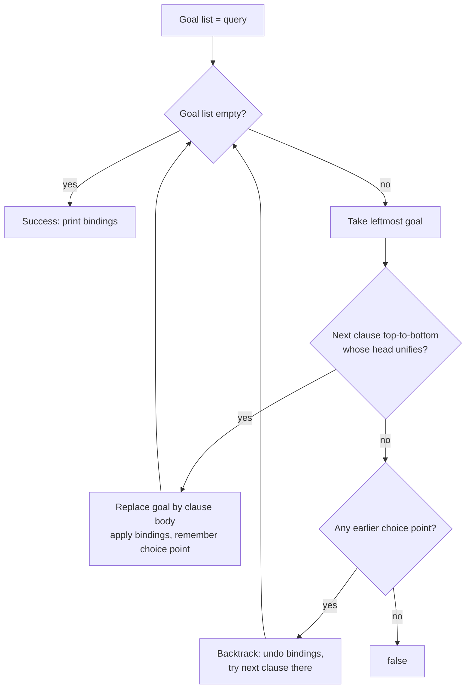

# Prolog (Programación lógica con Prolog)

> **Summary (EN):** Prolog ("programmation en logique", Marseille 1972, Colmerauer & Roussel, on Kowalski's theory) is first-order definite clauses in a different syntax plus an execution strategy: SLD resolution — depth-first, left-to-right backward chaining with unification and backtracking. You state what holds; the interpreter searches for a proof and returns the substitution. "Algorithm = Logic + Control": your clauses are the logic, Prolog supplies the control — so clause and goal order matter. The course uses SWI-Prolog 9.2+.

> **En palabras simples (ES):** En Prolog no le dices a la computadora **cómo** hacer algo, sino **qué es verdad** (hechos y reglas). Cuando le preguntas algo, Prolog toma la primera pregunta pendiente, busca de arriba hacia abajo la primera regla que encaje, la reemplaza por las condiciones de esa regla, y si algo falla **vuelve a la última elección** y prueba la siguiente opción. *(Abajo está el pseudocódigo paso a paso, en inglés y en español.)*

## Términos clave

| English | Español | Significado |
|---|---|---|
| Term (atom, number, variable, compound) | Término | Todo en Prolog es un término. |
| Fact / Rule / Query | Hecho / regla / consulta | `parent(a,b).` / `h :- b1, b2.` / `?- goal.` |
| Predicate `name/arity` | Predicado | `father/2` ≠ `father/3`. |
| SLD resolution | Resolución SLD | Estrategia de ejecución de Prolog. |
| Backtracking | Retroceso | Deshacer ligaduras y probar la siguiente cláusula. |
| Choice point | Punto de elección | Lugar donde quedan alternativas por probar. |
| Negation as failure `\+` | Negación por fallo | Éxito si no se puede probar la meta. |
| Closed-world assumption | Supuesto de mundo cerrado | Lo que no se puede derivar se considera falso. |
| Cut `!` | Corte | Compromete las elecciones hechas en la cláusula. |
| Tabling | Tabulación (memoización) | `:- table p/2.` evita bucles y recomputación. |

## Explicación

### De FOL a Prolog — cuatro convenciones (s7)
1. La implicación se escribe al revés: `A ∧ B ⇒ C` → `c :- a, b.`
2. **Mayúscula = variable**, minúscula = constante (al revés que el libro).
3. Cuantificadores implícitos: toda variable es universal.
4. Puntuación: coma = "y", punto y coma = "o", toda cláusula termina en punto.

### Anatomía (s12, `family.pl`)

```prolog
parent(hector, ana).   parent(hector, luis).
parent(ana, sofia).    parent(luis, diego).
male(hector). male(luis). male(diego).   female(ana). female(sofia).

father(X, Y)      :- parent(X, Y), male(X).
grandparent(X, Z) :- parent(X, Y), parent(Y, Z).
sibling(X, Y)     :- parent(P, X), parent(P, Y), X \= Y.
ancestor(X, Y)    :- parent(X, Y).
ancestor(X, Y)    :- parent(X, Z), ancestor(Z, Y).
```

Un predicado es una **relación**, no una función: `?- parent(hector, Who).` da `Who = ana ; Who = luis.`

### Ejecución: SLD resolution (s15)
1. Tomar la meta más a la izquierda.
2. Recorrer las cláusulas **en orden de archivo** buscando una cabeza que unifique ([Unification](unification.md)).
3. Reemplazar la meta por el cuerpo de esa cláusula.
4. Si falla, **backtrack**: deshacer ligaduras y probar la siguiente cláusula.
5. Éxito cuando no quedan metas.

Es una [DFS](uninformed-search.md) sobre el grafo Y–O de las [cláusulas de Horn](horn-clauses-and-backward-chaining.md). **SLD es completa, pero la estrategia de Prolog no:**

```prolog
path(X, Z) :- path(X, Y), link(Y, Z).   % left recursion FIRST → infinite loop
path(X, Z) :- link(X, Z).
?- path(a, c).   % ERROR: Stack limit exceeded
% Fix: put the base case first, recurse on the right, or use  :- table path/2.
```

### Aritmética: `is/2` no es `=/2` (s16)

| Operador | Significado |
|---|---|
| `=` | Unifica términos (no evalúa) |
| `is` | Evalúa la derecha y unifica: `X is 3+4` → 7 |
| `=:=` / `=\=` | Igualdad / desigualdad aritmética |
| `<  >  =<  >=` | Comparación (ojo: `=<`, nunca `<=`) |
| `==` | Identidad de términos |
| `\=` | No unificable |

`is/2` necesita la derecha ya ligada: `X is Y + 1` con Y libre → *Arguments are not sufficiently instantiated*.

### Colectar soluciones (s13, s24)
`findall(T, G, L)` conserva duplicados y devuelve `[]` si no hay; `setof/3` ordena, deduplica y **falla** si no hay (usar `Var^Goal` para "cualquier Var"); `bagof/3` agrupa; `aggregate_all(count, G, N)` cuenta. Otros: `between/3`, `select/3`, `permutation/2`, `length/2`, `msort/2`, `forall/2`, `format/2`, `time/1`.

### Negación por fallo y corte (s23)
- `\+ G` tiene éxito si **no se puede probar** G — coincide con la negación lógica solo bajo el **supuesto de mundo cerrado**. Solo negar metas con variables **ya ligadas**: `\+ parent(X, ana)` es `false` (existe algún X), pero `X = sofia, \+ parent(X, _)` funciona.
- `!` compromete las elecciones de la cláusula: no se reintentan metas a su izquierda ni otras cláusulas del predicado. Gana velocidad pero **destruye la lectura declarativa**:

```prolog
max(X, Y, X) :- X >= Y, !.        % BUG: ?- max(5, 3, 3). → true
max(_, Y, Y).
max(X, Y, M) :- X >= Y, !, M = X. % right: unify the output AFTER the cut
max(_, Y, Y).
max2(X, Y, M) :- ( X >= Y -> M = X ; M = Y ).   % preferred: no cut
```

### Herramientas (s9–11, s28)
`swipl archivo.pl`, `?- [archivo].` o `consult/1`, `listing/1`, `make/0`, `halt/0`. Depurador de cuatro puertos: `trace/0` muestra **Call, Exit, Redo, Fail**. Pruebas con `plunit`: `:- begin_tests(x). … :- end_tests(x).` y `?- run_tests.` En el navegador: SWISH.

### Diagrama



## Pseudocódigo intuitivo (para explicar en el examen)

> **Idea (ES):** En Prolog no le dices a la computadora **cómo** hacer algo, sino **qué es verdad** (hechos y reglas). Cuando le preguntas algo, Prolog toma la primera pregunta pendiente, busca de arriba hacia abajo la primera regla que encaje, la reemplaza por las condiciones de esa regla, y si algo falla **vuelve a la última elección** y prueba la siguiente opción.

**Antes de empezar: qué significa cada cosa**

| Palabra | Qué es (en simple) | English |
|---|---|---|
| Consulta / meta | la pregunta: `?- grandparent(hector, Z).` | query / goal |
| Lista de metas | lo que falta probar, en orden | goal list |
| Cláusula | un hecho o una regla del programa | clause |
| Unificar | hacer coincidir la pregunta con la cabeza de una regla dando valores a variables | unify |
| Punto de elección | un lugar donde había otra opción que no se probó todavía | choice point |
| Backtracking | volver al último punto de elección y probar la siguiente opción | backtracking |
| SLD resolution | el nombre técnico de este método | SLD resolution |

**Pasos** — en inglés (como lo escribes en el examen) y debajo en español (para entender):

1. The goal list starts as the query.
   - *ES:* Lo que falta probar es la pregunta.
2. Take the LEFTMOST goal.
   - *ES:* Toma la primera meta de la izquierda.
3. Search the clauses from TOP to BOTTOM for one whose head unifies with it.
   - *ES:* Busca en el programa, de arriba hacia abajo, la primera cláusula que encaje.
4. Replace the goal with that clause's body (applying the variable values found).
   - *ES:* Cambia esa meta por las condiciones de la regla (si es un hecho, simplemente desaparece).
5. If no clause matches → BACKTRACK: undo the last choice and try the next clause there.
   - *ES:* Si nada encaja, retrocede a la última decisión y prueba la siguiente opción.
6. When the goal list is empty → success: print the variable values. Typing ";" asks for more answers (more backtracking).
   - *ES:* Si ya no falta nada, responde con los valores. Si escribes ";" busca otra respuesta.

**Ejemplo con números:** con `parent(hector, ana). parent(hector, luis). parent(ana, sofia). parent(luis, diego).` y la regla `grandparent(X, Z) :- parent(X, Y), parent(Y, Z).`
Pregunta `?- grandparent(hector, Z).`
1. La regla encaja: metas = `parent(hector, Y), parent(Y, Z)`.
2. Primer hecho que encaja: Y = ana. Quedan: `parent(ana, Z)` → Z = **sofia**. ✓ Primera respuesta.
3. Escribo ";" → retrocede: Y = luis → `parent(luis, Z)` → Z = **diego**. ✓ Segunda respuesta.

**Say it in the exam (EN):** "Prolog is Horn clauses plus backward chaining plus unification, executed depth-first and left to right with backtracking (SLD resolution). 'Algorithm = Logic + Control': the programmer writes the logic and Prolog supplies the control, so the order of clauses and goals matters — for example, left recursion loops forever. Negation is negation as failure: `\+ G` succeeds if G cannot be proved, under the closed-world assumption."

**Dilo así (ES):** "Prolog es cláusulas de Horn + encadenamiento hacia atrás + unificación, ejecutado en profundidad, de izquierda a derecha y con backtracking. 'Algoritmo = Lógica + Control': el programador escribe la lógica y Prolog pone el control, por eso el orden de las reglas importa (la recursión por la izquierda se queda en un bucle infinito). La negación es negación por fallo: `\+ G` es verdad si no se puede probar G."

## Errores comunes y tips de examen (s28)
- Olvidar el **punto** final (la cláusula se fusiona con la siguiente).
- Usar `=` en vez de `is`.
- *Singleton variable warnings*: casi siempre un error de tipeo o una variable que debía ser `_`.
- **Recursión por la izquierda**.
- Mayúscula donde querías un átomo: `parent(Hector, ana)` significa "algún Hector".
- `\+` con variables sin ligar.
- Prolog **no** es de Dennis Ritchie ni es imperativo (error de la slide 9 de la intro, ver [errata](../study/errata.md)).

## Relacionado

- [Recursion and Lists in Prolog](prolog-recursion-and-lists.md)
- [Unification](unification.md)
- [Horn Clauses and Backward Chaining](horn-clauses-and-backward-chaining.md)
- [N-Queens](n-queens.md)
- [Prolog Lab 01](../assignments/prolog-lab-01-family.md)

## Fuentes

- [Slides XX](../sources/slides-xx-logic-programming-prolog.md), slides 7–16, 23–24, 28.
- [Code — Prolog examples](../sources/code-prolog-examples.md).
- [Luger 6e](../sources/book-luger-ai.md) §14.3; Bratko, *Prolog Programming for AI*.
