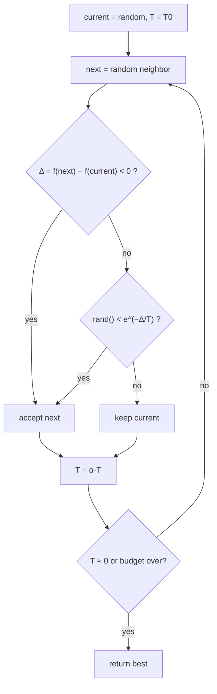

# Simulated Annealing (Recocido simulado)

> **Summary (EN):** Simulated annealing is local search that sometimes accepts a worse solution so it can escape local optima. A better neighbor is always accepted; a worse one, whose cost is higher by Δ, is accepted with probability e^(−Δ/T). The temperature T starts high (it accepts almost anything, like a random walk) and is lowered step by step by a cooling schedule until the search only accepts improvements, like hill climbing. The class script applies it to the Rastrigin function; Dorigo et al. compare Ant System against it.

> **En palabras simples (ES):** Es como hill climbing, pero a veces **acepta empeorar** para poder salir de un valle pequeño. Al principio está "caliente" y acepta empeorar casi siempre (explora mucho); con el tiempo se "enfría" y casi nunca acepta empeorar (solo mejora). El nombre viene de cómo se enfría el metal poco a poco para que quede fuerte. *(Abajo está el pseudocódigo paso a paso, en inglés y en español.)*

## Términos clave

| English | Español | Significado (en simple) |
|---|---|---|
| Annealing | Recocido | Calentar un metal y enfriarlo muy despacio para que quede fuerte y ordenado. |
| Temperature T | Temperatura | Qué tan dispuesto está el algoritmo a aceptar empeorar. |
| Cooling schedule | Esquema de enfriamiento | Cómo baja T con el tiempo; p. ej. T ← α·T (cada paso queda un poco más frío). |
| α (alpha) | Tasa de enfriamiento | Por cuánto se multiplica T en cada paso (p. ej. 0.99). |
| Δ (delta) | Cambio de costo | f(nuevo) − f(actual). Negativo = mejora; positivo = empeora. |
| e^(−Δ/T) | Probabilidad de aceptar | Número entre 0 y 1: grande si T es alta o Δ es pequeño (e ≈ 2.718). |
| Metropolis criterion | Criterio de Metropolis | El nombre de esa regla de aceptación. |

## Explicación

### 1. La idea

Hill climbing se queda en el primer valle que encuentra. El recocido simulado deja que, **de vez en cuando, empeore** para poder salir de ese valle:
- **Al principio (T alta):** acepta casi cualquier cambio, aunque empeore → explora mucho.
- **Al final (T baja):** casi solo acepta mejoras → afina la respuesta.

Si T baja **lo bastante despacio**, la probabilidad de terminar en el mejor valle de todos se acerca a 1 (complemento AIMA §4.1.2).

### 2. ¿Con qué probabilidad acepta empeorar?

Probabilidad de aceptar un cambio, minimizando:

| Cambio Δ | T alta (100) | T baja (0.1) |
|---|---|---|
| −1 (mejora) | 1 (siempre) | 1 (siempre) |
| +1 (empeora poco) | e^(−0.01) ≈ 0.99 | e^(−10) ≈ 0.00005 |
| +10 (empeora mucho) | e^(−0.1) ≈ 0.90 | ≈ 0 |

Se ve que: con T alta acepta casi todo; con T baja casi nunca acepta empeorar; y un empeoramiento grande se acepta menos que uno pequeño.

### 3. El código de clase (`sa_functions.py`, resumido)

```python
def simulated_annealing(func, bounds, max_iter, initial_temp, cooling_rate):
    current = random point in bounds;  best = current;  T = initial_temp
    for i in range(max_iter):
        new = clip(current + uniform(-1, 1, size=dim), bounds)
        delta = func(new) - func(current)
        if delta < 0 or random() < exp(-delta / T):
            current = new
            if func(new) < func(best): best = new
        T *= cooling_rate
    return best
```

Cómo leerlo: empieza en un punto al azar. En cada vuelta prueba un punto cercano (moviéndose entre −1 y +1 en cada coordenada, sin salirse de los límites); calcula cuánto cambió f; si mejora, o si "gana el dado" con probabilidad e^(−Δ/T), se mueve; guarda el mejor que haya visto; y enfría T.

Se aplica a Rastrigin en 2-D, en [−5.12, 5.12]², con T₀ = 100, α = 0.8 y 100 000 iteraciones.

⚠️ **Se enfría demasiado rápido.** Con α = 0.8, la temperatura queda casi en 0 (menos de 10⁻⁸) después de unas 105 iteraciones. Así, el 99.9 % del tiempo el algoritmo es solo hill climbing. Además, T llega a ser exactamente 0.0 tras unas 3 400 iteraciones y se produce una división por cero. Valores normales de α: entre 0.95 y 0.9999, o calcular α para que T termine cerca de 10⁻³: α = (T_final/T₀)^(1/max_iter).

### 4. La versión del libro (AIMA §4.1.2)

El libro lo presenta como un punto medio entre **hill climbing** (nunca baja, así que se atasca) y la **caminata al azar** (encuentra el óptimo, pero tardando muchísimo).

**Analogía:** quieres que una pelota de ping-pong caiga en el hoyo más profundo de una superficie llena de baches. Si solo la dejas rodar, se queda en el primer hoyo. Si **sacudes** la superficie, salta a otros hoyos. Hay que sacudir fuerte al principio (T alta) y cada vez más suave (T baja).

```
function SIMULATED-ANNEALING(problem, schedule) returns a solution state
    current ← problem.INITIAL
    for t = 1 to ∞ do
        T ← schedule(t)
        if T = 0 then return current
        next ← a randomly selected successor of current
        ΔE ← VALUE(current) – VALUE(next)          # here VALUE is a COST (minimize)
        if ΔE > 0 then current ← next
        else current ← next only with probability e^(ΔE/T)
```

⚠️ **Ojo con los signos.** En esta versión del libro VALUE es un **costo** (minimizar) y ΔE = VALUE(actual) − VALUE(siguiente). Si ΔE > 0, el siguiente **es mejor** → se acepta siempre. Si ΔE < 0 (empeora), se acepta con probabilidad e^(ΔE/T), que es menor que 1. El código de clase usa Δ = f(nuevo) − f(actual), que es lo mismo con el signo cambiado, y e^(−Δ/T). **Es exactamente la misma regla:** siempre aceptar mejoras; aceptar empeoramientos con probabilidad e^(−tamaño del empeoramiento / T).

Si T baja lo bastante despacio, toda la probabilidad termina concentrada en los mejores valles (por la distribución de Boltzmann), así que los encuentra con probabilidad cercana a 1. Usos reales: diseño de chips desde los años 80 y horarios de fábricas.

### Diagrama



## Pseudocódigo intuitivo (para explicar en el examen)

> **Idea (ES):** Es como hill climbing, pero a veces **acepta empeorar** para poder salir de un valle pequeño. Al principio está "caliente" y acepta empeorar casi siempre (explora mucho); con el tiempo se "enfría" y casi nunca acepta empeorar (solo mejora). El nombre viene de cómo se enfría el metal poco a poco para que quede fuerte.

**Antes de empezar: qué significa cada cosa**

| Símbolo | Qué es (en simple) | English |
|---|---|---|
| f | el costo que queremos hacer pequeño | cost / objective |
| Vecino | una solución con un cambio pequeño al azar | neighbor |
| Δ (delta) | cuánto empeora: Δ = f(nuevo) − f(actual). Negativo = mejora | change in cost |
| T | la **temperatura**: qué tan dispuesto está a aceptar empeorar | temperature |
| T₀ | la temperatura inicial (alta) | initial temperature |
| e^(−Δ/T) | la probabilidad de aceptar un empeoramiento: un número entre 0 y 1 (e ≈ 2.718) | acceptance probability |
| α | cuánto se enfría en cada paso (p. ej. 0.99: T baja un 1 %) | cooling rate |

**Pasos** — en inglés (como lo escribes en el examen) y debajo en español (para entender):

1. Start with a random solution and a high temperature T = T₀; remember it as the best.
   - *ES:* Empieza en cualquier solución, con temperatura alta.
2. Pick a random neighbor and compute Δ = f(neighbor) − f(current).
   - *ES:* Prueba un cambio pequeño al azar y mide cuánto empeora o mejora.
3. If Δ < 0 (better) → accept it. Otherwise accept it with probability e^(−Δ/T).
   - *ES:* Si mejora, acéptalo siempre. Si empeora, acéptalo a veces: tira un "dado" con probabilidad e^(−Δ/T). Con T alta esa probabilidad es grande; con T baja es casi 0.
4. If the current solution is the best so far → remember it.
   - *ES:* Guarda la mejor solución que hayas visto.
5. Cool down: T ← α · T. Repeat from step 2 until T is almost 0. Return the best.
   - *ES:* Baja la temperatura un poco y repite. Al final devuelve la mejor.

**Ejemplo con números:** un cambio empeora el costo en Δ = 2. ¿Con qué probabilidad lo acepta?
- T = 10 (caliente): e^(−2/10) = e^(−0.2) ≈ **0.82** → lo acepta 82 de cada 100 veces.
- T = 1: e^(−2) ≈ **0.14**.
- T = 0.1 (frío): e^(−20) ≈ **0.000000002** → casi nunca. Ya se comporta como hill climbing.

**Say it in the exam (EN):** "Simulated annealing is local search that sometimes accepts worse moves so it can escape local optima. A better neighbor is always accepted; a worse one is accepted with probability e^(−Δ/T). At high temperature it explores almost like a random walk; as T decreases it behaves like hill climbing. If the temperature decreases slowly enough, it finds the global optimum with probability approaching 1."

**Dilo así (ES):** "El recocido simulado es búsqueda local que a veces acepta empeorar para salir de óptimos locales. Si el vecino es mejor, lo acepta; si es peor, lo acepta con probabilidad e^(−Δ/T). Con temperatura alta explora casi al azar; al enfriarse se comporta como hill climbing. Si se enfría lo bastante lento, encuentra el óptimo global con probabilidad cercana a 1."

## Errores comunes y tips de examen

- El recocido simulado trabaja con **una sola** solución (no con una población), pero usa azar.
- Con T muy alta es una caminata al azar; con T = 0 es hill climbing.
- Guarda siempre la **mejor** solución vista: la actual puede empeorar en cualquier momento.

## Relacionado

- [Local Search and Hill Climbing](local-search-hill-climbing.md)
- [Optimization Basics](optimization-basics.md)
- [Gradient Descent](gradient-descent.md)
- [Ant Colony Optimization](ant-colony-optimization.md) (comparado con SA en el paper)
- [Metaheuristics comparison](../study/metaheuristics-comparison.md)

## Fuentes

- [Code — class optimization](../sources/code-class-optimization.md) (`sa_functions.py`).
- [Dorigo et al. 1996](../sources/paper-dorigo-1996-ant-system.md) §VI (comparación).
- [AIMA 4e](../sources/book-russell-norvig-aima.md) §4.1.2 (ingestado: pseudocódigo, analogía, convergencia).
