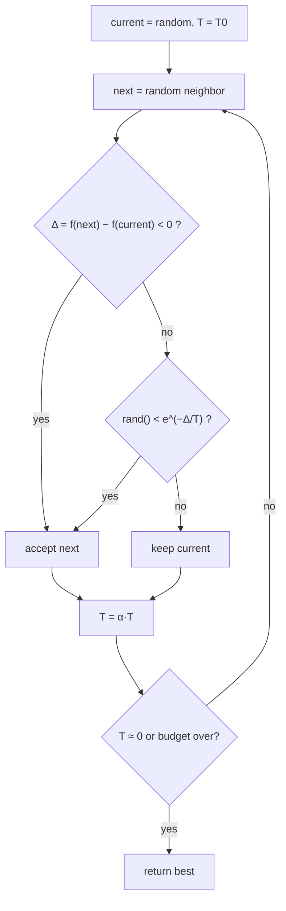

# Simulated Annealing (Recocido simulado)

> **Summary (EN):** Simulated annealing is local search that sometimes accepts worse moves to escape local optima. A neighbor with cost change Δ is always accepted if Δ < 0 and otherwise with probability e^(−Δ/T). The temperature T starts high (lots of exploration, almost a random walk) and is lowered by a cooling schedule until the search becomes greedy hill climbing. The class script applies it to the Rastrigin function; Dorigo et al. use it as a baseline for Ant System.

> **En palabras simples (ES):** Es como hill climbing, pero a veces **acepta empeorar** para poder salir de un valle pequeño. Al principio está "caliente" y acepta empeorar casi siempre (explora mucho); con el tiempo se "enfría" y casi nunca acepta empeorar (solo mejora). El nombre viene de cómo se enfría el metal poco a poco para que quede fuerte. *(Abajo está el pseudocódigo paso a paso, en inglés y en español.)*

## Términos clave

| English | Español | Significado |
|---|---|---|
| Annealing | Recocido | Calentar un metal y enfriarlo lentamente para que alcance un estado de baja energía. |
| Temperature T | Temperatura | Controla cuánto empeoramiento se acepta. |
| Cooling schedule | Esquema de enfriamiento | Cómo baja T (p. ej. geométrico T ← αT). |
| Metropolis criterion | Criterio de Metropolis | Aceptar con probabilidad e^(−Δ/T). |
| Energy Δ | Diferencia de energía | f(nuevo) − f(actual) al minimizar. |

## Explicación

**Intuición.** Hill climbing se queda en el primer valle. SA permite "subir colinas" de vez en cuando: al principio (T alta) acepta casi cualquier movimiento; al final (T baja) casi solo mejoras. Si T baja lo suficientemente despacio, la probabilidad de terminar en el óptimo global tiende a 1 (complemento AIMA §4.1.2).

**Probabilidad de aceptación** (al minimizar):

| Δ | T alta (100) | T baja (0.1) |
|---|---|---|
| −1 (mejora) | 1 | 1 |
| +1 | e^(−0.01) ≈ 0.99 | e^(−10) ≈ 0.00005 |
| +10 | e^(−0.1) ≈ 0.90 | ≈ 0 |

**Código de clase (`sa_functions.py`, resumido):**

```python
def simulated_annealing(func, bounds, max_iter, initial_temp, cooling_rate):
    current = random point in bounds;  best = current;  T = initial_temp
    for i in range(max_iter):
        new = clip(current + uniform(-1, 1, size=dim), bounds)
        delta = func(new) - func(current)
        if delta < 0 or random() < exp(-delta / T):
            current = new
            if func(new) < func(best): best = new
        T *= cooling_rate
    return best
```

Aplicado a Rastrigin 2-D en [−5.12, 5.12]², T₀ = 100, α = 0.8, 100 000 iteraciones.

⚠️ **Enfriamiento demasiado rápido.** Con α = 0.8, T < 10⁻⁸ tras ~105 iteraciones: el 99.9 % de las iteraciones son hill climbing puro (y T llega a 0.0 tras ~3 400, causando divisiones por cero). Valores típicos de α: 0.95–0.9999, o ajustar α para que T llegue a ~10⁻³ al final: α = (T_final/T₀)^(1/max_iter).

### La versión de AIMA (§4.1.2)

AIMA la presenta como un punto medio entre hill climbing (nunca baja → se atasca) y la caminata aleatoria (encuentra el óptimo pero de forma ineficiente). **Analogía:** meter una pelota de ping-pong en la grieta más profunda de una superficie llena de baches: si solo la dejas rodar queda en un mínimo local; si **sacudes** la superficie, salta a otros. Hay que sacudir fuerte al inicio (T alta) y cada vez menos (T baja).

```
function SIMULATED-ANNEALING(problem, schedule) returns a solution state
    current ← problem.INITIAL
    for t = 1 to ∞ do
        T ← schedule(t)
        if T = 0 then return current
        next ← a randomly selected successor of current
        ΔE ← VALUE(current) – VALUE(next)          # here VALUE is a COST (minimize)
        if ΔE > 0 then current ← next
        else current ← next only with probability e^(ΔE/T)
```

⚠️ **Convención de signos.** En esta figura AIMA 4e cambia al punto de vista de *gradient descent* (minimizar un costo): ΔE = VALUE(current) − VALUE(next) > 0 significa que `next` es **mejor** → se acepta siempre; si ΔE < 0 (empeora), se acepta con probabilidad e^(ΔE/T) < 1. El código de clase usa Δ = f(nuevo) − f(actual) = −ΔE y e^(−Δ/T): **es la misma regla** — siempre aceptar mejoras; aceptar empeoramientos con probabilidad e^(−|empeoramiento|/T).

Propiedad clave: si el esquema baja T **lo suficientemente lento**, por la distribución de Boltzmann toda la probabilidad se concentra en los óptimos globales, que se encuentran con probabilidad → 1. Usos: diseño de circuitos VLSI desde los 80, *scheduling* de fábricas.

### Diagrama



## Pseudocódigo intuitivo (para explicar en el examen)

> **Idea (ES):** Es como hill climbing, pero a veces **acepta empeorar** para poder salir de un valle pequeño. Al principio está "caliente" y acepta empeorar casi siempre (explora mucho); con el tiempo se "enfría" y casi nunca acepta empeorar (solo mejora). El nombre viene de cómo se enfría el metal poco a poco para que quede fuerte.

**Antes de empezar: qué significa cada cosa**

| Símbolo | Qué es (en simple) | English |
|---|---|---|
| f | el costo que queremos hacer pequeño | cost / objective |
| Vecino | una solución con un cambio pequeño al azar | neighbor |
| Δ (delta) | cuánto empeora: Δ = f(nuevo) − f(actual). Negativo = mejora | change in cost |
| T | la **temperatura**: qué tan dispuesto está a aceptar empeorar | temperature |
| T₀ | la temperatura inicial (alta) | initial temperature |
| e^(−Δ/T) | la probabilidad de aceptar un empeoramiento: un número entre 0 y 1 (e ≈ 2.718) | acceptance probability |
| α | cuánto se enfría en cada paso (p. ej. 0.99: T baja un 1 %) | cooling rate |

**Pasos** — en inglés (como lo escribes en el examen) y debajo en español (para entender):

1. Start with a random solution and a high temperature T = T₀; remember it as the best.
   - *ES:* Empieza en cualquier solución, con temperatura alta.
2. Pick a random neighbor and compute Δ = f(neighbor) − f(current).
   - *ES:* Prueba un cambio pequeño al azar y mide cuánto empeora o mejora.
3. If Δ < 0 (better) → accept it. Otherwise accept it with probability e^(−Δ/T).
   - *ES:* Si mejora, acéptalo siempre. Si empeora, acéptalo a veces: tira un "dado" con probabilidad e^(−Δ/T). Con T alta esa probabilidad es grande; con T baja es casi 0.
4. If the current solution is the best so far → remember it.
   - *ES:* Guarda la mejor solución que hayas visto.
5. Cool down: T ← α · T. Repeat from step 2 until T is almost 0. Return the best.
   - *ES:* Baja la temperatura un poco y repite. Al final devuelve la mejor.

**Ejemplo con números:** un cambio empeora el costo en Δ = 2. ¿Con qué probabilidad lo acepta?
- T = 10 (caliente): e^(−2/10) = e^(−0.2) ≈ **0.82** → lo acepta 82 de cada 100 veces.
- T = 1: e^(−2) ≈ **0.14**.
- T = 0.1 (frío): e^(−20) ≈ **0.000000002** → casi nunca. Ya se comporta como hill climbing.

**Say it in the exam (EN):** "Simulated annealing is local search that sometimes accepts worse moves so it can escape local optima. A better neighbor is always accepted; a worse one is accepted with probability e^(−Δ/T). At high temperature it explores almost like a random walk; as T decreases it behaves like hill climbing. If the temperature decreases slowly enough, it finds the global optimum with probability approaching 1."

**Dilo así (ES):** "El recocido simulado es búsqueda local que a veces acepta empeorar para salir de óptimos locales. Si el vecino es mejor, lo acepta; si es peor, lo acepta con probabilidad e^(−Δ/T). Con temperatura alta explora casi al azar; al enfriarse se comporta como hill climbing. Si se enfría lo bastante lento, encuentra el óptimo global con probabilidad cercana a 1."

## Errores comunes y tips de examen

- SA mantiene **una** solución (no es poblacional), pero es estocástico.
- Con T → ∞ es caminata aleatoria; con T = 0 es hill climbing.
- Guardar siempre la **mejor** solución vista: la actual puede empeorar.

## Relacionado

- [Local Search and Hill Climbing](local-search-hill-climbing.md)
- [Optimization Basics](optimization-basics.md)
- [Gradient Descent](gradient-descent.md)
- [Ant Colony Optimization](ant-colony-optimization.md) (comparado con SA en el paper)
- [Metaheuristics comparison](../study/metaheuristics-comparison.md)

## Fuentes

- [Code — class optimization](../sources/code-class-optimization.md) (`sa_functions.py`).
- [Dorigo et al. 1996](../sources/paper-dorigo-1996-ant-system.md) §VI (comparación).
- [AIMA 4e](../sources/book-russell-norvig-aima.md) §4.1.2 (ingestado: pseudocódigo, analogía, convergencia).
