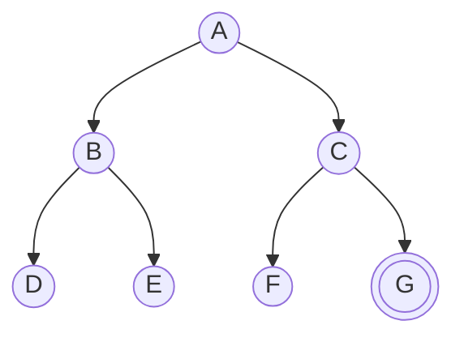

# Uninformed Search (Búsqueda no informada: BFS, DFS, UCS/Dijkstra)

> **Summary (EN):** Uninformed (blind) search knows only the start, the actions and the goal test; it has no idea how far the goal is, so it explores in a fixed order. The algorithms differ only in that order and are compared by completeness, optimality, time and memory. BFS (FIFO queue) is complete and finds the fewest-steps path but needs O(b^d) memory. DFS (LIFO stack) needs only O(b·m) memory but is not optimal and not always complete. Uniform-cost search (Dijkstra) always expands the cheapest path g(n) and is optimal for any positive costs. Iterative deepening mixes DFS memory with BFS completeness.

> **En palabras simples (ES):** Búsqueda "a ciegas": no sabes qué tan lejos está la meta, así que revisas en un orden fijo. **BFS** revisa por niveles, como una mancha que se expande (cola: el primero que entra es el primero que sale). **DFS** sigue un solo camino hasta el fondo antes de probar otro (pila: el último que entra es el primero que sale). **UCS** siempre revisa el camino más barato hasta ahora. **IDS** hace DFS con un límite de profundidad que va subiendo. *(Abajo está el pseudocódigo paso a paso, en inglés y en español.)*

## Términos clave

| English | Español | Significado (en simple) |
|---|---|---|
| Uninformed / blind search | Búsqueda no informada / ciega | Buscar sin ninguna pista de dónde está la meta. |
| Complete | Completo | Si hay solución, seguro la encuentra. |
| Optimal | Óptimo | Encuentra la solución **más barata**. |
| Time / space complexity | Complejidad de tiempo / memoria | Cuánto tarda / cuánta memoria usa, según b, d y m. |
| FIFO queue | Cola FIFO | Fila del banco: sale primero el que llegó primero. |
| LIFO stack | Pila LIFO | Pila de platos: sale primero el último que pusiste. |
| Uniform-cost search (UCS) | Búsqueda de costo uniforme | Siempre revisa el camino más barato hasta ahora; es Dijkstra. |
| Depth-limited search | Búsqueda con límite de profundidad | DFS que no baja más de *l* pasos. |
| Iterative deepening (IDS) | Profundización iterativa | Repite DFS con límite 0, 1, 2, … |
| *b*, *d*, *m* | — | Hijos por nodo / pasos hasta la meta más cercana / camino más largo posible. |

## Explicación

### Cómo se comparan los algoritmos (las 4 preguntas)

1. **¿Completo?** Si existe solución, ¿la encuentra seguro?
2. **¿Óptimo?** ¿Encuentra la más barata?
3. **¿Tiempo?** ¿Cuántos nodos genera?
4. **¿Memoria?** ¿Cuántos nodos guarda a la vez?

Para el tiempo y la memoria se usan tres letras: **b** = cuántos hijos tiene cada nodo; **d** = cuántos pasos hay hasta la meta más cercana; **m** = cuántos pasos tiene el camino más largo posible. Por ejemplo, O(b^d) significa "crece como b multiplicado por sí mismo d veces": con b = 10 y d = 5 son 100 000 nodos.

### BFS — búsqueda en anchura (*Breadth-First Search*)

**Idea:** revisa todos los lugares a 1 paso, luego todos los que están a 2 pasos, luego a 3… como una gota de tinta que se expande. Usa una **cola FIFO**.

- **Completo:** sí (si cada nodo tiene un número finito de hijos).
- **Óptimo:** encuentra el camino con **menos pasos**. Eso es lo más barato **solo si todos los pasos cuestan igual**.
- **Tiempo y memoria:** O(b^d). El problema grave es la **memoria**: tiene que guardar todo un nivel completo.

**¿Cuánto es eso en la vida real?** (AIMA §3.4.1) Con b = 10, un millón de nodos por segundo y 1 KB por nodo: llegar a profundidad 10 tarda menos de 3 horas, pero necesita **10 terabytes** de memoria. A profundidad 14 tardaría 3.5 años. En BFS, **la memoria se acaba antes que la paciencia**.

BFS puede preguntar "¿es la meta?" al **descubrir** el nodo (prueba temprana), porque nunca encontrará un camino con menos pasos.

### DFS — búsqueda en profundidad (*Depth-First Search*)

**Idea:** sigue un solo camino hasta el fondo; cuando ya no puede avanzar, retrocede y prueba la siguiente opción, como recorrer un laberinto siempre con la mano en la misma pared. Usa una **pila LIFO**.

- **Completo:** solo si evita repetir estados **y** el espacio es finito; si no, puede bajar para siempre por una rama infinita.
- **Óptimo:** **no**; devuelve el primer camino que encuentra.
- **Tiempo:** O(b^m). **Memoria: O(b·m)**, muchísimo menos que BFS, porque solo guarda el camino actual y los hermanos pendientes.

**Variante con límite (*depth-limited*):** DFS que no baja más de *l* pasos (la tarea usa `max_depth = 10`).

### UCS / Dijkstra — costo uniforme (AIMA §3.4.2)

**Idea:** siempre revisa el camino **más barato hasta ahora**. Usa una lista de prioridad ordenada por **g(n)**, lo que llevo pagado. Avanza en "ondas" de igual costo (BFS avanza en ondas de igual número de pasos).

**Ejemplo (AIMA Fig. 3.10), de Sibiu a Bucarest:**

1. Saca Rimnicu Vilcea (80) → descubre Pitesti (80 + 97 = 177).
2. Saca Fagaras (99) → descubre Bucarest por 99 + 211 = **310**. ¡No termina! La meta se revisa al **sacarla**, no al descubrirla.
3. Saca Pitesti (177) → descubre Bucarest por 177 + 101 = **278**, más barato, y reemplaza al de 310.
4. Saca Bucarest (278) → ahora sí termina, con el camino óptimo.

Si hubiera revisado la meta al descubrirla, habría devuelto el camino de 310.

- **Completo** (si todos los costos son positivos, al menos un mínimo ε) y **óptimo** con cualquier costo positivo.
- **Complejidad:** O(b^(1+⌊C\*/ε⌋)), donde C\* es el costo de la mejor solución y ε el costo más pequeño de un paso. En simple: si hay muchos pasos baratos, explora mucho antes de probar un paso caro pero útil, y puede costar más que b^d.
- Es exactamente la función `dijkstra()` de la tarea [A\* vs Dijkstra](../assignments/astar-vs-dijkstra.md), y es A\* con h = 0.

### Backtracking (AIMA §3.4.3)

Es un DFS más ahorrador: genera **un hijo a la vez** y, en vez de copiar el estado, lo **modifica y lo deshace** al retroceder (como escribir con lápiz y borrar). Usa memoria para un solo estado y la lista de acciones. Es la base de los [CSP](constraint-satisfaction-problems.md) y de [Prolog](prolog.md).

### IDS — profundización iterativa (AIMA §3.4.4)

**Idea:** hace DFS con límite 0, luego con límite 1, luego 2… hasta encontrar la meta. Junta lo mejor de los dos: **memoria pequeña como DFS** (O(b·d)) y **completo y óptimo (con pasos iguales) como BFS**.

Parece que repite mucho trabajo, pero casi todos los nodos están en el último nivel, así que repetir los de arriba cuesta poco: con b = 10 y d = 5, IDS genera **123 450** nodos y BFS **111 110** (solo ~11 % más). AIMA: *"Iterative deepening is the preferred uninformed search method when the search state space is larger than can fit in memory and the depth of the solution is not known."*

Un buen límite máximo es el **diámetro** del mapa: en Rumania cualquier ciudad se alcanza en ≤ 9 pasos.

### Búsqueda bidireccional (AIMA §3.4.5) *(extra)*

Busca a la vez desde el inicio hacia adelante y desde la meta hacia atrás, hasta que las dos búsquedas se encuentran. Ventaja: dos búsquedas de la mitad de profundidad cuestan mucho menos (b^(d/2) + b^(d/2) es 50 000 veces menos que b^d con b = d = 10). Necesita poder ir "hacia atrás" (saber de dónde se llega a cada estado).

### Tabla resumen (AIMA Fig. 3.15)

| Criterio | BFS | UCS | DFS | Con límite | IDS | Bidireccional |
|---|---|---|---|---|---|---|
| Frontera | Cola FIFO | Prioridad por g | Pila LIFO | Pila LIFO | Pila LIFO | 2 fronteras |
| ¿Completo? | Sí¹ | Sí¹˒² | No | No | Sí¹ | Sí¹˒⁴ |
| ¿Óptimo? | Sí³ | Sí | No | No | Sí³ | Sí³˒⁴ |
| Tiempo | O(b^d) | O(b^(1+⌊C\*/ε⌋)) | O(b^m) | O(b^l) | O(b^d) | O(b^(d/2)) |
| Memoria | O(b^d) | O(b^(1+⌊C\*/ε⌋)) | O(b·m) | O(b·l) | O(b·d) | O(b^(d/2)) |

¹ si cada nodo tiene un número finito de hijos. ² si todos los costos son al menos ε > 0. ³ si todos los pasos cuestan igual. ⁴ si las dos direcciones usan BFS. Si se guarda una lista de visitados (graph search), DFS sí es completo en espacios finitos.

## Ejemplo (8-puzzle de la tarea)

Inicio `(2,4,3,1,0,6,7,5,8)` → meta `(1,2,3,4,5,6,7,8,0)` (ver [Deber 1](../assignments/deber-1-search-problems.md)):

| Algoritmo | Movimientos | Estados generados |
|---|---|---|
| BFS | **6** (lo mínimo) | 135 |
| DFS (límite 10) | 10 (no es lo mínimo) | 484 |
| Greedy best-first (Manhattan) | 6 | **15** |

BFS garantiza la solución más corta; DFS encontró una más larga; la búsqueda con pista (greedy) generó 9 veces menos estados.

### Diagrama

Mismo árbol, distinto orden de revisión (meta = G):

| Algoritmo | Orden en que revisa los nodos hasta encontrar G |
|---|---|
| BFS (cola) | A, B, C, D, E, F, G — nivel por nivel |
| DFS (pila, hijos de izquierda a derecha) | A, B, D, E, C, F, G — rama por rama |
| IDS | límite 0: A · límite 1: A, B, C · límite 2: A, B, D, E, C, F, G |

## Pseudocódigo intuitivo (para explicar en el examen)

> **Idea (ES):** Búsqueda "a ciegas": no sabes qué tan lejos está la meta, así que revisas en un orden fijo. **BFS** revisa por niveles, como una mancha que se expande (cola: el primero que entra es el primero que sale). **DFS** sigue un solo camino hasta el fondo antes de probar otro (pila: el último que entra es el primero que sale). **UCS** siempre revisa el camino más barato hasta ahora. **IDS** hace DFS con un límite de profundidad que va subiendo.

**Antes de empezar: qué significa cada cosa**

| Símbolo / palabra | Qué es (en simple) | English |
|---|---|---|
| Cola (FIFO) | fila del banco: sale primero el que llegó primero | queue, first in first out |
| Pila (LIFO) | pila de platos: sale primero el último que pusiste | stack, last in first out |
| Cola de prioridad | lista ordenada: siempre sale el de menor valor | priority queue |
| g | costo acumulado desde el inicio | path cost |
| b | cuántos hijos tiene cada nodo en promedio | branching factor |
| d | profundidad de la meta más cercana (cuántos pasos) | depth of shallowest goal |
| m | profundidad máxima del árbol | maximum depth |
| Completo / óptimo | siempre encuentra solución si existe / encuentra la más barata | complete / optimal |

**Pasos** — en inglés (como lo escribes en el examen) y debajo en español (para entender):

*BFS (breadth-first search)*

1. Put the start in a FIFO queue and mark it as reached.
   - *ES:* Pon el inicio en la fila.
2. Take the FIRST node of the queue.
   - *ES:* Saca el que lleva más tiempo esperando.
3. For each child: if it is the goal → return it. If it was not reached before → mark it and add it to the END of the queue.
   - *ES:* Revisa sus hijos: si alguno es la meta, termina ya (se revisa al **generar**). Los nuevos van al final de la fila. Repite desde el paso 2.

*DFS (depth-first search)*

1. Put the start in a LIFO stack.
   - *ES:* Pon el inicio en la pila.
2. Take the LAST node added. If it is the goal → return it.
   - *ES:* Saca el más nuevo; si es la meta, termina.
3. Push its children, skipping states already on the current path. Go to 2.
   - *ES:* Mete sus hijos encima de la pila (sin repetir lugares del camino actual, para no dar vueltas).

*UCS (uniform-cost search, also called Dijkstra)*

1. Put the start in a priority queue with g = 0.
   - *ES:* Pon el inicio con costo 0.
2. Take the node with the SMALLEST g. If it is the goal → return it.
   - *ES:* Saca siempre el más barato hasta ahora. Si es la meta, termina (se revisa al **sacarlo**, no al generarlo; así seguro es el más barato).
3. For each child: if it is new, or the new g is smaller than before → save the new g and add it. Go to 2.
   - *ES:* Calcula el costo de cada hijo (g del padre + costo del paso). Si es nuevo o encontraste un camino más barato, actualízalo.

*IDS (iterative deepening)*

1. For limit = 0, 1, 2, …: run DFS without going deeper than the limit; stop when the goal is found.
   - *ES:* Haz DFS hasta profundidad 0, luego hasta 1, luego hasta 2… Usa poca memoria como DFS, pero encuentra la meta más cercana como BFS.

**Ejemplo con números:** grafo de práctica S–A 1, S–B 4, A–B 2, A–C 5, B–C 1, B–G 6, C–G 3, meta G.
- **BFS:** expande S (descubre A, B), luego A (descubre C), luego B y descubre G → devuelve S–B–G, costo 4 + 6 = **10**. Tiene pocos pasos, pero no es el más barato.
- **UCS:** saca S(0), A(1), B(3, por S–A–B), C(4, por S–A–B–C) y luego G(7) → devuelve S–A–B–C–G, costo **7**, el más barato.

**Say it in the exam (EN):** "BFS uses a FIFO queue: it is complete, and optimal when all steps cost the same, but it needs O(b^d) memory. DFS uses a LIFO stack: it needs only O(b·m) memory but is neither optimal nor, in general, complete. UCS always expands the cheapest path g and tests the goal when it expands it, so it is optimal for any positive costs. IDS repeats depth-limited DFS with growing limits: DFS memory with BFS completeness."

**Dilo así (ES):** "BFS usa una cola: es completo y óptimo si todos los pasos cuestan igual, pero usa mucha memoria, O(b^d). DFS usa una pila: usa poca memoria, O(b·m), pero no es óptimo ni siempre completo. UCS siempre expande el camino más barato y revisa la meta al sacarla, por eso es óptimo con cualquier costo positivo. IDS repite DFS con límites crecientes: memoria de DFS con la completitud de BFS."

## Errores comunes y tips de examen

- BFS es óptimo en **número de pasos**, no en costo cuando los pasos cuestan distinto. Para eso está UCS/Dijkstra.
- No confundas **d** (pasos hasta la meta más cercana) con **m** (el camino más largo posible, que puede ser infinito).
- "DFS usa poca memoria" solo si guarda únicamente el camino actual (O(b·m)). Si guarda una lista global de todos los visitados, la memoria vuelve a crecer.

## Relacionado

- [Problem Formulation](problem-formulation.md)
- [Heuristics](heuristics.md)
- [A* Search](a-star-search.md)
- [Greedy Best-First Search](greedy-best-first-search.md)
- [Search algorithms comparison](../study/search-algorithms-comparison.md)

## Fuentes

- [Slides 02](../sources/slides-02-problem-solving.md), slides 6–10.
- [AIMA 4e](../sources/book-russell-norvig-aima.md) §3.4 (ingestado: BFS, UCS con ejemplo Sibiu→Bucarest, backtracking, IDS, bidireccional, Fig. 3.15).
- Resultados reales: [Deber 1](../assignments/deber-1-search-problems.md).
