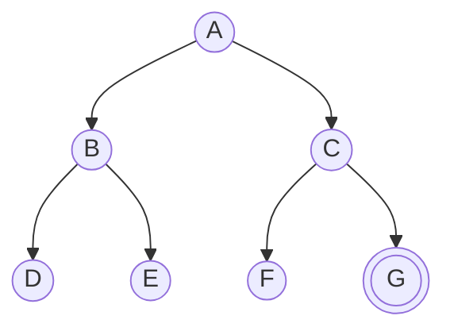

# Uninformed Search (Búsqueda no informada: BFS, DFS, UCS/Dijkstra)

> **Summary (EN):** Blind search knows only the initial state, the actions and the goal test; it explores systematically without preferring any path. Algorithms differ in the order they expand nodes and are judged by completeness, optimality, time and space. BFS (FIFO queue) is complete and optimal for uniform costs but uses O(b^d) memory; DFS (LIFO stack) needs only O(b·m) memory but is neither optimal nor, in general, complete. Uniform-cost search (Dijkstra) expands the lowest path cost g(n) first and is optimal for any non-negative costs.

## Términos clave

| English | Español | Significado |
|---|---|---|
| Uninformed / blind search | Búsqueda no informada / ciega | Sin información extra sobre qué estados son prometedores. |
| Completeness | Completitud | ¿Encuentra solución si existe? |
| Optimality | Optimalidad | ¿Encuentra la de menor costo? |
| Time / space complexity | Complejidad temporal / espacial | ¿Cuánto tarda? ¿Cuánta memoria usa? |
| FIFO queue / LIFO stack | Cola FIFO / pila LIFO | Estructura de la frontera en BFS / DFS. |
| Uniform-cost search (UCS) | Búsqueda de costo uniforme | Expande el menor g(n); equivale a Dijkstra. |
| Depth-limited / Iterative deepening | Profundidad limitada / profundización iterativa | DFS con límite; IDS repite DFS con límite creciente. |

## Explicación

### BFS — Breadth-First Search (anchura)
Expande primero los nodos **menos profundos**, nivel por nivel. Frontera = **cola FIFO**.
- Completo: sí (si *b* es finito).
- Óptimo: encuentra el camino con **menos pasos**; óptimo en costo **solo si todos los costos son iguales**.
- Tiempo y espacio: **O(b^d)**. El problema es la memoria: la frontera crece exponencialmente.

### DFS — Depth-First Search (profundidad)
Expande primero el nodo **más profundo**, siguiendo una rama hasta el final. Frontera = **pila LIFO**.
- Completo: solo con control de repetidos **y** espacio finito.
- Óptimo: **no**.
- Tiempo **O(b^m)**, espacio **O(b·m)** — mucha menos memoria que BFS.
- Variante **depth-limited**: DFS con profundidad máxima *l* (la tarea usa `max_depth = 10`). **IDS** (complemento, AIMA §3.4.4): repetir con l = 0, 1, 2…; completo, óptimo con costos uniformes, tiempo O(b^d), espacio O(b·d).

**¿Cuánto es O(b^d) en la práctica?** (AIMA §3.4.1) Con b = 10, 1 millón de nodos/s y 1 KB/nodo: a profundidad d = 10 tarda < 3 horas pero necesita **10 terabytes** de memoria; a d = 14 tardaría 3.5 años. Conclusión: en BFS **la memoria es peor problema que el tiempo**.

BFS puede usar **prueba de meta temprana** (al generar el nodo), porque nunca encontrará un camino más corto a un estado ya alcanzado.

### UCS / Dijkstra (AIMA §3.4.2)
Frontera = **cola de prioridad por g(n)** (costo acumulado): best-first con f = PATH-COST. Se expande en "ondas" de costo uniforme (BFS lo hace en ondas de profundidad uniforme).

**Ejemplo (AIMA Fig. 3.10), Sibiu → Bucarest:** expande Rimnicu Vilcea (80) → agrega Pitesti (177); expande Fagaras (99) → agrega Bucarest (310) pero **no** se detiene (la meta se prueba al expandir); expande Pitesti (177) → encuentra Bucarest por 278 y reemplaza al de 310; expande Bucarest (278) ✓. Si se probara la meta al generar, devolvería el camino de 310.

Completo (costos ≥ ε > 0) y óptimo. Complejidad O(b^(1+⌊C*/ε⌋)), que puede ser **mucho mayor** que b^d porque explora árboles enteros de acciones baratas antes de probar una cara pero útil. Es exactamente `dijkstra()` de la tarea [A\* vs Dijkstra](../assignments/astar-vs-dijkstra.md), y es A\* con h = 0.

### Backtracking search (AIMA §3.4.3)
Variante de DFS que genera **un sucesor a la vez** y modifica el estado actual en lugar de copiarlo (deshaciendo la acción al retroceder): memoria O(m) acciones + un solo estado. Es la base de los [CSP](constraint-satisfaction-problems.md) y de [Prolog](prolog.md).

### Iterative deepening (AIMA §3.4.4)
Llama a depth-limited search con l = 0, 1, 2, … hasta encontrar solución. Combina lo mejor de DFS (memoria O(b·d)) y BFS (completo, óptimo con costos iguales). Parece derrochador, pero casi todos los nodos están en el último nivel: con b = 10, d = 5, **N(IDS) = 123 450** vs. **N(BFS) = 111 110** (solo ~11 % más). *"Iterative deepening is the preferred uninformed search method when the search state space is larger than can fit in memory and the depth of the solution is not known."*

Un límite de profundidad bien elegido: el **diámetro** del grafo (en Rumania cualquier ciudad se alcanza en ≤ 9 acciones, mejor límite que 19).

### Bidirectional search (AIMA §3.4.5)
Busca hacia adelante desde el inicio y hacia atrás desde la meta hasta que las fronteras se encuentran. Motivación: b^(d/2) + b^(d/2) ≪ b^d (50 000 veces menos con b = d = 10). Requiere poder razonar hacia atrás (conocer predecesores).

### Comparación (AIMA Fig. 3.15, versiones tree-like)

| Criterio | BFS | UCS | DFS | Depth-limited | IDS | Bidireccional |
|---|---|---|---|---|---|---|
| Frontera | FIFO | Prioridad g(n) | LIFO | LIFO | LIFO | 2 fronteras |
| Completo | Sí¹ | Sí¹˒² | No | No | Sí¹ | Sí¹˒⁴ |
| Óptimo | Sí³ | Sí | No | No | Sí³ | Sí³˒⁴ |
| Tiempo | O(b^d) | O(b^(1+⌊C*/ε⌋)) | O(b^m) | O(b^l) | O(b^d) | O(b^(d/2)) |
| Espacio | O(b^d) | O(b^(1+⌊C*/ε⌋)) | O(b·m) | O(b·l) | O(b·d) | O(b^(d/2)) |

¹ si *b* es finito y el espacio tiene solución o es finito. ² si los costos son ≥ ε > 0. ³ si todos los costos son iguales. ⁴ si ambas direcciones son BFS. En versiones **graph search**, DFS es completo en espacios finitos y las complejidades quedan acotadas por |V| + |E|.

## Ejemplo (8-puzzle de la tarea)

Inicio `(2,4,3,1,0,6,7,5,8)` → meta `(1,2,3,4,5,6,7,8,0)` (ver [Deber 1](../assignments/deber-1-search-problems.md)):

| Algoritmo | Movimientos | Estados generados |
|---|---|---|
| BFS | **6** (óptimo) | 135 |
| DFS (límite 10) | 10 (no óptimo) | 484 |
| Greedy best-first (Manhattan) | 6 | **15** |

BFS garantiza la solución más corta; DFS encontró una más larga; la búsqueda informada generó 9× menos estados.

### Diagrama

Mismo árbol binario, distinto orden de expansión (meta = G):



| Algoritmo | Orden de expansión hasta encontrar G |
|---|---|
| BFS (FIFO) | A, B, C, D, E, F, G |
| DFS (LIFO, hijos izquierda→derecha) | A, B, D, E, C, F, G |
| IDS | límite 0: A · límite 1: A, B, C · límite 2: A, B, D, E, C, F, G |

## Pseudocódigo intuitivo (para explicar en el examen)

> **Idea (ES):** BFS = por niveles (cola), DFS = una rama hasta el fondo (pila), UCS = siempre el camino más barato (prioridad por g), IDS = DFS con límite creciente.

```text
BFS:
1. Queue ← [start]; reached ← {start}.
2. While the queue is not empty: take the FIRST node.
3. For each child: if it is the goal → return it (early goal test);
   if not reached → mark reached, add it to the END of the queue.

DFS:
1. Stack ← [start].
2. While the stack is not empty: take the LAST node added.
3. If it is the goal → return it.
4. Push its children (skipping states already on the current path).

UNIFORM-COST SEARCH (Dijkstra):
1. Priority queue ordered by g (cost so far) ← [start with g = 0].
2. Pop the node with the SMALLEST g. If it is the goal → return it (test on expansion!).
3. For each child: if new or reached with a smaller g → update g and push it.

ITERATIVE DEEPENING:
1. For limit = 0, 1, 2, ...: run DFS that does not go deeper than limit.
2. Stop when DFS finds the goal.
```

**Say it in the exam (EN):** "BFS is complete and optimal for equal step costs but needs O(b^d) memory. DFS needs only O(b·m) memory but is neither complete nor optimal. UCS is optimal for any positive costs. IDS combines DFS memory with BFS completeness and optimality, at only ~11% extra time."

## Errores comunes y tips de examen

- BFS es óptimo en **número de pasos**, no en costo con pesos distintos → para eso UCS/Dijkstra.
- d = profundidad de la solución más superficial; m = profundidad máxima del árbol (puede ser ∞).
- "DFS usa poca memoria" solo si se guarda el camino actual (O(b·m)); si se guarda un conjunto global de visitados, la memoria vuelve a crecer.

## Relacionado

- [Problem Formulation](problem-formulation.md)
- [Heuristics](heuristics.md)
- [A* Search](a-star-search.md)
- [Greedy Best-First Search](greedy-best-first-search.md)
- [Search algorithms comparison](../study/search-algorithms-comparison.md)

## Fuentes

- [Slides 02](../sources/slides-02-problem-solving.md), slides 6–10.
- [AIMA 4e](../sources/book-russell-norvig-aima.md) §3.4 (ingestado: BFS, UCS con ejemplo Sibiu→Bucarest, backtracking, IDS, bidireccional, Fig. 3.15).
- Resultados reales: [Deber 1](../assignments/deber-1-search-problems.md).
