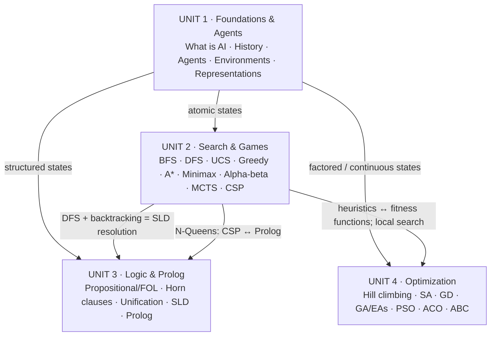

# Course overview (Mapa del curso de Inteligencia Artificial)

> **Summary (EN):** The course is built around one idea — the rational agent — and four ways for an agent to decide what to do: search a state space for a plan (Unit 2), reason logically from a knowledge base (Unit 3), or optimize an objective with nature-inspired metaheuristics (Unit 4), after foundations and history (Unit 1). This page shows how the units connect and where to start reading.

## Mapa

## Unidades

| Unidad | Pregunta central | Páginas de entrada | Tareas |
|---|---|---|---|
| 1. Fundamentos y agentes | ¿Qué es la IA y cómo modelamos un agente? | [What Is AI?](concepts/what-is-ai.md), [Intelligent Agents](concepts/intelligent-agents.md) | — |
| 2. Búsqueda | ¿Cómo encuentra un agente una secuencia de acciones? | [Problem Formulation](concepts/problem-formulation.md), [A*](concepts/a-star-search.md) | [Deber 1](assignments/deber-1-search-problems.md), [A* vs Dijkstra](assignments/astar-vs-dijkstra.md), [Tic-tac-toe 4×4](assignments/tic-tac-toe-4x4-minimax.md) |
| 3. Lógica y Prolog | ¿Cómo razona un agente con conocimiento explícito? | [Logic](concepts/propositional-and-first-order-logic.md), [Prolog](concepts/prolog.md) | [Prolog Lab 01](assignments/prolog-lab-01-family.md) |
| 4. Optimización bioinspirada | ¿Cómo encontrar el mejor punto de un espacio enorme? | [Optimization Basics](concepts/optimization-basics.md), [Swarm Intelligence](concepts/swarm-intelligence.md) | [GA](assignments/genetic-algorithm-task.md), [PSO](assignments/pso-task.md) |

## Hilos que cruzan las unidades

1. **La representación del estado** ([State Representation](concepts/state-representation.md)) decide qué algoritmos sirven: atómica → búsqueda; factorizada → CSP y optimización; estructurada → lógica.
2. **DFS está en todas partes:** DFS clásica, minimax, backtracking de CSP y la ejecución SLD de Prolog son variantes de búsqueda en profundidad con retroceso.
3. **Heurística ≈ función de aptitud:** h(n) guía a A\*; f(x) guía a GA/PSO; η = 1/d guía a las hormigas.
4. **Exploración vs. explotación:** desde greedy vs. A\* hasta mutación, inercia y evaporación.
5. **"Algorithm = Logic + Control"** (Kowalski): la misma lógica de N-Reinas con distinto control cambia 77× el costo.
6. **Simbólico vs. estadístico vs. bioinspirado** como corrientes históricas ([History of AI](concepts/history-of-ai.md)).

## Estado de la wiki

- Ingestado: las 5 presentaciones, los 3 papers, el código de clase, los ejemplos de Prolog, las 6 tareas y el enunciado de HW01.
- Plan para el test del jueves 8 de octubre: [Study plan](study/study-plan.md).
- Libros: AIMA caps. 2–6 y Eiben & Smith caps. 3–5 ingestados (2026-10-01); resto de AIMA, Luger y Eiben con mapas de capítulos listos para ingestar por partes.
- Revisar antes del examen: [Errata](study/errata.md).
