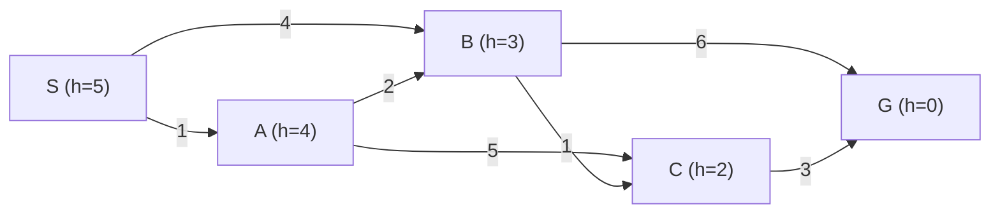
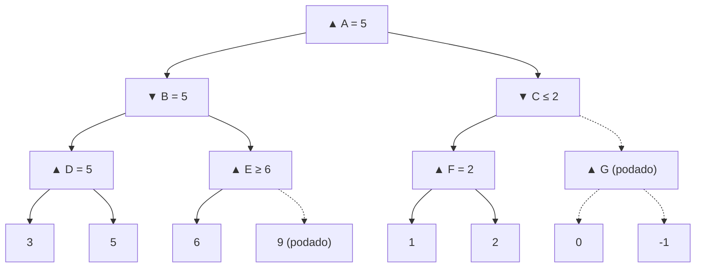

# Practice problems — Unit 2: Search, games and CSP (Problemas de práctica — Unidad 2)

> **Summary (EN):** Hand-tracing exercises for BFS, DFS, UCS, greedy and A* on one small graph, heuristic properties, 8-puzzle heuristics, minimax and alpha–beta trees, MCTS/UCB1, expectiminimax, CSP propagation and complexity counts. Every numeric answer was checked by running code. Questions in English, solutions in Spanish with the English answer.

## The graph for Problems 1–3

Directed graph, start **S**, goal **G** (costs on edges; h in parentheses):

Ties are broken alphabetically. Children are generated in alphabetical order.

## Problem 1 — Uninformed search

Give the order of **expanded** nodes and the returned path for (a) BFS (goal test when generating), (b) DFS (graph search, no repeated states on the path), (c) uniform-cost search.

Solución

(a) **BFS:** expande S, A, B. Al expandir B genera G → devuelve **S → B → G** (costo 10, el de **menos pasos**, no el más barato).

(b) **DFS:** expande S, A, B, C, G → devuelve **S → A → B → C → G** (costo 7; aquí tuvo suerte).

(c) **UCS:** S(g=0) → A(1) → B(3, mejor que 4 directo) → C(4) → G(7). Devuelve **S → A → B → C → G, costo 7** (óptimo). Nota que G entra a la frontera con g = 9 por B pero se expande con g = 7 por C: por eso la meta se prueba al **expandir**.

## Problem 2 — Informed search

(a) Run greedy best-first and A*. Give expanded nodes with their f values and the returned path. (b) Which one is optimal here and why?

Solución

(a) **Greedy (f = h):** S(5) → B(3) → G(0). Devuelve **S → B → G, costo 10**.
**A\* (f = g + h):** S(0+5=5) → A(1+4=5) → B(3+3=6) → C(4+2=6) → G(7+0=7). Devuelve **S → A → B → C → G, costo 7**.

(b) A\* es óptimo porque h es **admisible** (y consistente). Greedy ignora g y se va directo a B porque "parece" más cerca.

## Problem 3 — Heuristic properties

(a) Is h admissible? Is it consistent? (Compute the true cost-to-go h\* of every node.) (b) Same questions for h' with h'(A) = 7 (others unchanged).

Solución

h\*: G = 0, C = 3, B = min(6, 1+3) = 4, A = min(2+4, 5+3) = 6, S = min(1+6, 4+4) = 7.

(a) **Admisible:** 5 ≤ 7, 4 ≤ 6, 3 ≤ 4, 2 ≤ 3 ✓. **Consistente:** revisar cada arista h(n) ≤ c + h(n'): S→A 5 ≤ 1+4 ✓, S→B 5 ≤ 4+3 ✓, A→B 4 ≤ 2+3 ✓, A→C 4 ≤ 5+2 ✓, B→C 3 ≤ 1+2 ✓, B→G 3 ≤ 6 ✓, C→G 2 ≤ 3 ✓ → **sí**.

(b) h'(A) = 7 > h\*(A) = 6 → **no admisible**, y por lo tanto **no consistente** (consistente ⇒ admisible). Ejemplo de violación: A→B: 7 ≤ 2 + 3 = 5 ✗.

## Problem 4 — 8-puzzle heuristics

Start (2,4,3 / 1,_,6 / 7,5,8), goal (1,2,3 / 4,5,6 / 7,8,_). Compute h₁ (misplaced tiles, blank not counted) and h₂ (Manhattan). The optimal solution has 6 moves; comment.

Solución

Fichas fuera de lugar: 2, 4, 1, 5, 8 → **h₁ = 5**. Manhattan: 2 → 1, 4 → 1, 1 → 1, 5 → 1, 8 → 1, las demás 0 → **h₂ = 6**.

Ambas ≤ 6 (admisibles). h₂ es exacta en este estado y domina a h₁ → greedy/A\* con h₂ generan menos nodos (en la tarea: 15 estados con Manhattan vs. 20 con misplaced).

## Problem 5 — Minimax and alpha–beta (2 ply)

MAX root with three MIN children: B = [4, 8, 9], C = [3, 7, 1], D = [6, 2, 5]. (a) Minimax value and best move. (b) Which leaves are pruned by alpha–beta (left to right)?

Solución

(a) B = 4, C = 1, D = 2 → raíz = **4**, jugada hacia **B**.

(b) Tras B, α = 4. En C la primera hoja 3 hace C ≤ 3 < 4 → se podan **7 y 1**. En D: 6 (D ≤ 6, seguir), 2 (D ≤ 2 < 4) → se poda **5**. Se podan **3 hojas**; el valor sigue siendo 4.

## Problem 6 — Alpha–beta (3 ply)

MAX root A with MIN children B and C. B has MAX children D = [3, 5] and E = [6, 9]; C has MAX children F = [1, 2] and G = [0, −1]. Trace alpha–beta.

Solución

- D = max(3, 5) = 5 → en B, β = 5.
- E: primera hoja 6 → E ≥ 6 > β = 5 → MIN nunca elegirá E → **se poda la hoja 9**. B = 5 → en A, α = 5.
- F = max(1, 2) = 2 → en C, β = 2 ≤ α = 5 → **se poda todo G** (0 y −1).
- Raíz A = **5** (igual que minimax).

## Problem 7 — MCTS / UCB1

A node visited N = 15 times has children A = 7/10, B = 3/4, C = 0/1 (wins/visits). Which child does UCB1 select with (a) C = 1, (b) C = 0.3? (ln 15 ≈ 2.708)

Solución

Explotación: A 0.700, B 0.750, C 0. Raíz de exploración √(ln N / n): A √0.271 = 0.520, B √0.677 = 0.823, C √2.708 = 1.646.

(a) C = 1: A 1.220, B 1.573, **C 1.646** → se elige **C** (exploración: casi no se ha probado).
(b) C = 0.3: A 0.856, **B 0.997**, C 0.494 → se elige **B** (explotación).

## Problem 8 — Expectiminimax

MAX chooses a₁ or a₂. Each leads to a chance node (0.5 / 0.5) whose outcomes are MIN nodes: a₁ → MIN[2, 4] and MIN[7, 4]; a₂ → MIN[10, 1] and MIN[8, 9]. (a) Expectiminimax decision? (b) What would plain minimax choose if chance were treated as an adversary (MIN)?

Solución

(a) a₁: 0.5·min(2,4) + 0.5·min(7,4) = 0.5·2 + 0.5·4 = **3**. a₂: 0.5·min(10,1) + 0.5·min(8,9) = 0.5·1 + 0.5·8 = **4.5** → elegir **a₂**.

(b) Si el azar fuera un adversario: a₁ → min(2, 4) = 2; a₂ → min(1, 8) = 1 → elegiría **a₁**. Con azar hay que **promediar**, no minimizar.

## Problem 9 — CSP: forward checking and AC-3

(a) Australia map with {red, green, blue}. Assign WA = red, then Q = green. Give the domains of NT, SA, NSW, V after forward checking. Which variable does MRV choose next? (b) X, Y ∈ {1, 2, 3} with X < Y. Make the arc set consistent.

Solución

(a) Tras WA = red: NT = {g, b}, SA = {g, b}. Tras Q = green: NT = **{blue}**, SA = **{blue}**, NSW = **{red, blue}**, V = {r, g, b}. MRV elige NT o SA (1 valor). Nota: forward checking **no** detecta que NT y SA (vecinos) quedaron ambos con solo blue; **MAC/AC-3** sí lo detectaría y retrocedería ya.

(b) X necesita un Y mayor → quitar 3 de X: X = **{1, 2}**. Y necesita un X menor → quitar 1 de Y: Y = **{2, 3}**.

## Problem 10 — Complexity

b = 10, solution depth d = 5. (a) Nodes generated by BFS and by IDS? (b) Why is IDS preferred when memory is limited? (c) With perfect move ordering, how much deeper can alpha–beta search than minimax in the same time?

Solución

(a) BFS: 10 + 100 + 1 000 + 10 000 + 100 000 = **111 110**. IDS: 5·10 + 4·100 + 3·1 000 + 2·10 000 + 1·100 000 = **123 450** (solo ~11 % más).
(b) IDS usa memoria O(b·d) en vez de O(b^d) y sigue siendo completo y óptimo con costos iguales.
(c) Alpha–beta con orden perfecto: O(b^(m/2)) → **el doble de profundidad** (factor de ramificación efectivo √b).

## Relacionado

- [Search algorithms comparison](search-algorithms-comparison.md) · [Exam questions](exam-questions.md)
- [A* Search](../concepts/a-star-search.md) · [Alpha–Beta Pruning](../concepts/alpha-beta-pruning.md) · [MCTS](../concepts/monte-carlo-tree-search.md) · [CSP](../concepts/constraint-satisfaction-problems.md)
